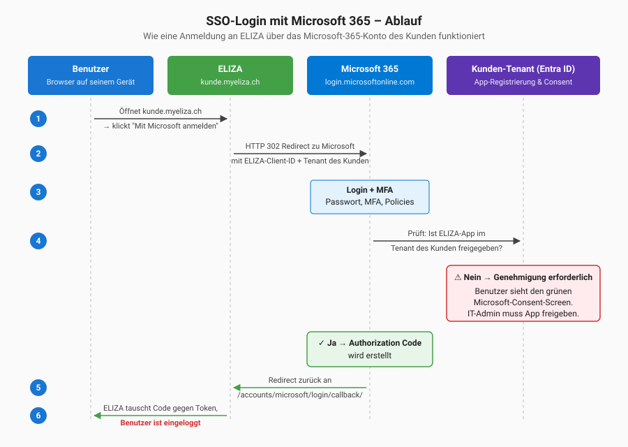

# Single Sign-On (SSO) mit Microsoft 365

Mit Single Sign-On (SSO) können sich deine Mitarbeitenden mit ihrem bestehenden Microsoft-365-Konto in ELIZA anmelden – ohne zusätzliches Passwort. Dieses Kapitel richtet sich an **IT-Administratoren beim Kunden** und beschreibt:

- Wie der SSO-Login aus Benutzer- und System-Sicht abläuft
- Wie du als Microsoft-365-Admin die ELIZA-Anwendung **einmalig** in deinem Tenant freigibst
- Wie du den Login testest und häufige Stolpersteine löst

> 💡 **Du musst keine App in deinem Microsoft-Tenant registrieren.** Die Anwendung „ELIZA AG" wird zentral von der ELIZA AG bereitgestellt (Multi-Tenant-App). Du musst sie nur **freigeben** – das geht in wenigen Minuten.

---

## SSO-Login vs. Entra ID Synchronisation

ELIZA bietet zwei unabhängige Integrationen mit Microsoft 365. Verwechsle sie nicht:

| Funktion | Was es macht | Wo dokumentiert |
|----------|--------------|-----------------|
| **SSO-Login** (dieses Kapitel) | Benutzer melden sich mit ihrem Microsoft-365-Konto in ELIZA an | Kapitel 11 |
| **Entra ID Synchronisation** | Benutzerdaten werden im Hintergrund von Microsoft 365 nach ELIZA übertragen | [Kapitel 8]() |

Beide können kombiniert werden, sind aber unabhängig voneinander.

---

## Wie funktioniert SSO mit ELIZA?

Die Anmeldung läuft als klassischer **OAuth 2.0 / OpenID Connect Flow** ab. Du als Admin musst nichts davon manuell ausführen – die Abbildung zeigt nur, was im Hintergrund passiert:



**Kurzfassung der Schritte:**

1. Benutzer öffnet `kunde.myeliza.ch` und klickt auf **Mit Microsoft anmelden**
2. ELIZA leitet ihn zu `login.microsoftonline.com` weiter, im Auftrag der ELIZA-App
3. Microsoft prüft die Identität (Passwort, MFA, Conditional Access)
4. Microsoft prüft, ob die App **ELIZA AG** in deinem Tenant freigegeben ist
   - ❌ **Nein** → Benutzer sieht den Bildschirm "Genehmigung erforderlich"
   - ✅ **Ja** → Microsoft stellt einen Authorization Code aus
5. Microsoft schickt den Code an `kunde.myeliza.ch/accounts/microsoft/login/callback/`
6. ELIZA tauscht den Code gegen Profil-Daten und loggt den Benutzer ein

> 🔐 **Wichtig:** ELIZA bekommt nur das, was du im Consent-Schritt freigibst – Name, E-Mail und die Aufrechterhaltung der Sitzung. **Keine Passwörter, keine Mails, keine Dateien.**

---

## Was die ELIZA-App in deinem Tenant anfordert

Die App **ELIZA AG** fordert ausschliesslich folgende Standard-Berechtigungen (Delegated Permissions, Microsoft Graph) an:

| Berechtigung | Zweck |
|--------------|-------|
| `openid` | OpenID-Connect-Flow durchführen |
| `profile` | Vor- und Nachname auslesen |
| `email` | E-Mail-Adresse (wird in ELIZA als Identifier verwendet) |
| `User.Read` | Eigenes Microsoft-365-Benutzerprofil lesen |
| `offline_access` | Refresh-Token für längere Sitzungen |

Das sind die **minimalen** Berechtigungen für einen OIDC-Login. ELIZA hat damit **keinen** Zugriff auf:

- ❌ Andere Benutzer in deinem Tenant
- ❌ Postfächer, Kalender oder Teams-Nachrichten
- ❌ Dateien in OneDrive/SharePoint
- ❌ Verzeichnis-Daten oder Gruppen
- ❌ Schreibrechte auf irgendwelchen Microsoft-Diensten

---

## ELIZA-App in deinem Tenant freigeben (Admin-Consent)

Bevor sich der **erste Benutzer** anmelden kann, muss ein **globaler Administrator** deines Tenants die App **einmalig** freigeben. Danach funktioniert SSO für alle Benutzer.

Du hast drei Wege – wähle den, der zu eurer Situation passt:

### Weg A: Direktlink für Admin-Consent (am schnellsten)

Die ELIZA AG schickt dir einen Link nach folgendem Muster:

```
https://login.microsoftonline.com/organizations/adminconsent
  ?client_id=<ELIZA-AG-CLIENT-ID>
  &redirect_uri=https://kunde.myeliza.ch/accounts/microsoft/login/callback/
```

1. Öffne den Link in einem Browser
2. Melde dich mit einem **globalen Administrator**-Konto deines Tenants an
3. Microsoft zeigt dir die angeforderten Berechtigungen (siehe Liste oben)
4. Klicke auf **Akzeptieren**
5. Du wirst kurz weitergeleitet – die App ist nun in deinem Tenant freigegeben

> 💡 Den Direktlink bekommst du von `support@eliza.swiss` zusammen mit den Aktivierungs-Informationen für deine ELIZA-Instanz.

### Weg B: Über das Microsoft Entra Admin Center

Sobald sich der erste Benutzer **erfolglos** angemeldet hat (siehe Screenshot „Genehmigung erforderlich"), legt Microsoft automatisch einen Eintrag der App in deinem Tenant an. Diesen kannst du nachträglich freigeben:

1. Öffne das [Microsoft Entra Admin Center](https://entra.microsoft.com) als globaler Administrator
2. Navigiere zu **Identität → Anwendungen → Unternehmensanwendungen**
3. Im Filter **Anwendungstyp** wählst du *Alle Anwendungen*
4. Suche nach **ELIZA AG** (oder dem Namen, den die ELIZA AG im Support-E-Mail genannt hat)
5. Öffne die App und klicke links auf **Berechtigungen**
6. Klicke oben auf **Administratorzustimmung erteilen für [Tenantname]**
7. Bestätige im Microsoft-Popup mit **Akzeptieren**

**Erfolgreich:** Die Berechtigungen erscheinen jetzt unter **Erteilte Administratorzustimmung** mit grünem Status.

### Weg C: Benutzer fordert Genehmigung an

Wenn ein Benutzer auf den Bildschirm "Genehmigung erforderlich" stösst, kann er direkt darin eine Begründung eingeben und **Genehmigungsanforderung** klicken. Du als Admin bekommst dann eine E-Mail von Microsoft und kannst die App im Entra Admin Center mit einem Klick freigeben.

> ⚠️ **Voraussetzung:** In eurem Tenant muss der Admin-Consent-Workflow aktiviert sein (*Entra Admin Center → Identität → Anwendungen → Unternehmensanwendungen → Benutzereinstellungen*). Wenn nicht, wählst du besser **Weg A** oder **Weg B**.

---

## Erster Login testen

1. Öffne in einem **Inkognito-Fenster** `https://kunde.myeliza.ch`
2. Klicke auf **Mit Microsoft anmelden**
3. Melde dich mit einem ganz normalen Microsoft-365-Benutzer eures Tenants an
4. Erwartung: Du wirst nach erfolgreichem Microsoft-Login direkt ins ELIZA-Dashboard weitergeleitet

Wenn das nicht klappt → siehe **Troubleshooting**.

> 💡 **Empfehlung für den ersten Test:** Verwende ein „normales" Benutzerkonto, kein Admin-Konto. So merkst du sofort, ob der Admin-Consent für alle Benutzer wirkt – oder ob versehentlich nur für dich selbst.

---

## Troubleshooting

### "Genehmigung erforderlich" – ELIZA AG nicht überprüft

**Symptom:** Beim Microsoft-Login erscheint ein grüner Block mit „ELIZA AG / nicht überprüft" und der Aufforderung, eine Genehmigungsanforderung zu senden.

**Ursache:** Admin-Consent für die App **ELIZA AG** wurde im Tenant noch nicht erteilt.

**Lösung:** Folge **Weg A** oder **Weg B** im Abschnitt *ELIZA-App in deinem Tenant freigeben*.

> 💡 Der Hinweis **„nicht überprüft"** verschwindet, sobald die ELIZA AG ihr Publisher-Profil in Microsoft mit der App-Registrierung verknüpft hat. Das ist optional und ändert technisch nichts – frag bei `support@eliza.swiss` nach dem aktuellen Status der Publisher Verification.

### "AADSTS50020 – User account does not exist in tenant"

**Ursache:** Der Benutzer hat versucht, sich mit einem Microsoft-Konto anzumelden, das **nicht** zu eurem Tenant gehört (z.B. private outlook.com-Adresse oder Konto eines anderen Unternehmens).

**Lösung:** Nur Konten aus eurem Microsoft-365-Tenant können SSO nutzen. Wenn externe Personen Zugriff auf ELIZA brauchen, lade sie als **Gast** in deinen Microsoft-365-Tenant ein – danach funktioniert SSO auch für sie.

### "AADSTS90094 – AdminConsentRequired"

**Ursache:** Ältere Variante der Meldung „Genehmigung erforderlich". Tritt auf, wenn ein Benutzer ohne Admin-Rechte versucht, der App selbst zuzustimmen, und der Tenant das verbietet.

**Lösung:** Admin-Consent über **Weg A** oder **Weg B** erteilen.

### Benutzer wird eingeloggt, sieht aber leeres Dashboard / fehlende Rechte

**Ursache:** Der Benutzer wurde gerade frisch über SSO angelegt und ist noch keiner Gruppe zugeordnet.

**Lösung:** Ein ELIZA-Superuser ordnet den Benutzer manuell einer passenden Gruppe zu, oder die **Standard-Benutzergruppe** wird in der SSO-Konfiguration gesetzt (siehe unten).

### "E-Mail-Domain ist nicht erlaubt"

**Ursache:** Die Domain-Whitelist in deiner ELIZA-Instanz lässt nur bestimmte Domains zu.

**Lösung:** Ein ELIZA-Superuser ergänzt die Domain unter **Einstellungen → SSO-Konfiguration**.

### Login funktionierte gestern, heute nicht mehr

**Mögliche Ursachen:**

- **Conditional Access** in eurem Tenant blockiert plötzlich (z.B. neue Geräte-Richtlinie)
- Das Microsoft-Konto des Benutzers wurde deaktiviert oder zurückgesetzt
- Das Client Secret der ELIZA-App ist abgelaufen (in dem Fall sind aber **alle** Benutzer betroffen)

**Lösung:** Bei flächendeckendem Ausfall sofort `support@eliza.swiss` informieren. Bei einzelnen Benutzern Microsoft-Konto-Status prüfen.

---

## ELIZA-seitige Einstellungen (vom ELIZA-Support konfigurierbar)

Die folgenden Einstellungen werden **nicht von dir als Kunden-IT-Admin gesetzt**, sondern vom **ELIZA-Support** für deine Instanz konfiguriert. Wenn du eine Anpassung wünschst, melde dich bei `support@eliza.swiss` mit der entsprechenden Angabe – wir setzen es für dich um.

| Einstellung | Bedeutung | Wann anfordern? |
|-------------|-----------|-----------------|
| **Erlaubte Domains (Whitelist)** | E-Mail-Domains, die sich via SSO anmelden dürfen. Leer = alle erlaubt. | Wenn nur Konten bestimmter Domains (z.B. `kunde.ch`) zugelassen werden sollen und Fremd-Tenants ausgeschlossen werden müssen |
| **Nur bestehende Benutzer erlauben** | Wenn aktiv: nur Benutzer, die bereits in ELIZA existieren, können sich per SSO anmelden. Neue Konten werden nicht automatisch erstellt. | Wenn du parallel die Entra-ID-Synchronisation nutzt und sicherstellen willst, dass nur dort vorgesehene Mitarbeitende einloggen können |
| **Standard-Benutzergruppe** | Gruppe, in die neu per SSO erstellte Benutzer automatisch eingefügt werden | Wenn neue SSO-Benutzer ohne Admin-Eingriff sofort eine sinnvolle Grund-Berechtigung erhalten sollen (typisch: `eliza_user` mit Lese-Rechten) |
| **Standard-Login ausblenden** | Versteckt das klassische Benutzername/Passwort-Formular auf der Login-Seite; nur „Mit Microsoft anmelden" bleibt sichtbar. | Wenn ihr ausschliesslich SSO nutzt und Benutzer keinen lokalen Passwort-Login mehr sehen sollen. Erst aktivieren, **nachdem** SSO produktiv funktioniert |

**Beispiel-Anfrage an `support@eliza.swiss`:**

> *„Bitte für unsere Instanz `kunde.myeliza.ch` folgende SSO-Einstellungen setzen:
> – Whitelist: `kunde.ch`, `kunde-tochter.ch`
> – Nur bestehende Benutzer erlauben: aktivieren
> – Standard-Benutzergruppe: `eliza_user`
> – Standard-Login ausblenden: noch nicht – wir möchten zuerst zwei Wochen parallel testen."*

> ⚠️ **Aussperr-Schutz:** Wenn **Standard-Login ausblenden** aktiv ist, erreichst du das klassische Login-Formular weiterhin über `/accounts/login/?show=1`. Notiere dir diese URL für den Notfall, bevor du das Ausblenden anforderst.

---

## Sicherheitshinweise

> 🔐 **Was du auf Microsoft-365-Seite tun kannst:**
> - **Conditional Access** für die App ELIZA AG aktivieren (MFA-Pflicht, Compliant Device, vertrauenswürdige Standorte)
> - Audit-Logs in Entra ID prüfen – jeder SSO-Login wird dort protokolliert
> - Bei Mitarbeitenden-Austritt: Microsoft-365-Konto deaktivieren – damit ist auch ELIZA sofort gesperrt

> 🔐 **Was ELIZA tut:**
> - SSO-Login wird im ELIZA-Audit-Log erfasst
> - Sitzungen laufen nach Inaktivität ab (konfigurierbar)
> - Token werden serverseitig verschlüsselt gespeichert

---

## FAQ

### Können sich Benutzer parallel klassisch (Benutzername/Passwort) und per SSO anmelden?

**Ja.** Beide Wege bleiben parallel verfügbar, solange du **Standard-Login ausblenden** in ELIZA nicht aktivierst. Empfohlen für die Übergangsphase nach SSO-Einführung.

### Was passiert mit bestehenden ELIZA-Benutzern, wenn wir SSO aktivieren?

**Nichts.** Bestehende Benutzer werden anhand ihrer E-Mail-Adresse erkannt. Ein Benutzer mit `peter@kunde.ch` in ELIZA und `peter@kunde.ch` in Entra wird beim SSO-Login als derselbe erkannt – seine Berechtigungen bleiben erhalten.

### Wer kann den Admin-Consent erteilen?

In Microsoft 365: Ein Benutzer mit der Rolle **Globaler Administrator** oder **Anwendungsadministrator** (Privileged Role Administrator reicht nicht für jeden Permission-Typ).

### Müssen wir MFA selbst in ELIZA konfigurieren?

**Nein.** Wenn SSO aktiv ist, übernimmt Microsoft 365 die komplette Authentifizierung – inklusive Passwort-Richtlinien, MFA und Conditional Access. ELIZA vertraut dem Microsoft-Login.

### Funktioniert SSO auch mit privaten Microsoft-Konten (outlook.com, hotmail.com)?

**Nein.** Es funktionieren nur Konten, die zu eurem Microsoft-365-Tenant gehören (inklusive eingeladener Gast-Konten).

### Was passiert, wenn ein Mitarbeitender aus dem Unternehmen austritt?

Sobald sein Microsoft-365-Konto deaktiviert wird, kann er sich nicht mehr per SSO in ELIZA anmelden. Das ELIZA-Konto bleibt aber bestehen (mit Audit-Spuren) – ein ELIZA-Admin kann es separat archivieren.

### Kann ich den Admin-Consent wieder zurückziehen?

**Ja.** Entra Admin Center → Unternehmensanwendungen → **ELIZA AG** → **Eigenschaften → Löschen**. Damit ist SSO für eure Organisation sofort deaktiviert – Benutzer können sich aber weiterhin klassisch in ELIZA anmelden.

### Wie viele Klicks braucht der Login nach der Einrichtung?

Wenn der Benutzer in Microsoft 365 bereits angemeldet ist (z.B. im Outlook-Web-Client): **Ein Klick** auf „Mit Microsoft anmelden" – und er ist in ELIZA. Andernfalls plus Passwort + MFA.

---

## Checkliste für die Einrichtung

1. ☐ Aktivierungs-E-Mail von `support@eliza.swiss` mit Admin-Consent-Direktlink erhalten
2. ☐ Admin-Consent als globaler Administrator erteilt (Weg A oder Weg B)
3. ☐ Erster Test-Login im Inkognito-Fenster mit normalem Benutzerkonto erfolgreich
4. ☐ Optional: SSO-Konfiguration in ELIZA angepasst (Whitelist, Standard-Gruppe)
5. ☐ Optional: Conditional Access in Microsoft 365 für die App ELIZA AG konfiguriert
6. ☐ Notfall-Admin-Konto in ELIZA mit klassischem Passwort + MFA dokumentiert
7. ☐ Benutzer informiert, dass sie sich neu mit Microsoft anmelden können

---

**Vorheriges Kapitel:** [ELIZA als Mobile App nutzen]() | **Verwandt:** [Microsoft Entra ID Synchronisation]() | **Zur Übersicht:** [Index](./)
