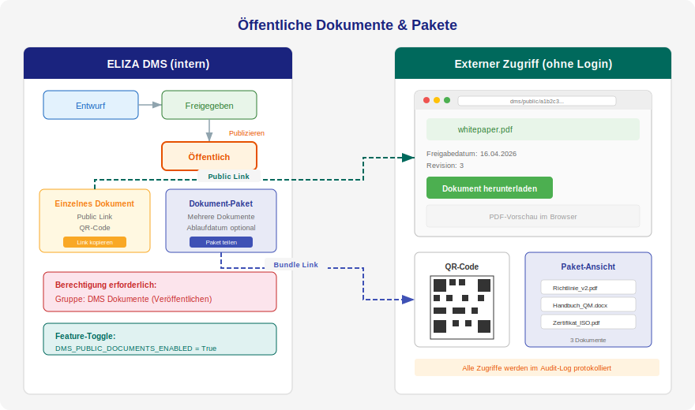

# Öffentliche Dokumente und Dokument-Pakete

Du kannst freigegebene Dokumente über einen öffentlichen Link ohne Login zugänglich machen. Externe Personen — Kunden, Partner oder Prüfer — können diese Dokumente direkt im Browser ansehen und herunterladen, ohne ein ELIZA-Benutzerkonto zu benötigen.

## Voraussetzungen

- Das Feature muss aktiviert sein: **DMS → Einstellungen → Konfiguration → DMS_PUBLIC_DOCUMENTS_ENABLED**
- Du benötigst die Berechtigung **dms.publish_document** (Gruppe: *DMS Dokumente (Veröffentlichen)*)
- Nur **freigegebene** Dokumente können veröffentlicht werden

## Einzelne Dokumente veröffentlichen

### Dokument publizieren

1. Öffne ein **freigegebenes** Dokument
2. Wähle im Workflow die Transition **Publizieren**
3. Das Dokument erhält den Status **Öffentlich**
4. Ein öffentlicher Link wird automatisch generiert

### Öffentlichen Link teilen

Nach dem Publizieren findest du auf der Dokument-Detailseite:

- **Link kopieren** — Kopiert den öffentlichen Link in die Zwischenablage
- **Öffentliche Ansicht** — Öffnet die Public-Seite in einem neuen Tab
- **QR-Code** — Generiert einen QR-Code zum Ausdrucken oder Einbetten
- **Link neu generieren** — Erzeugt einen frischen Token; alle bisher geteilten Links werden sofort ungültig

Der öffentliche Link hat das Format: `https://deine-instanz.myeliza.ch/dms/public/{uuid}/`

> **Tipp:** Der QR-Code eignet sich hervorragend zum Einbetten in gedruckte Dokumente, Poster oder Aushänge.
>
> **Link rotieren:** Falls ein Link versehentlich oder zu breit verteilt wurde, kannst du ihn jederzeit über **Link neu generieren** ungültig machen. Die Aktion wird im Audit-Log protokolliert. Vergiss nicht, den neuen Link allen berechtigten Empfängern erneut zu senden.

### Dokument zurückziehen

Wenn du ein Dokument nicht mehr öffentlich zugänglich machen möchtest:

1. Öffne das öffentliche Dokument
2. Wähle im Workflow die Transition **Zurückziehen**
3. Das Dokument wechselt zurück in den Status **Freigegeben**
4. Der öffentliche Link funktioniert nicht mehr

### Übersicht öffentlicher Dokumente

Alle öffentlichen Dokumente findest du unter:

**DMS → Öffentlich** (Button in der DMS-Navigation)

Hier siehst du eine Tabelle mit allen veröffentlichten Dokumenten, ihren Links und QR-Codes.

---

## Dokument-Pakete (Bundles)

Wenn du mehrere Dokumente zusammen teilen möchtest — zum Beispiel ein Handbuch mit Anhängen, oder eine Sammlung von Richtlinien für einen externen Auditor — kannst du ein **Dokument-Paket** erstellen.

### Neues Paket erstellen

1. Gehe zu **DMS → Pakete** (Button in der DMS-Navigation)
2. Klicke auf **Neues Paket erstellen**
3. Fülle das Formular aus:
   - **Titel** — Ein aussagekräftiger Name für das Paket
   - **Beschreibung** — Optional, wird auf der öffentlichen Seite angezeigt
   - **Ablaufdatum** — Wähle 7, 30 oder 90 Tage, oder unbegrenzt
4. Wähle die gewünschten Dokumente aus — es können **nur öffentliche Dokumente** einem Paket hinzugefügt werden (so ist intern und extern dieselbe Liste sichtbar)
5. Klicke auf **Paket erstellen**

> **Tipp:** Nutze das Suchfeld über der Dokumentliste, um schnell die richtigen Dokumente zu finden.

### Paket verwalten

In der Paket-Detailansicht kannst du:

- **Bearbeiten** — Titel, Beschreibung, Ablaufdatum und Dokumente ändern
- **Aktivieren / Deaktivieren** — Den öffentlichen Zugang ein- und ausschalten
- **Löschen** — Das Paket vollständig entfernen
- **Link kopieren** — Den öffentlichen Link teilen
- **Link öffnen** — Die öffentliche Ansicht in einem neuen Tab öffnen

### Wie sieht die öffentliche Ansicht aus?

Externe Personen sehen:

- Den Paket-Titel und die Beschreibung
- Eine Liste aller enthaltenen Dokumente (nur öffentliche)
- Für jedes Dokument einen **Download-Button**
- Falls vorhanden: einen eingebetteten **PDF-Viewer**

### Ablaufdatum

Pakete mit Ablaufdatum werden nach Ablauf automatisch als **nicht mehr zugänglich** markiert. Externe Personen sehen dann eine Meldung, dass das Paket nicht mehr verfügbar ist.

Du kannst ein abgelaufenes Paket jederzeit wieder aktivieren oder das Ablaufdatum ändern.

---

## Berechtigungen

| Berechtigung | Beschreibung |
|---|---|
| **dms.publish_document** | Dokumente publizieren, zurückziehen, Pakete erstellen und verwalten |
| **Gruppe: dms_publishers** | Benutzer mit dieser Berechtigung |
| **Gruppe: dms_admin** | Hat die Berechtigung automatisch |

> **Wichtig:** Die Gruppe *DMS Dokumente (Veröffentlichen)* wird nur angezeigt, wenn das Feature `DMS_PUBLIC_DOCUMENTS_ENABLED` aktiviert ist.

---

## Sicherheitshinweise

- Öffentliche Links verwenden **zufällige UUIDs** — sie sind nicht erratbar
- Dokumente werden nur angezeigt, wenn sie den Status **Öffentlich** haben
- Über **Link neu generieren** kannst du einen Token jederzeit rotieren — alte Links sind danach sofort ungültig
- Deaktivierte oder abgelaufene Pakete sind sofort nicht mehr zugänglich
- Alle öffentlichen Zugriffe und Token-Rotationen werden im **Audit-Log** protokolliert (wenn DMS_USE_ACCESS_AUDITLOG aktiviert)
- Die Public-Ansicht zeigt **keine internen Bearbeitungs- oder Online-Edit-Links** — externe Personen sehen nur Titel, Metadaten, Beschreibung und einen passiven Datei-Viewer
- Downloads verwenden **Content-Disposition: attachment** — Dateien werden heruntergeladen, nicht im Browser ausgeführt

---

## Anwendungsbeispiele

### Externe Audits
Erstelle ein Paket mit allen relevanten QM-Dokumenten für den Auditor. Setze ein Ablaufdatum von 30 Tagen.

### Kundeninformation
Publiziere Produktdatenblätter oder Zertifikate als einzelne öffentliche Dokumente. Nutze QR-Codes auf Printmaterialien.

### Lieferantenmanagement
Teile Qualitätsrichtlinien und Verhaltenskodex als Paket mit neuen Lieferanten.

### Behörden und Compliance
Stelle Richtlinien und Reglemente öffentlich zur Verfügung, z.B. für Gemeinden oder öffentliche Verwaltungen.
