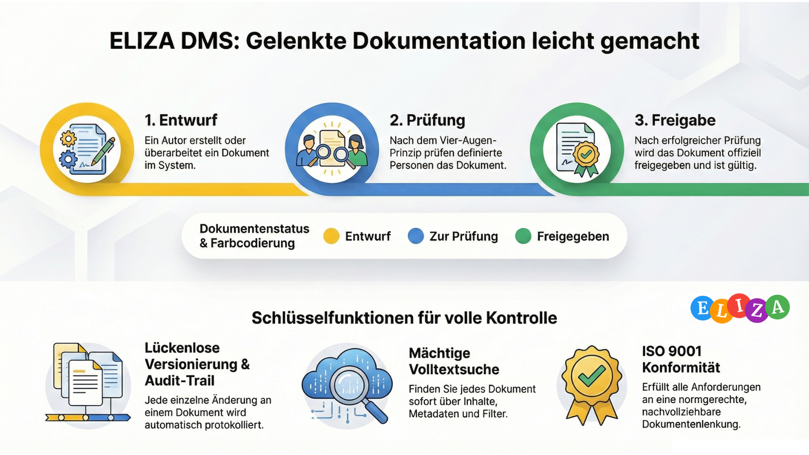

# DMS Benutzerhandbuch

Willkommen zum umfassenden Benutzerhandbuch für das ELIZA Dokumentenmanagementsystem (DMS).

## Über dieses Handbuch

Dieses Handbuch hilft dir, das DMS-Modul effektiv zu nutzen. Es ist in mehrere Kapitel unterteilt, die dich von den Grundlagen bis zu fortgeschrittenen Funktionen führen. Du lernst, wie du Dokumente erstellst, organisierst, versionierst und durch den Freigabe-Workflow führst.

## 📚 Kapitel-Übersicht

### [1. Erste Schritte]()

**Einführung ins DMS**

Lerne die Grundlagen des Dokumentenmanagements in ELIZA kennen. Dieses Kapitel erklärt, was das Modul leistet, wie du darauf zugreifst und welche Hauptfunktionen verfügbar sind.

**Inhalte:**
- Was ist das DMS?
- Hauptfunktionen im Überblick
- Navigation und Dashboard
- Zugriff und Berechtigungen

**Zielgruppe:** Alle Benutzer
**Lesezeit:** ~10 Minuten

---

### [2. Dokumente erstellen und hochladen]()

**Neue Dokumente anlegen und importieren**

Schritt-für-Schritt Anleitung zum Erstellen und Hochladen von Dokumenten. Du erfährst, welche Felder wichtig sind und wie du Dokumente optimal strukturierst.

**Inhalte:**
- Neues Dokument erstellen
- Dateien hochladen (Drag & Drop)
- Pflichtfelder und Metadaten
- Dokument-ID und Titel
- Externe Referenzen (URLs)
- Mehrere Dokumente gleichzeitig hochladen

**Zielgruppe:** Alle Benutzer
**Lesezeit:** ~15 Minuten

---

### [3. Ordnerstruktur und Navigation]()

**Dokumente organisieren und wiederfinden**

Erstelle eine logische Ordnerstruktur und navigiere effizient durch deine Dokumente.

**Inhalte:**
- Ordner erstellen und verwalten
- Ordnerhierarchien aufbauen
- Dokumente in Ordner verschieben
- Breadcrumb-Navigation
- Favoriten und Schnellzugriff
- Zuletzt geöffnete Dokumente

**Zielgruppe:** Alle Benutzer
**Lesezeit:** ~12 Minuten

---

### [4. Dokumenten-Workflow und Status]()

**Dokumenten-Lebenszyklus steuern**

Verstehe den Status-Workflow von der Erstellung bis zur Freigabe. Lerne, wie Prüfungen und Genehmigungen funktionieren.

**Inhalte:**
- Status-Workflow (Entwurf → Prüfung → Geprüft → Freigegeben)
- Dokumente zur Prüfung einreichen
- Dokumente prüfen und genehmigen
- Arbeitskopien erstellen
- Dokumente archivieren
- Abgelaufene Dokumente verwalten

**Zielgruppe:** Alle Benutzer, Dokumentenverantwortliche
**Lesezeit:** ~18 Minuten

---

### [5. Vorlagen und Template-Sprache]()

**Dokumentvorlagen erstellen und nutzen**

Erstelle wiederverwendbare Vorlagen mit dynamischen Platzhaltern für automatisierte Dokumentenerstellung.

**Inhalte:**
- Vorlagen erstellen und verwalten
- Word Template Wizard
- Excel Template-Sprache
- Platzhalter und Variablen
- Vorlagen aus Dokumenten erstellen
- Dokumente aus Vorlagen generieren

**Zielgruppe:** Dokumentenverantwortliche, Administratoren
**Lesezeit:** ~20 Minuten

---

### [6. Versionierung und Historie]()

**Änderungen nachverfolgen und verwalten**

Nutze die Versionierung, um Dokumentenänderungen nachzuverfolgen und bei Bedarf wiederherzustellen.

**Inhalte:**
- Automatische Versionierung
- Versionshistorie anzeigen
- Versionen vergleichen
- Frühere Versionen wiederherstellen
- Revisionsnummern verstehen
- Audit-Trail und Änderungsprotokoll

**Zielgruppe:** Alle Benutzer
**Lesezeit:** ~12 Minuten

---

### [7. Berechtigungen und Zugriff]()

**Zugriffsrechte und Sichtbarkeit steuern**

Verstehe, wie Berechtigungen funktionieren und wer welche Dokumente sehen und bearbeiten kann.

**Inhalte:**
- Berechtigungskonzept im DMS
- Ordner-Berechtigungen
- Dokumenten-Berechtigungen
- Verantwortliche Funktionen
- Prüfer und Freigeber
- Berechtigungen vererben

**Zielgruppe:** Administratoren, Dokumentenverantwortliche
**Lesezeit:** ~15 Minuten

---

### [8. Suche und Filter]()

**Dokumente schnell finden**

Nutze die leistungsstarke Suche und Filter, um Dokumente effizient zu finden.

**Inhalte:**
- Volltextsuche
- Erweiterte Suche mit Filtern
- Nach Dokumentart filtern
- Nach Labels filtern
- Nach Status filtern
- Suchergebnisse sortieren

**Zielgruppe:** Alle Benutzer
**Lesezeit:** ~10 Minuten

---

### [9. Integrationen]()

**Verknüpfung mit anderen Modulen**

Nutze die leistungsstarken Integrationen mit anderen ELIZA-Modulen und externen Systemen.

**Inhalte:**
- Prozess-Verknüpfung (BPMN)
- Mitgeltende Dokumente
- Office 365 / WOPI Integration
- SharePoint-Integration
- AI-Zusammenfassungen
- Kommentare und Diskussionen
- QR-Codes und Validierung

**Zielgruppe:** Fortgeschrittene Benutzer
**Lesezeit:** ~15 Minuten

---

### [10. Best Practices und FAQ]()

**Tipps für effektives Dokumentenmanagement**

Bewährte Methoden und Empfehlungen für die erfolgreiche Dokumentenarbeit in ELIZA.

**Inhalte:**
- Empfohlene Workflows
- Namenskonventionen
- Ordnerstrukturen
- Häufige Fehler vermeiden
- ISO 9001 Dokumentenlenkung
- FAQ

**Zielgruppe:** Alle Benutzer
**Lesezeit:** ~15 Minuten

---

## Spezialthemen

### [11. Excel Template-Sprache]()

**Fortgeschrittene Excel-Vorlagen**

Detaillierte Anleitung zur Excel Template-Sprache mit Variablen, Schleifen und bedingter Formatierung.

**Zielgruppe:** Fortgeschrittene Benutzer, Entwickler
**Lesezeit:** ~25 Minuten

---

### [12. Word Template Wizard]()

**Word-Vorlagen im Handumdrehen erstellen**

Schritt-für-Schritt Anleitung zum 5-Schritte-Wizard für professionelle Word-Vorlagen mit Kopf- und Fusszeilen.

**Zielgruppe:** Dokumentenverantwortliche
**Lesezeit:** ~15 Minuten

---

## Zielgruppen

### 📋 Einsteiger
**Empfohlene Kapitel:** 1-3

Starte mit den ersten Schritten, lerne Dokumente zu erstellen und verstehe die Ordnerstruktur.

### 👔 Dokumentenverantwortliche
**Empfohlene Kapitel:** 4-7, 10

Fokussiere dich auf Workflow, Vorlagen, Versionierung und Berechtigungen. Best Practices helfen dir, Dokumente professionell zu verwalten.

### 🔧 Administratoren
**Empfohlene Kapitel:** 5, 7, 9, 10

Verstehe Vorlagen-Verwaltung, Berechtigungskonzept und Integrationen mit anderen Modulen.

### 💪 Power User
**Empfohlene Kapitel:** Alle Kapitel

Nutze alle Features optimal, von Template-Sprache über Integrationen bis zu fortgeschrittenen Workflows.

---

## Verwendete Konventionen

In diesem Handbuch verwenden wir folgende Konventionen:

- **Fett**: UI-Elemente, Buttons und wichtige Begriffe
- `Code`: Technische Begriffe und Einstellungen
- > Blockquote: Tipps, Warnungen und wichtige Hinweise
- → : Navigation (z.B. DMS → Ordner → Neues Dokument)
- 💡 Tipp
- ⚠️ Wichtig
- ✅ Best Practice
- ❌ Häufiger Fehler

---

## Feedback und Verbesserungen

Dieses Handbuch wird kontinuierlich verbessert. Wenn du Fehler findest oder Verbesserungsvorschläge hast, kontaktiere bitte den Support.

---

## Letzte Aktualisierung

**Version**: 2026.01.30
**Autor**: ELIZA Documentation Team

---

**Viel Erfolg beim Arbeiten mit dem DMS!** 📄
