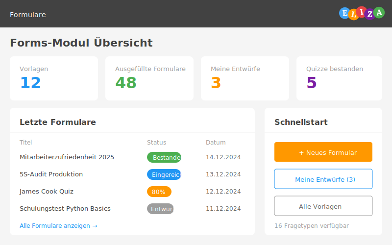

## Was ist das Forms-Modul?

Das Forms-Modul in ELIZA ist dein Werkzeug für die Erstellung, Verwaltung und Auswertung von Formularen und Befragungen. Du kannst damit:

- **Formulare erstellen** für Mitarbeiterbefragungen, Kundenfeedback, Audits und mehr
- **Quizze gestalten** für Schulungen und Wissenstests
- **Benutzer einladen** und Fristen setzen
- **Antworten sammeln** und auswerten
- **Vorlagen wiederverwenden** für wiederkehrende Befragungen



## Hauptfunktionen auf einen Blick

### 📁 Ordner-Struktur

Organisiere deine Formulare und Vorlagen in Ordnern mit flexiblen Berechtigungen:

- **Öffentlich**: Für alle sichtbar
- **Geschützt**: Nur für Team-Mitglieder
- **Privat**: Nur für Administratoren

### 📋 Formular-Vorlagen

Gestalte Vorlagen für wiederkehrende Befragungen:

- Drag & Drop Editor für intuitive Gestaltung
- 14 verschiedene Fragetypen
- Bedingte Fragen (zeige/verberge basierend auf Antworten)
- Verschiedene Layouts (volle Breite, halbe Breite, Drittel)

### ✉️ Benutzer einladen

Lade gezielt Benutzer zum Ausfüllen von Formularen ein:

- Mehrere Benutzer gleichzeitig einladen
- Fristen (Deadlines) setzen
- Bearbeitungsstand überwachen
- Überfällige Einladungen erkennen

### ✅ Formulare ausfüllen

Benutzerfreundliches Ausfüllen von Formularen:

- Einfache Benutzerführung
- Automatische Validierung
- Entwürfe speichern und später fortsetzen
- Übersichtliche Fortschrittsanzeige

### 🎯 Quiz-Modus

Erstelle Tests und Trainings für dein Team:

- **Test-Modus**: Nur ein Versuch möglich
- **Trainings-Modus**: Mehrfache Versuche erlaubt
- Automatische Bewertung
- Bestanden/Nicht bestanden Status
- Anzeige korrekter Antworten (optional)

### 📊 Auswertung

Werte die Antworten aus:

- Einzelne Formulare ansehen
- Statistiken und Übersichten
- Export-Funktionen (in Planung)

## Für wen ist das Forms-Modul?

### 👥 Personalwesen (HR)
- Mitarbeiterbefragungen
- Onboarding-Formulare
- Schulungstests
- 360-Grad-Feedback

### 🏆 Qualitätsmanagement
- Audit-Checklisten
- Prozessbewertungen
- Kundenzufriedenheitsumfragen
- Lieferantenbewertungen

### 📚 Schulung & Training
- Wissenstests nach Schulungen
- E-Learning Quizze
- Kompetenzabfragen
- Trainingsmaterialien

### 👨‍💼 Management
- Mitarbeiterbeurteilungen
- Projektbewertungen
- Strategieworkshops
- Team-Feedback

## Schnellstart

1. **Ordner erstellen**: Organisiere deine Formulare in Ordnern
2. **Vorlage gestalten**: Erstelle eine Vorlage mit Fragen
3. **Benutzer einladen**: Lade Benutzer ein und setze optional eine Frist
4. **Ausfüllen lassen**: Eingeladene Benutzer füllen das Formular aus
5. **Auswerten**: Schaue dir die Antworten an und werte sie aus

## Navigation im Modul

Das Forms-Modul findest du im Hauptmenü unter **Formulare**. Von dort aus kannst du zugreifen auf:

- **Ordner**: Übersicht aller Formular-Ordner
- **Vorlagen**: Liste aller Formular-Vorlagen
- **Formulare**: Aktive und abgeschlossene Formulare

## Typischer Workflow

```
1. VORBEREITUNG
   ↓
   Ordner erstellen → Vorlage mit Fragen gestalten

2. EINLADUNG
   ↓
   Benutzer einladen → Frist setzen → Status überwachen

3. DURCHFÜHRUNG
   ↓
   Benutzer füllen Formular aus → Fortschritt verfolgen

4. AUSWERTUNG
   ↓
   Antworten ansehen → Statistik erstellen → Massnahmen ableiten
```

## Berechtigungen

Du benötigst folgende Berechtigungen, um das Forms-Modul zu nutzen:

- **Formulare ansehen**: Formulare und Vorlagen sehen
- **Formulare bearbeiten**: Formulare erstellen und bearbeiten
- **Formulare verwalten**: Ordner und Berechtigungen verwalten

Dein Administrator kann dir diese Berechtigungen zuweisen.

## Nächste Schritte

- [Arbeiten mit Ordnern]()
- [Vorlagen erstellen]()
- [Benutzer einladen]()
- [Formulare ausfüllen]()
- [Quiz-Modus verwenden]()
- [Alle Fragetypen im Überblick]()
