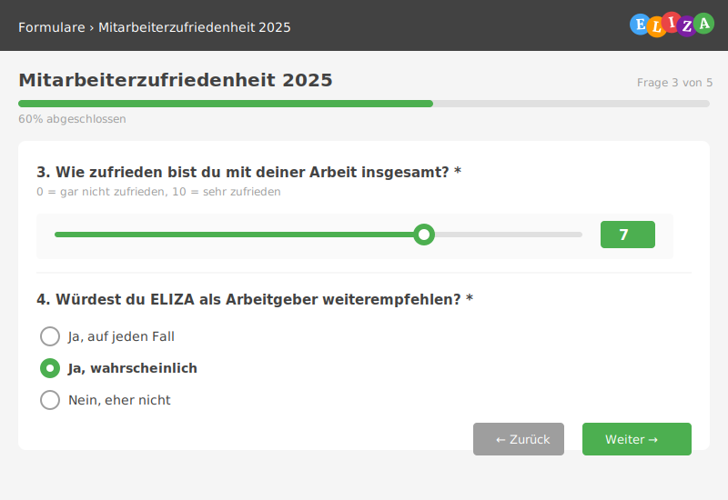

# Formulare ausfüllen

Nachdem eine Vorlage erstellt wurde, können Benutzer Formulare daraus erstellen und ausfüllen.

## 🎯 Was du in diesem Kapitel lernst

- Formulare aus Vorlagen erstellen
- Formulare ausfüllen und speichern
- Entwürfe speichern und später fortsetzen
- Formulare einreichen
- Status-Übersicht verstehen
- Mit verschiedenen Fragetypen arbeiten

---

## 📝 Formular aus Vorlage erstellen

Es gibt mehrere Wege, ein neues Formular zu starten.

### Weg 1: Direkt aus Vorlagen-Liste

> **Formular-Vorlagen**
>
> | Vorlage | Typ | Fragen | Aktion |
> |---------|-----|--------|--------|
> | Mitarbeiterzufriedenheit 2025 | 📋 Formular | 15 | **[Ausfüllen]** |
> | 5S-Audit Produktion | 📋 Checkliste | 25 | **[Ausfüllen]** |

**Schritte:**

1. Navigiere zu **Forms** → **Vorlagen**
2. Finde die gewünschte Vorlage
3. Klicke auf Button **"Ausfüllen"**
4. Das leere Formular öffnet sich

---

### Weg 2: Über "Meine Formulare"

> **Meine Formulare**
>
> 📊 **Übersicht:**
> - 3 Entwürfe
> - 2 zur Überarbeitung
> - 12 abgeschlossen
>
> **[+ Neues Formular erstellen]**

**Schritte:**

1. Navigiere zu **Forms** → **Meine Formulare**
2. Klicke auf **"+ Neues Formular erstellen"**
3. Wähle eine Vorlage aus der Liste
4. Das leere Formular öffnet sich

---

### Weg 3: Über öffentlichen Link

Wenn die Vorlage als "Öffentliches Formular" konfiguriert ist:

> **📧 E-Mail Einladung**
>
> Du wurdest eingeladen, folgendes Formular auszufüllen:
>
> 🔗 **Mitarbeiterzufriedenheit 2025**
> `https://eliza.ch/forms/fill/abc123`
>
> Geschätzte Ausfüllzeit: 10 Minuten
>
> **[Formular öffnen]**

**Schritte:**

1. Klicke auf den Link in der E-Mail
2. Falls erforderlich, melde dich an
3. Das leere Formular öffnet sich

> **💡 Tipp:** Öffentliche Links können auch anonym ausgefüllt werden (wenn aktiviert).

---

## ✍️ Formular ausfüllen

Das Formular präsentiert alle Fragen in der definierten Reihenfolge.

### Formular-Aufbau

> **Mitarbeiterzufriedenheit 2025**
>
> Geschätzte Ausfüllzeit: 10 Minuten
>
> ---
>
> **1. Wie heisst du?** * _(Pflichtfeld)_
>
> **2. Deine E-Mail-Adresse** * _Wird für Rückfragen verwendet_
>
> **3. Wie zufrieden bist du?** (0-10) → Slider: [7]
> _0 = gar nicht, 10 = sehr zufrieden_
>
> **4. Was läuft gut? Was könnte besser sein?** _(Textfeld)_
>
> ---
>
> **[Als Entwurf speichern]** | **[Einreichen]**

**Elemente:**

- **Titel**: Name der Vorlage
- **Zeitangabe**: Geschätzte Ausfüllzeit
- **Pflichtfelder**: Markiert mit Sternchen (*)
- **Hilfetexte**: Erklärungen unter Fragen (kursiv)
- **Fortschrittsbalken**: Zeigt Prozent der ausgefüllten Fragen (optional)

---

### Verschiedene Fragetypen ausfüllen

#### Text-Eingabe

> **Wie heisst du?** *
>
> `Max Mustermann`

**Tipp:** Einfach Text eintippen. Bei Pflichtfeldern (*) ist Eingabe erforderlich.

---

#### E-Mail-Adresse

> **Deine E-Mail** *
>
> `max.mustermann@firma.ch`
>
> ✓ Gültige E-Mail-Adresse

**Validierung:** System prüft automatisch auf gültiges E-Mail-Format.

---

#### Bewertungsskala: Slider

> **Wie zufrieden bist du?** (0-10)
>
> Slider: ○───●───○ → **[7]**
>
> _0 = gar nicht zufrieden ... 10 = sehr zufrieden_

**Bedienung:**
- Ziehe den Punkt mit der Maus
- Oder klicke auf gewünschte Position
- Aktuelle Zahl wird rechts angezeigt

---

#### Bewertungsskala: Zahlenfeld

> **Wie zufrieden bist du?** (0-10)
>
> Eingabefeld: `7`
>
> _(Wertebereich: 0-10)_

**Bedienung:**
- Gib eine Zahl direkt ein
- Pfeiltasten hoch/runter ändern Wert
- Min/Max-Werte werden automatisch begrenzt

---

#### Bewertungsskala: Zahlen-Buttons

> **Wie zufrieden bist du?**
>
> Buttons: `[1]` `[2]` `[●3]` `[4]` `[5]`
>
> _Ausgewählt: 3_

**Bedienung:**
- Klicke auf gewünschte Zahl
- Ausgewählter Button wird hervorgehoben
- Ein Klick genügt

---

#### Bewertungsskala: Sterne-Buttons

> **Wie bewertest du uns?**
>
> ★★★☆☆ _(3 von 5 Sternen)_

**Bedienung:**
- Klicke auf gewünschten Stern
- Alle Sterne bis dorthin werden ausgefüllt
- Perfekt für intuitive Bewertungen

> **💡 Tipp:** Sterne sind besonders auf mobilen Geräten beliebt!

---

#### Single Choice (Einfachauswahl)

> **Wie viel Erfahrung hast du?** *
>
> - ○ Anfänger
> - ● Fortgeschritten _(ausgewählt)_
> - ○ Experte
> - ○ Profi

**Bedienung:**
- Klicke auf gewünschte Option
- Nur eine Auswahl möglich
- Pflichtfeld: Mindestens eine Auswahl erforderlich

---

#### Multiple Choice (Mehrfachauswahl)

> **Was interessiert dich?**
>
> - ☑ Sport _(ausgewählt)_
> - ☐ Musik
> - ☑ Technik _(ausgewählt)_
> - ☐ Reisen
> - ☐ Sonstiges: `_______________`

**Bedienung:**
- Klicke auf mehrere Optionen
- "Sonstiges"-Feld erscheint wenn aktiviert
- Beschreibe eigene Antwort im Freitext

---

#### Ja/Nein-Frage

> **Möchtest du unseren Newsletter erhalten?**
>
> ○ Ja | ● Nein _(ausgewählt)_
>
> **Wenn nein, warum nicht?**
>
> `Bekomme bereits zu viele E-Mails`

**Bedienung:**
- Klicke auf "Ja" oder "Nein"
- Optional: Freitextfeld für Begründung

---

#### Datum

> **Wann bist du geboren?**
>
> `15.03.1990` 📅

**Bedienung:**
- Klicke auf Kalender-Icon
- Wähle Datum aus Kalender-Widget
- Oder tippe im Format TT.MM.JJJJ ein

---

#### Datei-Upload

> **Lade deinen Lebenslauf hoch**
>
> _Klicke hier oder ziehe Datei hinein_
>
> ✓ `lebenslauf.pdf` (256 KB) **[X Entfernen]**
>
> _Erlaubt: PDF, DOCX (max. 5 MB)_

**Bedienung:**
- Klicke auf Feld oder ziehe Datei per Drag & Drop
- Hochgeladene Datei wird angezeigt
- "X" klicken zum Entfernen
- Beachte erlaubte Formate und Größe

---

#### Matrix-Frage

> **Bewerte deine Fähigkeiten**
>
> | Skill | Anfänger | Fortgeschritten | Experte |
> |-------|----------|-----------------|---------|
> | Python | ○ | ● | ○ |
> | JavaScript | ○ | ○ | ● |
> | SQL | ● | ○ | ○ |
> | Docker | ○ | ○ | ● |

**Bedienung:**
- Pro Zeile eine Auswahl treffen
- Jede Zeile ist eine eigene Frage
- Übersichtlich für ähnliche Bewertungen

---

#### Unterschrift

> **Unterschreibe hier**
>
> _[Unterschriften-Zeichenfeld]_
>
> **[Löschen]** | **[Speichern]**

**Bedienung:**
- Zeichne mit Maus (Desktop) oder Finger (Touchscreen)
- "Löschen" startet neu
- "Speichern" übernimmt Unterschrift

> **💡 Tipp:** Nutze ein Tablet oder Touchscreen für natürlichere Unterschriften.

---

## 💾 Entwürfe speichern

Du musst nicht alles auf einmal ausfüllen – speichere Zwischenstände!

### Entwurf speichern

> **Fortschritt: 60%** ████████░░░░ _6 von 10 Fragen_
>
> **[Als Entwurf speichern]**
>
> ✓ Entwurf gespeichert! Du kannst später fortfahren.

**Wann speichern?**

- Zwischendurch beim Ausfüllen
- Vor dem Schließen des Browsers
- Wenn du Informationen recherchieren musst
- Bei Unterbrechungen (Telefon, Meeting)

**Was wird gespeichert?**

- Alle bisher ausgefüllten Felder
- Aktuelle Position im Formular
- Hochgeladene Dateien
- Unterschriften

> **💡 Tipp:** Das System speichert automatisch alle 2 Minuten im Hintergrund!

---

### Entwurf fortsetzen

> **Meine Formulare > Entwürfe (3)**
>
> | Formular | Gespeichert | Fortschritt | Aktionen |
> |----------|-------------|-------------|----------|
> | 📝 Mitarbeiterzufriedenheit 2025 | Heute 14:30 | 60% ████████░░░░ | **[Fortsetzen]** **[Löschen]** |

**Schritte:**

1. Navigiere zu **Forms** → **Meine Formulare**
2. Wähle Tab **"Entwürfe"**
3. Klicke auf **"Fortsetzen"**
4. Formular öffnet sich an gespeicherter Stelle

---

## ✅ Formular einreichen

Sobald alle Pflichtfelder ausgefüllt sind, kannst du das Formular einreichen.

### Einreichen

> **Fortschritt: 100%** ██████████ _10 von 10 Fragen_
>
> ✓ Alle Pflichtfelder ausgefüllt
>
> **[Einreichen]**

**Was passiert beim Einreichen?**

1. **Validierung**: System prüft alle Pflichtfelder
2. **Fehlerprüfung**: Ungültige Eingaben werden markiert
3. **Speicherung**: Formular wird final gespeichert
4. **Status-Wechsel**: Von "Entwurf" → "Eingereicht"
5. **Benachrichtigung**: Bestätigung wird angezeigt
6. **Optional**: E-Mail an Verantwortliche

---

### Bestätigung

> ✅ **Formular erfolgreich eingereicht!**
>
> Vielen Dank für deine Teilnahme!
>
> Deine Antworten wurden gespeichert und werden vertraulich behandelt.
>
> 📧 Du erhältst eine Bestätigung per E-Mail.
>
> **[Zurück zur Übersicht]**

---

### Fehler bei Einreichung

> ⚠️ **Bitte korrigiere folgende Fehler:**
>
> - Frage 2: E-Mail-Adresse ungültig
> - Frage 5: Pflichtfeld nicht ausgefüllt
> - Frage 8: Zahl muss zwischen 0-100 liegen
>
> **[Zu den Fehlern springen]**

**Schritte bei Fehlern:**

1. Klicke auf **"Zu den Fehlern springen"**
2. Korrigiere markierte Felder (rot umrandet)
3. Versuche erneut einzureichen

> **💡 Tipp:** Fehlerhafte Felder werden automatisch rot markiert und scrollen in den Sichtbereich.

---

## 📊 Status-Übersicht

Formulare durchlaufen verschiedene Status.

### Status-Lebenszykl us

> **Formular-Status**
>
> 📝 **Entwurf** → ✅ **Eingereicht** → 🏁 **Abgeschlossen**
>
> _Bei Bedarf:_ ✅ Eingereicht → ✏️ **Zur Überarbeitung** → ✅ Eingereicht

**Status-Bedeutungen:**

- **📝 Entwurf**: In Bearbeitung, noch nicht eingereicht
- **✅ Eingereicht**: Abgeschickt, wartet auf Prüfung
- **✏️ Zur Überarbeitung**: Muss korrigiert werden
- **🏁 Abgeschlossen**: Final akzeptiert

---

### Meine Formulare-Übersicht

> **Meine Formulare**
>
> Tabs: **[Alle]** | [Entwürfe] | [Eingereicht] | [Abgeschl.]
>
> | Formular | Status | Details | Aktionen |
> |----------|--------|---------|----------|
> | 📝 Mitarbeiterzufriedenheit 2025 | Entwurf | Fortschritt: 60%, Heute 14:30 | **[Fortsetzen]** **[Löschen]** |
> | ✅ 5S-Audit Produktion | Eingereicht | 22.11.2025 | **[Anzeigen]** |
> | ✏️ Schulungstest Python Basics | Zur Überarbeitung | Feedback: "Frage 7 bitte präzisieren" | **[Überarbeiten]** |

**Aktionen pro Status:**

- **Entwurf**: Fortsetzen, Löschen
- **Eingereicht**: Anzeigen (nur Lesemodus)
- **Zur Überarbeitung**: Überarbeiten, Feedback lesen
- **Abgeschlossen**: Anzeigen, PDF-Export

---

## ✅ Best Practices

### ✅ Empfehlung 1: Regelmäßig speichern

Auch wenn Auto-Save aktiv ist:
- Speichere vor dem Schließen des Browsers
- Speichere vor Meetings oder Pausen
- Speichere nach größeren Texteingaben

### ✅ Empfehlung 2: Vollständigkeit prüfen

Vor dem Einreichen:
- Scrolle durch alle Fragen
- Prüfe Rechtschreibung bei Freitexten
- Kontrolliere Zahlen und Daten
- Teste hochgeladene Dateien

### ✅ Empfehlung 3: Aussagekräftige Antworten

- Bei Freitexten: Konkrete Beispiele nennen
- Bei Bewertungen: Begründungen hinzufügen
- Bei "Sonstiges": Klar formulieren

### ✅ Empfehlung 4: Zeitmanagement

- Plane genug Zeit ein (siehe geschätzte Ausfüllzeit)
- Fülle Formulare nicht unter Zeitdruck aus
- Nutze Entwürfe bei Unterbrechungen

### ✅ Empfehlung 5: Mobile-freundlich

- Viele Formulare sind mobil optimiert
- Nutze Tablet für Unterschriften
- Fotos können direkt von Handy hochgeladen werden

---

## ❌ Häufige Fehler vermeiden

### ❌ Fehler 1: Browser-Tab schließen ohne Speichern

**Problem:** Ungespei cherte Änderungen gehen verloren.

**Lösung:**
- Nutze "Als Entwurf speichern" regelmäßig
- Auto-Save läuft alle 2 Minuten (aber nicht 100% sicher)
- Browser warnt oft beim Schließen ungespeicherter Formulare

---

### ❌ Fehler 2: Falsche E-Mail-Adresse

**Problem:** Bestätigungen und Rückfragen gehen ins Leere.

**Lösung:**
- Prüfe E-Mail-Adresse doppelt
- Achte auf Tippfehler (@gmali.com statt @gmail.com)
- System zeigt ✓ bei gültiger Syntax

---

### ❌ Fehler 3: Dateien zu groß

**Problem:** Upload schlägt fehl wegen Größenbeschränkung.

**Lösung:**
- Komprimiere PDFs (viele Online-Tools verfügbar)
- Skaliere Bilder runter (z.B. 1920x1080 statt 4K)
- Beachte Limit (meist 5 MB pro Datei)

---

### ❌ Fehler 4: Unvollständige Matrix-Fragen

**Problem:** Nicht alle Zeilen ausgefüllt.

**Lösung:**
- Scrolle durch gesamte Matrix
- Prüfe ob alle Zeilen eine Auswahl haben
- Pflicht-Matrix verlangt Auswahl in jeder Zeile

---

## 🔍 Häufige Fragen (FAQ)

### Kann ich ein eingereicht es Formular ändern?

**Standard:** Nein, eingereichte Formulare sind final.

**Ausnahme:** Wenn Verantwortlicher es auf "Zur Überarbeitung" setzt, kannst du es erneut bearbeiten und einreichen.

---

### Wie lange bleiben Entwürfe gespeichert?

**Standardmäßig:** Unbegrenzt

**Automatische Löschung:**
- Wenn Vorlage gelöscht wird
- Nach Admin-definierten Aufbewahrungsfristen
- Bei manueller Löschung durch dich

> **💡 Tipp:** Lösche alte Entwürfe regelmäßig für bessere Übersicht.

---

### Kann ich ein Formular mehrmals ausfüllen?

**Hängt von Vorlage ab:**
- **Mehrfache Einsendungen erlaubt**: Ja, beliebig oft
- **Nur eine Einsendung**: Nein, nach Einreichung gesperrt
- **Quiz/Training**: Nur Training erlaubt mehrere Versuche

> **Hinweis:** Vorlage-Einstellungen bestimmen dies, nicht du.

---

### Werden meine Antworten vertraulich behandelt?

**Ja, grundsätzlich:**
- Nur Verantwortliche und Admins sehen Antworten
- ELIZA speichert wer wann was ausgefüllt hat
- Auswertungen können anonymisiert werden

**Bei anonymen Formularen:**
- Kein Benutzer-Tracking
- Keine E-Mail-Erfassung
- Absolut anonym (wenn aktiviert)

---

### Was passiert wenn ich Formular nicht einreiche?

**Entwurf bleibt gespeichert:**
- Du kannst jederzeit fortfahren
- Keine Frist (außer Vorlage definiert Deadline)
- Optional: Erinnerungs-E-Mails vom System

**Konsequenzen:**
- Verantwortliche sehen: "Noch nicht eingereicht"
- Antworten fließen nicht in Auswertung ein
- Bei Pflicht-Formularen: Nachfragen vom Team

---

### Kann ich Antworten nachträglich einsehen?

**Nach Einreichung:**
- **Lesemodus**: Ja, unter "Meine Formulare"
- **PDF-Export**: Oft verfügbar für eigene Unterlagen
- **Ändern**: Nur wenn auf "Zur Überarbeitung" gesetzt

---

## 📚 Zusammenfassung

In diesem Kapitel hast du gelernt:

- ✅ Formulare aus Vorlagen erstellen (3 Wege)
- ✅ Verschiedene Fragetypen ausfüllen
- ✅ Entwürfe speichern und fortsetzen
- ✅ Formulare validieren und einreichen
- ✅ Status-Übersicht verstehen
- ✅ Best Practices für professionelles Ausfüllen

---

## 🚀 Nächste Schritte

- **[Quiz-Modus]()**: Lerne Tests und Trainings durchzuführen
- **[Alle Fragetypen]()**: Detaillierte Übersicht aller Eingabe-Möglichkeiten
- **[Checklisten]()**: Erfahre mehr über Audit-Checklisten

---

**Viel Erfolg beim Ausfüllen deiner Formulare! 🎉**
