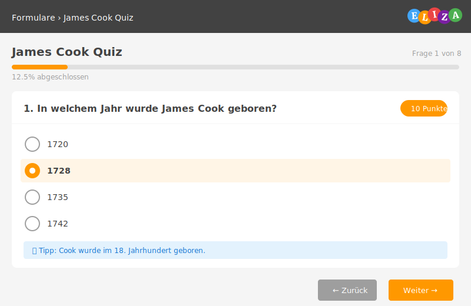
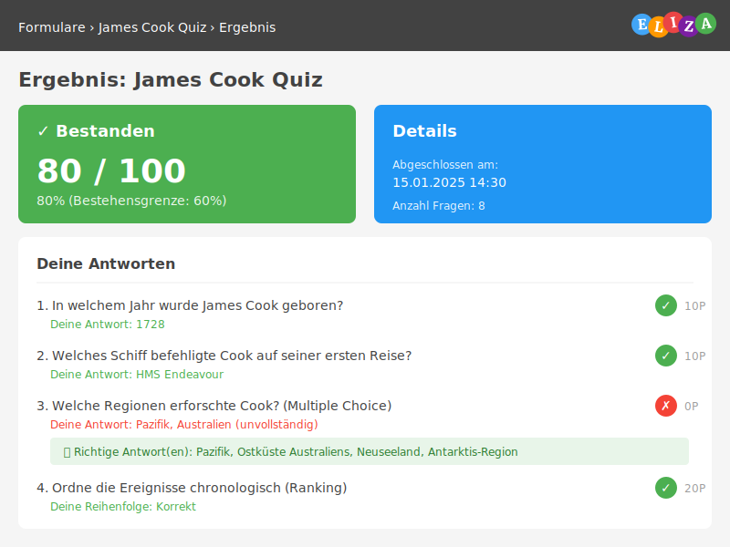

## Übersicht

Der Quiz-Modus ermöglicht es dir, interaktive Tests und Trainings zu erstellen. Du kannst Fragen mit korrekten Antworten versehen, Punkte vergeben und eine Bestehensgrenze festlegen.



## Quiz-Modi

### Quiz-Test
- **Einmaliger Versuch**: Teilnehmer können das Quiz nur einmal ausfüllen
- **Bewertung**: Bestanden/Nicht bestanden mit Punktzahl
- **Ideal für**: Prüfungen, Zertifizierungen, Abschlusstests
- **Verwendung**: Wenn du ein offizielles Testergebnis brauchst

### Quiz-Training
- **Mehrere Versuche**: Teilnehmer können das Quiz beliebig oft wiederholen
- **Lernmodus**: Lernen durch Wiederholung und Feedback
- **Ideal für**: Schulungen, Übungen, Selbststudium
- **Verwendung**: Wenn Teilnehmer üben und lernen sollen

## Quiz erstellen - Schritt für Schritt

### Schritt 1: Vorlage erstellen

1. Navigiere zu **Formulare → Vorlagen → Neue Vorlage**
2. Fülle die Grundinformationen aus:
   - **Titel**: z.B. "James Cook Quiz"
   - **Beschreibung**: Kurze Erklärung des Quiz-Inhalts
   - **Kategorie**: Wähle passende Kategorie (z.B. "Schulung")

3. Wähle den **Modus**:
   - **Test**: Für offizielle Tests (nur ein Versuch)
   - **Quiz**: Für Übungen (mehrere Versuche möglich)

4. Konfiguriere die Quiz-Einstellungen:
   - **Bestehensgrenze**: z.B. 60% (Teilnehmer müssen mindestens 60% erreichen)
   - **Richtige Antworten zeigen**: Aktivieren, wenn Teilnehmer die richtigen Antworten sehen sollen
   - **Fragen randomisieren**: Optional - mischt die Fragen-Reihenfolge

### Schritt 2: Fragen hinzufügen

Füge Fragen direkt in der Vorlage hinzu:

**Geeignete Fragetypen für Quiz:**
- ✅ **Single Choice** - Eine richtige Antwort
- ✅ **Multiple Choice** - Mehrere richtige Antworten
- ✅ **Ranking** - Korrekte Reihenfolge
- ✅ **Ja/Nein** - Wahre oder falsche Aussagen
- ✅ **Ganzzahl** - Numerische Antworten

**Nicht geeignet:**
- ❌ Freitext-Fragen (können nicht automatisch bewertet werden)
- ❌ Datei-Uploads
- ❌ Unterschriften

### Schritt 3: Punkte vergeben

Für jede Frage in der Vorlage:

1. Klicke auf **Bearbeiten** bei der Frage
2. Setze die **Punktzahl** (z.B. 10 Punkte)
3. Die Gesamtpunktzahl wird automatisch berechnet

**Empfohlene Punkteverteilung:**
- Einfache Fragen: 5-10 Punkte
- Mittelschwere Fragen: 10-15 Punkte
- Schwierige Fragen: 15-20 Punkte
- Ranking/Multiple Choice: Höhere Punktzahl (komplexer)

### Schritt 4: Korrekte Antworten definieren

#### Single Choice / Multiple Choice

1. Bei jeder Auswahl-Option die Checkbox **"Ist korrekt"** setzen
2. Bei **Single Choice**: Nur eine Option markieren
3. Bei **Multiple Choice**: Alle richtigen Optionen markieren

**Wichtig:** Bei Multiple Choice müssen Teilnehmer ALLE richtigen Antworten auswählen, um die volle Punktzahl zu erhalten.

#### Ranking-Fragen

1. Definiere die Items im Feld **"Konfiguration"**
2. Setze die **korrekte Reihenfolge** im Feld "Richtige Antworten"
3. Format: JSON-Array mit Items in chronologischer/richtiger Reihenfolge

**Beispiel:** Ereignisse aus James Cooks Leben
```json
{
  "order": [
    "Geburt in England",
    "Beobachtung des Venustransits auf Tahiti",
    "Erste Kartierung der Ostküste Australiens",
    "Überquerung des südlichen Polarkreises",
    "Entdeckung der Hawaii-Inseln",
    "Tod auf Hawaii"
  ]
}
```

**Tipp:** Verwende keine Jahreszahlen in den Item-Namen - das macht es zu einfach!

#### Ja/Nein-Fragen

Wähle die korrekte Antwort (Ja oder Nein) im Feld **"Richtige Antwort"**

#### Ganzzahl-Fragen

Gib den korrekten numerischen Wert im Feld **"Richtige Antwort"** ein

## Quiz-Ergebnis-Anzeige



### Was Teilnehmer nach dem Absenden sehen

Nach dem Absenden des Quiz erhalten Teilnehmer eine übersichtliche Auswertung:

#### Gesamtergebnis
- **Erreichte Punktzahl**: z.B. "80,00 / 100,00 Punkte"
- **Prozentsatz**: z.B. "80%"
- **Status-Badge**: "Bestanden" (grün) oder "Nicht bestanden" (rot)
- **Abschlussdatum**: Wann das Quiz abgeschlossen wurde

#### Pro Frage
- **Richtig/Falsch-Icon**: ✓ (grün) oder ✗ (rot)
- **Deine Antwort**: Was du ausgewählt/eingegeben hast
- **Richtige Antwort** (wenn aktiviert): Die korrekte Lösung wird angezeigt

### Darstellung der richtigen Antworten

Die korrekten Antworten werden benutzerfreundlich dargestellt:

- **Dezente Farbgebung**: Hellgrüner Hintergrund, nicht aufdringlich
- **Türkise Chips**: Richtige Antworten als türkisfarbene Chips mit weißem Text
- **Gute Lesbarkeit**: Optimaler Kontrast für alle Altersgruppen
- **Glühbirnen-Icon**: Visueller Hinweis auf "Richtige Antwort"

**Bei Single/Multiple Choice:**
```
💡 Richtige Antwort(en):
[William Bligh (Seefahrer)] [Daniel Solander] [Joseph Banks]
```

**Bei Ranking-Fragen:**
```
💡 Richtige Reihenfolge:
1. Geburt in England
2. Beobachtung des Venustransits auf Tahiti
3. Erste Kartierung der Ostküste Australiens
...
```

## Beispiel: James Cook Quiz

Ein vollständiges Beispiel-Quiz zeigt verschiedene Fragetypen in Aktion:

### Übersicht
- **8 Fragen** über den britischen Seefahrer James Cook
- **100 Punkte** Gesamtpunktzahl
- **60% Bestehensgrenze**
- **Gemischte Fragetypen**: Single Choice, Multiple Choice, Ranking

### Beispiel-Fragen

**Frage 1: Geburtsjahr** (Single Choice, 10 Punkte)
- 4 Antwortoptionen
- Nur eine ist korrekt (1728)
- Antworten sind durcheinander gemischt

**Frage 4: Erforschte Regionen** (Multiple Choice, 15 Punkte)
- 6 Antwortoptionen
- 4 davon sind korrekt
- Teilnehmer müssen alle 4 richtigen auswählen

**Frage 6: Chronologische Ereignisse** (Ranking, 20 Punkte)
- 6 Ereignisse aus Cooks Leben
- Müssen in richtige zeitliche Reihenfolge gebracht werden
- Ohne Jahreszahlen für höhere Schwierigkeit

## Best Practices

### Fragen-Design

✅ **Empfohlen:**
- Antwort-Reihenfolge durcheinander mischen
- Klare, eindeutige Fragestellungen
- Angemessene Schwierigkeit für Zielgruppe
- Hilfetext bei komplexen Fragen
- Konsistente Punktevergabe

❌ **Vermeiden:**
- Zu viele Fragen (Richtwert: 5-15 Fragen)
- Jahreszahlen in Ranking-Items
- Mehrdeutige oder Trick-Fragen
- Zu lange Fragetexte
- Unklare Formulierungen

### Punktevergabe-Strategie

**Ausgewogene Verteilung:**
- 20% einfache Fragen (zum Einstieg)
- 60% mittelschwere Fragen (Hauptteil)
- 20% schwierige Fragen (Differenzierung)

**Nach Fragetyp:**
- Single Choice: 5-10 Punkte
- Multiple Choice: 10-15 Punkte (komplexer)
- Ranking: 15-20 Punkte (am schwierigsten)
- Ja/Nein: 5 Punkte (einfach zu raten)

### Bestehensgrenze festlegen

**Wähle die Grenze passend zum Zweck:**
- **50-60%**: Locker, für erste Orientierung
- **60-80%**: Standard, für normale Tests
- **80-100%**: Streng, für Zertifizierungen

**Faustregel:** Bei 60% Bestehensgrenze sollten durchschnittliche Teilnehmer bestehen, wenn sie den Stoff gelernt haben.

### Feedback und Lernen

**Wenn Lernen im Vordergrund steht:**
- ✅ Quiz-Training Modus verwenden
- ✅ "Richtige Antworten zeigen" aktivieren
- ✅ Hilfetext bei Fragen hinzufügen
- ✅ Niedrigere Bestehensgrenze (50-60%)

**Wenn Prüfung im Vordergrund steht:**
- ✅ Quiz-Test Modus verwenden
- ❌ "Richtige Antworten zeigen" deaktivieren
- ✅ Fragen randomisieren
- ✅ Höhere Bestehensgrenze (70-80%)

## Häufige Fragen

### Kann ich die Fragen randomisieren?
Ja! Aktiviere die Option **"Fragen in zufälliger Reihenfolge"** in der Vorlage. Jeder Teilnehmer erhält die Fragen in einer anderen Reihenfolge.

### Werden auch die Antworten gemischt?
Ja, die Antwort-Reihenfolge sollte bereits beim Erstellen der Fragen durcheinander sein. Die Reihenfolge wird dann für alle Teilnehmer gleich beibehalten.

### Wie viele Versuche haben Teilnehmer?
- **Quiz-Test**: Genau 1 Versuch
- **Quiz-Training**: Unbegrenzt viele Versuche

### Können Teilnehmer ihre Antworten nachträglich ändern?
Nein, nach dem Absenden sind die Antworten final. Bei Quiz-Training können Teilnehmer aber ein neues Quiz starten.

### Sehen Teilnehmer sofort ihr Ergebnis?
Ja, nach dem Absenden wird direkt die Auswertung mit Punktzahl und Status (Bestanden/Nicht bestanden) angezeigt.

### Können Teilnehmer die richtigen Antworten sehen?
Nur wenn du die Option **"Richtige Antworten zeigen"** in der Vorlage aktiviert hast. Ansonsten sehen sie nur, ob ihre Antworten richtig oder falsch waren.

### Wie verhindere ich, dass Teilnehmer mogeln?
- Nutze **Quiz-Test Modus** (nur 1 Versuch)
- Deaktiviere **"Richtige Antworten zeigen"**
- Aktiviere **"Fragen randomisieren"**
- Mische die Antwort-Reihenfolge
- Setze Zeitlimit (wenn möglich)

### Kann ich verschiedene Fragetypen mischen?
Ja! Du kannst Single Choice, Multiple Choice, Ranking, Ja/Nein und Ganzzahl-Fragen beliebig im selben Quiz kombinieren.

### Wie erstelle ich ein gutes Multiple-Choice-Quiz?
- Stelle sicher, dass mehrere Antworten tatsächlich richtig sind
- Verwende 4-6 Antwortoptionen insgesamt
- Markiere 2-4 davon als korrekt
- Vermeide offensichtlich falsche "Ablenkungen"

### Was passiert, wenn ein Teilnehmer nicht alle richtigen Antworten auswählt?
Bei Multiple Choice gibt es nur Punkte, wenn ALLE richtigen Antworten ausgewählt wurden. Es gibt keine Teilpunkte.

## Troubleshooting

### Problem: Alle Antworten werden als falsch markiert
**Lösung:** Prüfe, ob bei den Auswahl-Optionen die Checkbox **"Ist korrekt"** gesetzt ist. Ohne diese Markierung weiß das System nicht, welche Antworten richtig sind.

### Problem: Teilnehmer sehen 0 Punkte / 0,00%
**Lösung:**
1. Prüfe, ob jede Frage im Template eine Punktzahl hat
2. Stelle sicher, dass die `is_correct` Flags bei den Choices gesetzt sind
3. Bei Ranking: Prüfe das `correct_answers` JSONField

### Problem: Richtige Antworten werden nicht angezeigt
**Lösung:** Aktiviere die Option **"Richtige Antworten zeigen"** in der Vorlagen-Einstellungen.

### Problem: Ranking-Reihenfolge ist unleserlich
**Lösung:** Das wurde behoben! Die Ereignisse sollten jetzt mit schwarzem Text und türkisen Badges dargestellt werden.

### Problem: Quiz-Ergebnis wird nicht gespeichert
**Lösung:** Das `calculate_score()` wird automatisch beim Absenden aufgerufen. Falls es nicht funktioniert, kontaktiere deinen Administrator.

## Tipps für Trainer

### Effektive Quiz-Struktur
1. **Einstieg**: 1-2 einfache Aufwärmfragen (10%)
2. **Hauptteil**: 5-10 Kernfragen (70%)
3. **Abschluss**: 1-2 Transferfragen (20%)

### Schwierigkeitsgrad staffeln
- Beginne mit Single Choice
- Steigere zu Multiple Choice
- Schließe mit Ranking ab

### Feedback nutzen
- Nutze Hilfetext, um Kontext zu geben
- Zeige bei Training-Quiz die richtigen Antworten
- Erkläre WARUM eine Antwort richtig ist (im Hilfetext)

### Quiz-Auswertung
Nach Durchführung:
1. Prüfe die Bestehensquote
2. Identifiziere schwierige Fragen (oft falsch beantwortet)
3. Passe Schwierigkeit oder Formulierung an
4. Gib persönliches Feedback bei Nicht-Bestehen

---

**Viel Erfolg beim Erstellen deiner Quiz! 🎯**
