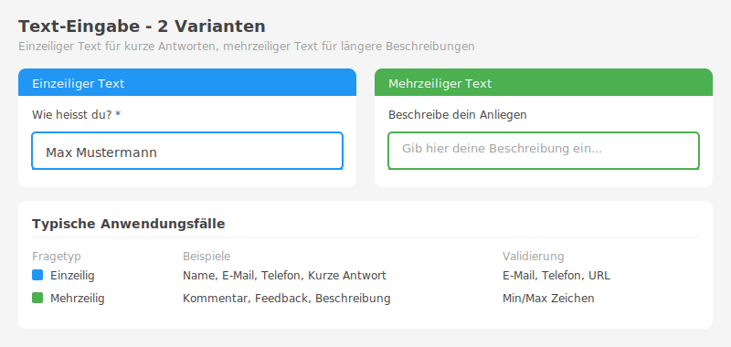
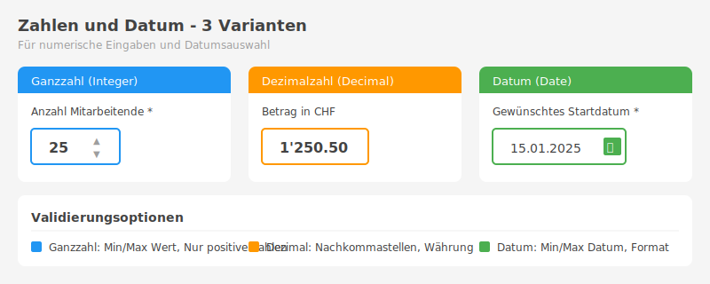
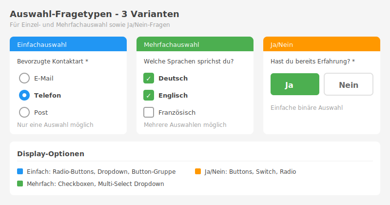
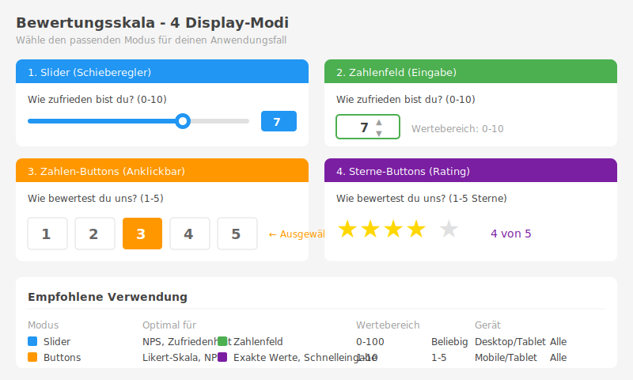
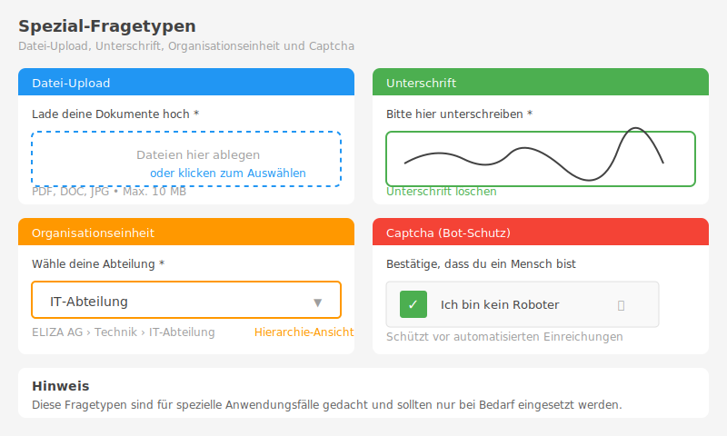

Das Forms-Modul bietet 16 verschiedene Fragetypen für unterschiedliche Anwendungsfälle.

## 📰 Inhaltsblöcke


### 1. Inhaltsblock
**Antworttyp:** `content`

Ein Inhaltsblock ist **kein Eingabefeld**, sondern dient zur Anzeige von erklärendem Text und/oder Bildern innerhalb des Formulars. Perfekt für Anleitungen, Erklärungen oder visuelle Elemente zwischen Fragen.

**Konfiguration:**
- Markdown-formatierter Text
- Optionales Bild
- Layout-Auswahl (Bild/Text-Anordnung)
- Bildrahmen-Radius (abgerundete Ecken)

**Layout-Optionen:**

| Layout | Darstellung |
|--------|-------------|
| **Volle Breite** (Standard) | Bild oben, Text darunter (100% Breite) |
| **Bild links** | Bild links (50%), Text rechts daneben |
| **Bild rechts** | Text links, Bild rechts (50%) |

**Beispiele:**
```
"Willkommen zur Mitarbeiterbefragung 2025!"

Hier kannst du anonym dein Feedback geben. Die Umfrage dauert
ca. 10 Minuten. Alle Antworten werden vertraulich behandelt.

**Wichtig:** Bitte beantworte alle Fragen ehrlich.

[Bild: Logo oder Illustration]
```

**Wann verwenden:**
- Für Einleitungstexte und Erklärungen
- Für Abschnittstrennungen mit Überschriften
- Für Bilder und Illustrationen zwischen Fragen
- Für wichtige Hinweise und Anleitungen
- Für Datenschutz-Hinweise oder rechtliche Informationen

**Vorteile:**
- ✅ Markdown-Support (fett, kursiv, Listen, Links)
- ✅ Klickbare Bilder (Vergrösserung bei Klick)
- ✅ Responsive Design (passt sich Mobile an)
- ✅ Keine Speicherung - reine Anzeige

> **💡 Tipp:** Verwende Inhaltsblöcke um lange Formulare in logische Abschnitte zu gliedern und dem Benutzer Kontext zu geben.

---

## 📝 Text-Eingabe



### 2. Einzeiliger Text
**Antworttyp:** `text`

Für kurze Texteingaben wie Namen, Titel oder kurze Antworten.

**Konfiguration:**
- Maximale Länge: 500 Zeichen
- Einzeilige Eingabe

**Beispiele:**
```
"Wie lautet deine Abteilung?"
"Gib einen Titel für deinen Verbesserungsvorschlag an"
"Dein Name"
```

**Wann verwenden:**
- Für demografische Daten
- Für Identifikationsinformationen
- Für kurze, präzise Antworten

---

### 3. Mehrzeiliger Text
**Antworttyp:** `textarea`

Für längere Texteingaben und offenes Feedback.

**Konfiguration:**
- Unbegrenzte Länge
- Mehrzeilige Eingabe
- Automatische Höhenanpassung

**Beispiele:**
```
"Welche Verbesserungsvorschläge hast du?"
"Beschreibe deine Erwartungen an die neue Position"
"Was hat dir an der Schulung besonders gut gefallen?"
```

**Wann verwenden:**
- Für offenes Feedback
- Für ausführliche Beschreibungen
- Für Kommentare und Begründungen

---

## 🔢 Zahlen-Eingabe



### 4. Ganzzahl
**Antworttyp:** `integer`

Für ganze Zahlen ohne Dezimalstellen.

**Konfiguration:**
- Nur ganze Zahlen erlaubt
- Optional: Min/Max Werte
- Für Quiz: Korrekte Antwort definierbar

**Beispiele:**
```
"Wie viele Jahre Berufserfahrung hast du?"
"Anzahl Schulungstage pro Jahr"
"Wie viele Mitarbeiter hat dein Team?"
```

**Wann verwenden:**
- Für Mengenangaben
- Für Anzahlen
- Für Altersangaben

---

### 5. Dezimalzahl
**Antworttyp:** `decimal`

Für Zahlen mit Dezimalstellen.

**Konfiguration:**
- Bis zu 10 Stellen, 2 Dezimalstellen
- Optional: Min/Max Werte
- Schweizer Format (Punkt als Dezimaltrenner)

**Beispiele:**
```
"Wie hoch ist dein Arbeitspensum? (z.B. 0.8 für 80%)"
"Bewerte die Schulung (0.0 bis 10.0)"
"Durchschnittliche Projektlaufzeit in Monaten"
```

**Wann verwenden:**
- Für Prozentangaben
- Für Bewertungen mit Dezimalstellen
- Für Messungen

---

### 6. Datum
**Antworttyp:** `date`

Für Datumsangaben.

**Konfiguration:**
- Schweizer Datumsformat (TT.MM.JJJJ)
- Datepicker-Widget
- Optional: Min/Max Datum

**Beispiele:**
```
"Wann hast du die Schulung absolviert?"
"Dein Eintrittsdatum"
"Geplantes Abschlussdatum des Projekts"
```

**Wann verwenden:**
- Für Zeitpunkte
- Für Fristen
- Für historische Daten

---

## ☑️ Auswahl-Fragen



### 7. Einfachauswahl (Single Choice)
**Antworttyp:** `single_choice`

Genau eine Option kann ausgewählt werden.

**Konfiguration:**
- Liste von Auswahlmöglichkeiten
- Optional: Korrekte Antwort für Quiz
- Darstellung als Radio Buttons

**Beispiel:**
```
"Wie häufig nutzt du das DMS-Modul?"
○ Täglich
○ Mehrmals pro Woche
○ Einmal pro Woche
○ Seltener
○ Nie
```

**Wann verwenden:**
- Wenn nur eine Antwort richtig ist
- Für demografische Fragen
- Für Kategorisierungen

---

### 8. Mehrfachauswahl (Multiple Choice)
**Antworttyp:** `multiple_choice`

Mehrere Optionen können ausgewählt werden.

**Konfiguration:**
- Liste von Auswahlmöglichkeiten
- Optional: Korrekte Antworten für Quiz
- Darstellung als Checkboxen

**Beispiel:**
```
"Welche ELIZA-Module nutzt du regelmässig?"
☑ Dashboard
☑ DMS
☐ Prozesse
☑ Projekte
☐ Issues
☑ Timetracker
```

**Wann verwenden:**
- Wenn mehrere Antworten möglich sind
- Für Interessensabfragen
- Für Mehrfachnennung

---

### 9. Ja/Nein
**Antworttyp:** `yesno`

Einfache Entscheidungsfrage.

**Konfiguration:**
- Zwei Optionen: Ja oder Nein
- Optional: Korrekte Antwort für Quiz
- Darstellung als Toggle oder Radio Buttons

**Beispiel:**
```
"Wurde die Schulung rechtzeitig angekündigt?"
○ Ja
○ Nein
```

**Wann verwenden:**
- Für eindeutige Ja/Nein-Fragen
- Für Compliance-Checks
- Für binäre Entscheidungen

---

## 📊 Bewertungs-Fragen

### 10. Bewertungsskala (Scale)
**Antworttyp:** `scale`

Numerische Bewertung auf einer Skala mit **4 verschiedenen Darstellungsformen**.



**Konfiguration:**
- Minimum-Wert (z.B. 0, 1)
- Maximum-Wert (z.B. 5, 10, 100)
- Schrittweite (z.B. 1 oder 0.5)
- **Display-Modus**: Slider, Zahlenfeld, Zahlen-Buttons, Sterne-Buttons

---

#### Display-Modus 1: Slider (Standard)

Schieberegler für intuitive Auswahl.

```
Wie zufrieden bist du?
╌╌╌╌╌╌●╌╌╌╌╌  [7]
0                                              10
```

**Vorteile:**
- Visuell ansprechend
- Schnelle Eingabe durch Klicken oder Ziehen
- Gut für große Wertebereiche (0-100)

**Wann verwenden:**
- NPS-Umfragen (0-10)
- Zufriedenheitsskalen (0-100)
- Große Wertebereiche

---

#### Display-Modus 2: Zahlenfeld

Direkteingabe für präzise Werte.

```
Wie zufrieden bist du? (0-10)
┌──────┐
│  7   │
└──────┘
```

**Vorteile:**
- Exakte Eingabe möglich
- Schnell bei bekanntem Wert
- Tastatureingabe möglich

**Wann verwenden:**
- Wenn Benutzer exakte Zahlen kennen
- Für kleine Wertebereiche
- Für schnelle Eingabe

---

#### Display-Modus 3: Zahlen-Buttons

Anklickbare Zahlen für klare Auswahl.

```
Wie bewertest du uns?
┌───┐ ┌───┐ ┌───┐ ┌───┐ ┌───┐
│ 1 │ │ 2 │ │ 3 │ │ 4 │ │ 5 │
└───┘ └───┘ └───┘ └───┘ └───┘
        Ausgewählt: ●
```

**Vorteile:**
- Alle Optionen auf einen Blick sichtbar
- Ein Klick genügt
- Mobile-freundlich (große Buttons)

**Wann verwenden:**
- Likert-Skalen (1-5)
- NPS mit visueller Übersicht
- Mobile-optimierte Formulare

---

#### Display-Modus 4: Sterne-Buttons

Anklickbare Sterne für intuitive Bewertungen.

```
Wie bewertest du uns?
☆ ☆ ☆ ★ ★  (3 von 5 Sternen)
```

**Vorteile:**
- Universell verständlich (wie Amazon, Google)
- Visuell ansprechend
- Perfekt für Bewertungen und Reviews

**Wann verwenden:**
- Produktbewertungen
- Service-Feedback
- Schulungsbewertungen
- Überall wo "Sterne" intuitiv sind

---

**Konfiguration im Vorlagen-Editor:**

Beim Bearbeiten einer Scale-Frage kannst du den Display-Modus wählen:

> **Bewertungsskala konfigurieren**
>
> **Darstellung:** Slider (Schieberegler) | Zahlenfeld (Eingabe) | Buttons (Anklickbar)
>
> **Button-Stil:** (nur bei Buttons) Zahlen (1 2 3 4 5) | Sterne (⭐⭐⭐⭐⭐)
>
> **Wertebereich:** Min: 1 | Max: 5 | Schrittweite: 1
>
> **[Speichern]**

---

**Empfohlene Kombinationen:**

| Anwendungsfall | Display-Modus | Wertebereich |
|----------------|---------------|--------------|
| NPS-Score | Zahlen-Buttons | 0-10 |
| Zufriedenheit | Slider | 0-100 |
| Service-Rating | Sterne-Buttons | 1-5 |
| Schnelle Eingabe | Zahlenfeld | Beliebig |
| Likert-Skala | Zahlen-Buttons | 1-5 |
| Schulungsbewertung | Sterne-Buttons | 1-5 |

---

**Wann welchen Modus verwenden:**

- **Slider**: Große Wertebereiche, visuelle Auswahl
- **Zahlenfeld**: Exakte Werte, schnelle Eingabe
- **Zahlen-Buttons**: Kleine Bereiche (1-10), mobile Geräte
- **Sterne-Buttons**: Bewertungen, Reviews, 1-5 Skala

---

### 11. Matrix-Frage


**Antworttyp:** `matrix`

Mehrere Aspekte mit derselben Bewertungsskala.

**Konfiguration:**
- Zeilen: Zu bewertende Aspekte
- Spalten: Bewertungsoptionen
- Kompakte Darstellung

**Beispiel:**
```
"Bewerte folgende Aspekte der Schulung:"

                    | Sehr gut | Gut | Befriedigend | Schlecht |
Inhalt              |    ○     |  ○  |      ○       |    ○     |
Vermittlung         |    ○     |  ○  |      ○       |    ○     |
Unterlagen          |    ○     |  ○  |      ○       |    ○     |
Praxisbezug         |    ○     |  ○  |      ○       |    ○     |
Zeitlicher Umfang   |    ○     |  ○  |      ○       |    ○     |
```

**Wann verwenden:**
- Wenn mehrere ähnliche Aspekte bewertet werden
- Für kompakte Fragebögen
- Für standardisierte Bewertungen

---

### 12. Ranking
**Antworttyp:** `ranking`

Optionen in eine Reihenfolge bringen.

**Konfiguration:**
- Liste von Optionen
- Drag & Drop Sortierung
- Nummerierte Ausgabe

**Beispiel:**
```
"Bringe folgende Weiterbildungsthemen nach Wichtigkeit in eine Reihenfolge:"

1. _______________
2. _______________
3. _______________
4. _______________
5. _______________

Verfügbare Themen (ziehen und ablegen):
- Projektmanagement
- Führungskompetenz
- Digitale Transformation
- Zeitmanagement
- Konfliktmanagement
```

**Wann verwenden:**
- Für Priorisierungen
- Für Präferenz-Erhebungen
- Für strategische Entscheidungen

---

## 📎 Spezial-Typen



### 13. Datei-Upload
**Antworttyp:** `file`

Upload von Dateien und Dokumenten.

**Konfiguration:**
- Erlaubte Dateitypen (z.B. "pdf,docx,jpg")
- Maximale Dateigrösse (in MB)
- Minimale/Maximale Anzahl Dateien

**Beispiel:**
```
"Lade dein Ausbildungszertifikat hoch"

Erlaubte Formate: PDF, JPG, PNG
Maximale Grösse: 5 MB
Anzahl Dateien: Mindestens 1, maximal 3

[Dateien auswählen] [Drag & Drop Bereich]
```

**Wann verwenden:**
- Für Zertifikatsnachweise
- Für Dokumenten-Einreichung
- Für Bildmaterial
- Für Belege

---

### 14. Unterschrift
**Antworttyp:** `signature`

Digitale Unterschrift mit Maus oder Touch.

**Konfiguration:**
- Canvas für Unterschrift
- Speicherung als Bild
- Löschen und Neu-Zeichnen möglich

**Beispiel:**
```
"Unterschreibe zur Bestätigung, dass du die Datenschutzerklärung gelesen hast"

[Unterschriften-Feld]
[Löschen] [Fertig]
```

**Wann verwenden:**
- Für rechtliche Bestätigungen
- Für Einverständniserklärungen
- Für Abnahmeprozesse
- Für Audit-Trails

---

### 15. Organisationseinheit
**Antworttyp:** `orgunit`

Auswahl einer Organisationseinheit aus ELIZA.

**Konfiguration:**
- Verknüpfung mit Organisation-Modul
- Dropdown mit allen verfügbaren Orgunits
- Hierarchische Darstellung

**Beispiel:**
```
"Wähle deine Abteilung aus"

[Dropdown]
├── Geschäftsleitung
├── Verkauf
│   ├── Verkauf Innendienst
│   └── Verkauf Aussendienst
├── Produktion
│   ├── Fertigung
│   └── Qualitätssicherung
└── Administration
    ├── Personal
    ├── Finanzen
    └── IT
```

**Wann verwenden:**
- Für abteilungsspezifische Zuordnungen
- Für organisatorische Auswertungen
- Für Reporting nach Orgunit

---

### 16. Captcha (Spam-Schutz)
**Antworttyp:** `captcha`

Einfache Rechenaufgabe zum Schutz vor automatisierten Formular-Einsendungen (Robots/Spam).

**Konfiguration:**
- Automatisch generierte Rechenaufgabe (Addition)
- Zahlen zwischen 1 und 10
- Neue Aufgabe bei falscher Antwort (Brute-Force-Schutz)

**Beispiel:**
```
"Spam-Schutz"

Bitte löse die folgende Rechenaufgabe zum Schutz vor Spam.

┌────────────────────────────────────┐
│          7 + 3 = ?                 │
└────────────────────────────────────┘

Lösung eingeben: [____]
```

**Funktionsweise:**
1. Bei jedem Laden des Formulars wird eine neue Rechenaufgabe generiert
2. Die Aufgabe besteht aus einer einfachen Addition (z.B. "7 + 3")
3. Der Benutzer muss die korrekte Lösung eingeben
4. Bei falscher Eingabe wird eine neue Aufgabe generiert (Brute-Force-Schutz)
5. Erst bei korrekter Lösung kann das Formular abgesendet werden

**Wann verwenden:**
- Für öffentliche Formulare ohne Login-Pflicht
- Für anonyme Umfragen, die vor Spam geschützt werden sollen
- Als einfache Alternative zu externen Captcha-Diensten (reCAPTCHA, hCaptcha)
- Wenn Datenschutz wichtig ist (keine externen Services nötig)

**Vorteile:**
- ✅ Keine externen Dienste oder API-Keys erforderlich
- ✅ DSGVO-konform (keine Daten an Dritte)
- ✅ Barrierefrei (nur einfache Mathematik)
- ✅ Funktioniert ohne JavaScript
- ✅ Brute-Force-Schutz durch neue Aufgabe bei Fehler

---

## Fragetyp-Übersicht

| Typ | Symbol | Verwendung | Quiz-fähig |
|-----|--------|------------|------------|
| Inhaltsblock | 📰 | Texte & Bilder (keine Eingabe) | ❌ |
| Text | 📝 | Kurze Antworten | ❌ |
| Textarea | 📄 | Lange Antworten | ❌ |
| Ganzzahl | 🔢 | Anzahlen | ✅ |
| Dezimalzahl | 💯 | Messungen | ❌ |
| Datum | 📅 | Zeitpunkte | ❌ |
| Single Choice | ⭕ | Eine Auswahl | ✅ |
| Multiple Choice | ☑️ | Mehrfachauswahl | ✅ |
| Ja/Nein | ✔️ | Binär | ✅ |
| Skala | 📊 | Bewertungen | ❌ |
| Matrix | 📋 | Mehrfach-Bewertung | ❌ |
| Ranking | 🔝 | Priorisierung | ❌ |
| Datei | 📎 | Upload | ❌ |
| Unterschrift | ✍️ | Signatur | ❌ |
| Orgunit | 🏢 | Abteilung | ❌ |
| Captcha | 🛡️ | Spam-Schutz | ❌ |

## Tipps zur Auswahl

### 🎯 Nach Anwendungsfall

**Feedback einholen:**
- Textarea für offene Kommentare
- Skala für Bewertungen
- Matrix für mehrere Aspekte

**Daten sammeln:**
- Text/Textarea für freie Eingaben
- Single/Multiple Choice für strukturierte Daten
- Datum für Zeitpunkte
- Integer/Decimal für Zahlen

**Wissen testen:**
- Single Choice für Wissensfragen
- Multiple Choice für Mehrfachantworten
- Ja/Nein für Faktenwissen
- Integer für Berechnungen

**Unterschriften sammeln:**
- Signature für rechtliche Bestätigungen
- Ja/Nein für einfache Zustimmung

**Formulare schützen:**
- Captcha für öffentliche Formulare ohne Login
- Captcha für anonyme Umfragen

**Formulare strukturieren:**
- Inhaltsblock für Einleitungstexte und Erklärungen
- Inhaltsblock für Bilder und Illustrationen
- Inhaltsblock für Hinweise zwischen Fragengruppen

### 📊 Nach Auswertbarkeit

**Quantitativ (leicht auswertbar):**
- Skala
- Single/Multiple Choice
- Ja/Nein
- Integer/Decimal
- Matrix

**Qualitativ (Text-Analyse nötig):**
- Text
- Textarea
- Ranking

### ⚡ Nach Benutzerfreundlichkeit

**Schnell auszufüllen:**
- Single Choice
- Ja/Nein
- Skala

**Etwas Zeit-intensiver:**
- Multiple Choice
- Matrix
- Ranking

**Zeitaufwändig:**
- Textarea
- File Upload
- Signature

## Nächste Schritte

- [Vorlagen erstellen]() - Kombiniere verschiedene Fragetypen in Vorlagen
