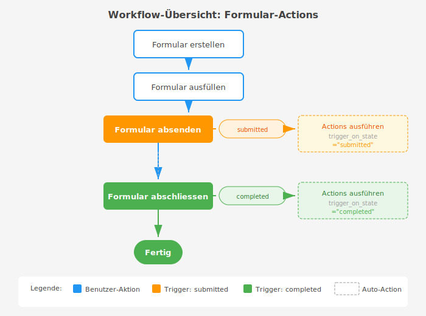

## Was sind Formular-Actions?

Formular-Actions ermöglichen es, automatisierte Aktionen auszuführen, wenn ein Formular einen bestimmten Status erreicht. Du kannst beispielsweise automatisch Meldungen erstellen, E-Mails versenden oder Webhooks aufrufen, sobald ein Formular abgesendet oder abgeschlossen wird.

### Hauptfunktionen

- ✅ **Automatische Meldungserstellung** - Erstelle automatisch Meldungen in Meldekreisen
- ✅ **E-Mail-Benachrichtigungen** - Sende automatisch E-Mails an Ausfüllende, Administratoren oder definierte Empfänger
- 🔗 **Webhook-Integration** (geplant) - Integriere externe Systeme
- 📋 **Kontrollen bei Massnahmen** (geplant) - Erstelle automatisch Kontrollen
- 🔄 **Workflow-Automatisierung** - Reduziere manuelle Arbeit

## Action-Typen im Überblick

### 1. Meldung erstellen

Erstellt automatisch eine Meldung in einem Meldekreis, wenn ein Formular einen bestimmten Status erreicht.

**Anwendungsbeispiele:**
- Kundenreklamationen automatisch als Q-Meldung erfassen
- Sicherheitsvorfälle direkt an Sicherheitsverantwortliche weiterleiten
- Verbesserungsvorschläge im KVP-Meldekreis dokumentieren

**Konfiguration:**
- Ziel-Meldekreis auswählen
- Meldungs-Titel mit Platzhaltern definieren
- Meldungs-Beschreibung mit Formular-Details

### 2. E-Mail versenden

Sendet automatisch E-Mails an definierte Empfänger, wenn ein Formular einen bestimmten Status erreicht.

**Empfänger-Optionen:**

| Option | Beschreibung |
|--------|--------------|
| **An Ausfüllenden** | E-Mail an die Person, die das Formular ausgefüllt hat |
| **An Administratoren** | E-Mail an alle Formular-Administratoren (siehe Tab "Administratoren") |
| **Zusätzliche Empfänger** | Frei wählbare Benutzer aus dem System |

**Konfiguration:**

- **Betreff für Ausfüllenden**: E-Mail-Betreff mit Platzhaltern
- **Nachricht für Ausfüllenden**: E-Mail-Text mit Platzhaltern
- **Betreff für Administratoren**: Separater Betreff für Admin-E-Mails
- **Nachricht für Administratoren**: Separater Text für Admin-E-Mails

**Anwendungsbeispiele:**

- Bestätigungs-E-Mail an den Ausfüllenden nach Formulareingang
- Benachrichtigung der Abteilungsleiter bei neuen Anträgen
- Eskalations-E-Mail bei kritischen Meldungen

### 3. Webhook aufrufen (in Planung)

Ruft eine externe URL auf und überträgt Formular-Daten.

**Geplante Funktionen:**
- Webhook-URL konfigurieren
- HTTP-Methode wählen (POST, PUT)
- Formular-Daten als JSON übertragen

### 4. Kontrolle bei Massnahme (in Planung)

Fügt automatisch eine Kontrolle zu einer bestehenden Massnahme hinzu.

**Geplante Funktionen:**
- Massnahme auswählen
- Kontroll-Details definieren
- Verantwortliche zuweisen

## Action erstellen

### Zugriff über die Formular-Vorlage (empfohlen)

1. Öffne die gewünschte **Formular-Vorlage**
2. Wechsle zum Tab **"Formularaktionen"**
3. Im Bereich **"Formularaktion hinzufügen"** wähle den Action-Typ:
   - **Meldung erstellen** - Klicke auf die Karte "Meldung erstellen"
   - **E-Mail Versand** - Klicke auf die Karte "E-Mail Versand"

### Actions verwalten

Im Tab "Formularaktionen" siehst du alle konfigurierten Actions in einer übersichtlichen Tabelle:

| Sortieren | Action-Typ | Auslöser | Ziel / Empfänger | Status | Aktionen |
|-----------|------------|----------|------------------|--------|----------|
| ⋮⋮ | Meldung erstellen | Abgeschlossen | [SAMPLE] Personalabteilung | Aktiv | 👁️ ✏️ 📋 🗑️ |
| ⋮⋮ | E-Mail senden | Abgeschlossen | 👤 Ausfüllender 👥 Hugo Boss | Aktiv | 👁️ ✏️ 📋 🗑️ |

**Funktionen:**

- **⋮⋮ Drag & Drop**: Ziehe Actions um die Reihenfolge zu ändern
- **👁️ Anzeigen**: Zeige Action-Details an
- **✏️ Bearbeiten**: Ändere Action-Einstellungen
- **📋 Duplizieren**: Erstelle eine Kopie der Action
- **🗑️ Löschen**: Entferne die Action

**Empfänger-Anzeige bei E-Mail-Actions:**

- **👤 Ausfüllender**: E-Mail geht an den Formular-Ausfüller
- **👥 Name**: E-Mail geht an Administratoren oder zusätzliche Empfänger
- **⚠️ Keine Admins**: Warnung wenn "An Admins" aktiviert aber keine Administratoren definiert sind

## Action konfigurieren

### Schritt 1: Allgemeine Einstellungen

**Formular-Template**
- Wähle das Template aus, für das die Action gelten soll
- Nur Formulare, die aus diesem Template erstellt wurden, lösen die Action aus

**Action-Typ**
- Wähle den gewünschten Action-Typ aus (z.B. "Meldung erstellen")
- Verschiedene Typen zeigen unterschiedliche Konfigurationsfelder

**Trigger-Status**
- **submitted** (abgesendet): Action wird beim Absenden des Formulars ausgeführt
- **completed** (abgeschlossen): Action wird beim Abschluss des Formulars ausgeführt

**Aktiv**
- Aktiviere oder deaktiviere die Action
- Nur aktive Actions werden ausgeführt
- Nützlich zum temporären Deaktivieren ohne Löschen

**Reihenfolge**
- Bestimmt die Ausführungsreihenfolge bei mehreren Actions
- Niedrigere Zahlen werden zuerst ausgeführt (0, 1, 2, ...)

### Schritt 2: Action-spezifische Konfiguration

#### Meldung erstellen

**Meldekreis**
- Wähle den Ziel-Meldekreis aus dem Dropdown
- Nur freigegebene Meldekreise werden angezeigt
- Der ausfüllende Benutzer benötigt die Berechtigung, Meldungen in diesem Meldekreis zu erstellen

**Meldungs-Titel Template**
- Definiere den Titel der automatisch erstellten Meldung
- Verwende Platzhalter für dynamische Inhalte
- Beispiel: `Formular: {form_title}`

**Meldungs-Beschreibung Template**

- Definiere die Beschreibung der Meldung
- Verwende Platzhalter und Formatierung
- Beispiel: `Ausgefüllt von {user} am {created_date}\n\nLink: {form_url}`

#### E-Mail versenden

**Empfänger-Einstellungen:**

- **An Ausfüllenden senden**: E-Mail geht an die Person, die das Formular ausgefüllt hat
- **An Administratoren senden**: E-Mail geht an alle Formular-Administratoren
- **Zusätzliche Empfänger**: Wähle weitere Benutzer aus dem System

> **💡 Tipp:** Formular-Administratoren verwaltest du im Tab "Administratoren" der Formular-Vorlage.

**E-Mail für Ausfüllenden:**

- **Betreff**: z.B. `Dein Formular "{form_title}" wurde empfangen`
- **Nachricht**: Bestätigungstext mit Platzhaltern

**E-Mail für Administratoren:**

- **Betreff**: z.B. `Neues Formular: {form_title}`
- **Nachricht**: Informationstext für Admins mit Link zum Formular

**Beispiel-Konfiguration für E-Mail:**

```
Betreff (Ausfüllender):
Bestätigung: {form_title}

Nachricht (Ausfüllender):
Hallo {user},

dein Formular "{form_title}" wurde erfolgreich übermittelt.

Datum: {created_date}

Bei Fragen wende dich an deine Ansprechperson.

---
Betreff (Administratoren):
Neues Formular eingegangen: {form_title}

Nachricht (Administratoren):
Ein neues Formular wurde ausgefüllt.

Formular: {form_title}
Ausgefüllt von: {user}
Datum: {created_date}

Link zum Formular: {form_url}
```

### Verfügbare Platzhalter

Du kannst folgende Platzhalter in Titel und Beschreibung verwenden:

| Platzhalter | Beschreibung | Beispiel |
|-------------|--------------|----------|
| `{form_title}` | Titel des ausgefüllten Formulars | "Kundenreklamation XY" |
| `{template_description}` | Beschreibung des Templates | "Erfassung von Kundenreklamationen" |
| `{user}` | Vollständiger Name des Benutzers | "Max Mustermann" |
| `{created_date}` | Datum und Uhrzeit der Erstellung | "28.10.2025 14:30" |
| `{form_url}` | Direkter Link zum Formular | "/forms/forms/123/detail/" |

**Beispiel-Konfiguration:**

```
Titel:
Kundenreklamation: {form_title}

Beschreibung:
Ein neues Reklamationsformular wurde ausgefüllt.

Formular: {form_title}
Ausgefüllt von: {user}
Datum: {created_date}

Beschreibung des Templates:
{template_description}

Direkter Link zum ausgefüllten Formular:
{form_url}
```

## Funktionsweise

### Workflow-Übersicht



### Action-Ausführung im Detail

Wenn ein Formular den konfigurierten Trigger-Status erreicht:

1. **Suchen**: ELIZA sucht nach allen aktiven Actions für dieses Template
2. **Filtern**: Nur Actions mit dem passenden `trigger_on_state` werden berücksichtigt
3. **Sortieren**: Actions werden nach `list_order` sortiert
4. **Prüfen**: Berechtigungen werden geprüft (z.B. darf der Benutzer Meldungen erstellen?)
5. **Ausführen**: Jede Action wird der Reihe nach ausgeführt
6. **Logging**: Alle Aktionen werden im Server-Log protokolliert

**Wichtig:**
- Bei Fehlern wird die betroffene Action übersprungen, das Formular bleibt aber gültig
- Fehlende Berechtigungen führen zu einer Warnung im Log, aber nicht zu einem Fehler
- Actions werden nur **einmal** pro Status-Übergang ausgeführt

## Mehrere Actions kombinieren

Du kannst mehrere Actions für ein Template definieren und so komplexe Workflows erstellen.

### Beispiel: Eskalations-Workflow

**Szenario**: Bei kritischen Sicherheitsmeldungen sollen mehrere Aktionen automatisch ausgelöst werden.

**Konfiguration:**

| Reihenfolge | Action-Typ | Trigger | Beschreibung |
|-------------|------------|---------|--------------|
| 0 | Meldung erstellen | submitted | Sicherheitsmeldung im Sicherheits-Meldekreis |
| 1 | E-Mail versenden | submitted | E-Mail an Sicherheitsverantwortliche |
| 2 | Webhook | submitted | Notification an externes System |

**Ablauf:**
1. Benutzer sendet Sicherheitsmeldung ab
2. Status wechselt zu "submitted"
3. ELIZA führt alle 3 Actions der Reihe nach aus
4. Sicherheitsteam erhält Meldung, E-Mail und externes System wird informiert

## Berechtigungen

### Erforderliche Berechtigungen zum Verwalten

Um Formular-Actions zu erstellen und zu verwalten, benötigst du:

- ✅ `forms.add_formaction` - Actions erstellen
- ✅ `forms.change_formaction` - Actions bearbeiten
- ✅ `forms.delete_formaction` - Actions löschen
- ✅ `forms.view_formaction` - Actions anzeigen

### Berechtigungen zur Ausführung

Damit eine Action ausgeführt werden kann, muss der ausfüllende Benutzer die entsprechenden Berechtigungen haben:

**Für "Meldung erstellen":**
- Berechtigung zum Erstellen von Meldungen im Ziel-Meldekreis
- Der Meldekreis muss im Status "freigegeben" sein

**Für andere Action-Typen:**
- Entsprechende Berechtigungen je nach Action-Typ

**Hinweis**: Fehlen die Berechtigungen, wird die Action übersprungen und ein Warnung im Server-Log erstellt.

## Anwendungsbeispiele

### Beispiel 1: Kundenreklamationen automatisch erfassen

**Ausgangslage**:
Kundenreklamationen werden manuell in einem Formular erfasst und müssen dann manuell als Q-Meldung angelegt werden.

**Lösung mit Formular-Actions:**

1. **Formular-Template**: "Kundenreklamation"
2. **Action-Konfiguration**:
   - Action-Typ: "Meldung erstellen"
   - Trigger: "completed" (bei Abschluss)
   - Meldekreis: "Q-Meldungen"
   - Titel: `Reklamation: {form_title}`
   - Beschreibung: `Kundenreklamation erfasst von {user} am {created_date}\n\n{form_url}`

**Ergebnis**:
- Sobald ein Mitarbeiter eine Reklamation ausfüllt und abschließt, wird automatisch eine Q-Meldung erstellt
- Die Meldung enthält alle relevanten Informationen und einen Link zum Formular
- Zeitersparnis und keine vergessenen Meldungen mehr

### Beispiel 2: Adressänderung mit Bestätigung und Admin-Benachrichtigung

**Ausgangslage**:
Mitarbeiter melden Adressänderungen über ein Formular. Die Personalabteilung soll benachrichtigt werden und der Mitarbeiter eine Bestätigung erhalten.

**Lösung mit Formular-Actions:**

1. **Formular-Template**: "Adressänderung"
2. **Administratoren definieren**: Im Tab "Administratoren" die Personalabteilung hinzufügen
3. **Action-Konfiguration (E-Mail)**:
   - Action-Typ: "E-Mail senden"
   - Trigger: "completed" (bei Abschluss)
   - An Ausfüllenden: ✅ (Bestätigung)
   - An Administratoren: ✅ (Personalabteilung)
   - Betreff (Ausfüllender): `Bestätigung: Deine Adressänderung`
   - Betreff (Admin): `Neue Adressänderung von {user}`

**Ergebnis**:

- Der Mitarbeiter erhält sofort eine Bestätigungs-E-Mail
- Die Personalabteilung wird automatisch informiert
- Kein manuelles Weiterleiten oder Vergessen mehr

### Beispiel 3: Compliance-Checks mit Eskalation

**Ausgangslage**:
Compliance-Checks müssen regelmäßig durchgeführt und bei Auffälligkeiten eskaliert werden.

**Lösung mit Formular-Actions:**

1. **Formular-Template**: "Monatlicher Compliance-Check"
2. **Administratoren**: Compliance-Officer als Administrator hinzufügen
3. **Action 1** (bei Abschluss):
   - Action-Typ: "Meldung erstellen"
   - Meldekreis: "Compliance"
   - Titel: `Compliance-Check {created_date}`
4. **Action 2** (bei Abschluss):
   - Action-Typ: "E-Mail versenden"
   - An Administratoren: ✅
   - Betreff: `Compliance-Check abgeschlossen: {form_title}`

**Ergebnis**:

- Automatische Dokumentation aller Checks
- Compliance-Officer wird sofort per E-Mail informiert
- Lückenlose Nachvollziehbarkeit

### Beispiel 4: Schulungsfeedback sammeln

**Ausgangslage**:
Nach jeder Schulung soll Feedback gesammelt und an den Trainer weitergeleitet werden.

**Lösung mit Formular-Actions:**

1. **Formular-Template**: "Schulungsfeedback"
2. **Administratoren**: Schulungsverantwortliche als Administrator hinzufügen
3. **Action-Konfiguration**:
   - Action-Typ: "E-Mail versenden"
   - Trigger: "submitted"
   - An Administratoren: ✅
   - Betreff (Admin): `Neues Feedback für Schulung: {form_title}`

**Ergebnis**:

- Schulungsverantwortliche erhalten sofort das Feedback
- Teilnehmer müssen nichts manuell versenden
- Feedback wird automatisch archiviert

## Troubleshooting

### Die Action wurde nicht ausgeführt

**Mögliche Ursachen und Lösungen:**

#### 1. Action ist nicht aktiv
**Problem**: Checkbox "Aktiv" ist nicht gesetzt
**Lösung**: Bearbeite die Action und aktiviere sie

#### 2. Falscher Trigger-Status
**Problem**: Action ist für "submitted" konfiguriert, aber du erwartest Ausführung bei "completed"
**Lösung**: Prüfe und korrigiere den `trigger_on_state`

#### 3. Fehlende Berechtigungen
**Problem**: Der ausfüllende Benutzer darf keine Meldungen im Ziel-Meldekreis erstellen
**Lösung**:
- Prüfe die Berechtigungen des Benutzers
- Prüfe die Meldekreis-Einstellungen
- Prüfe die Server-Logs für Details

#### 4. Meldekreis nicht freigegeben
**Problem**: Der Ziel-Meldekreis ist im Status "Entwurf" oder "Archiviert"
**Lösung**: Stelle sicher, dass der Meldekreis im Status "Freigegeben" ist

#### 5. Template-Fehler
**Problem**: Platzhalter sind falsch geschrieben oder Template ist leer
**Lösung**: Prüfe die Template-Syntax (z.B. `{form_title}` nicht `{title}`)

### Die erstellte Meldung hat falsche Inhalte

**Lösungsschritte:**

1. **Prüfe die Platzhalter**: Sind alle Platzhalter korrekt geschrieben?
2. **Teste mit einem Beispiel**: Fülle ein Test-Formular aus und prüfe das Ergebnis
3. **Prüfe die Formatierung**: Verwende `\n` für Zeilenumbrüche
4. **Kontrolliere das Formular**: Enthält das ausgefüllte Formular alle erwarteten Daten?

### Server-Logs prüfen

Wenn eine Action nicht wie erwartet funktioniert, prüfe die Server-Logs:

**Erfolgreiche Ausführung:**
```
INFO: Form 34 (state=completed): Found 1 active actions for trigger_on_state=completed
INFO: Executing action 1 (create_issue) for form 34
INFO: Action 1 created: #2 Formular: Kundenreklamation
```

**Keine Actions gefunden:**
```
INFO: Form 34 (state=completed): Found 0 active actions for trigger_on_state=completed
```
→ Prüfe ob Action aktiv ist und der Trigger-Status stimmt

**Berechtigung fehlt:**
```
WARNING: Action 1 returned None (permission denied or error)
```
→ Prüfe die Berechtigungen des ausfüllenden Benutzers

**Kontaktiere deinen Administrator**, wenn du keinen Zugriff auf die Server-Logs hast.

## Best Practices

### 1. Aussagekräftige Titel verwenden

✅ **Gut**: `Kundenreklamation: {form_title} - {user}`
❌ **Schlecht**: `Neue Meldung`

**Warum**: Aussagekräftige Titel erleichtern die Suche und Sortierung

### 2. Kontext in Beschreibungen einfügen

✅ **Gut**: Verwende alle relevanten Platzhalter und strukturiere die Beschreibung
❌ **Schlecht**: Nur den Link zum Formular einfügen

**Beispiel für gute Beschreibung**:
```
Ausgefüllt von: {user}
Datum: {created_date}

Template-Beschreibung:
{template_description}

Link zum Formular: {form_url}
```

### 3. Reihenfolge logisch festlegen

Bei mehreren Actions:
1. Zuerst Daten erstellen (Meldung)
2. Dann Benachrichtigungen senden (E-Mail)
3. Zuletzt externe Systeme informieren (Webhook)

### 4. Actions testen

- Erstelle ein Test-Formular
- Fülle es aus und schließe es ab
- Prüfe ob Actions wie erwartet ausgeführt wurden
- Prüfe die Server-Logs bei Problemen

### 5. Berechtigungen im Voraus klären

- Stelle sicher, dass alle relevanten Benutzer die nötigen Berechtigungen haben
- Dokumentiere, welche Berechtigungen für welche Actions benötigt werden
- Teste mit verschiedenen Benutzer-Rollen

### 6. Actions dokumentieren

Dokumentiere in der Template-Beschreibung, welche Actions konfiguriert sind:

```
Dieses Template erstellt automatisch:
- Q-Meldung im Meldekreis "Qualität"
- E-Mail an quality@firma.ch
```

## Häufige Fragen

**F: Kann ich Actions nachträglich zu bestehenden Templates hinzufügen?**
A: Ja, du kannst jederzeit Actions zu Templates hinzufügen. Nur neu ausgefüllte Formulare werden die Actions auslösen.

**F: Was passiert, wenn die Action fehlschlägt?**
A: Das Formular bleibt gültig. Die Action wird übersprungen und ein Fehler wird im Server-Log protokolliert.

**F: Kann ich Actions deaktivieren ohne sie zu löschen?**
A: Ja, entferne einfach das Häkchen bei "Aktiv". Die Action bleibt konfiguriert, wird aber nicht mehr ausgeführt.

**F: Werden Actions auch für alte Formulare ausgeführt?**
A: Nein, Actions werden nur ausgeführt, wenn ein Formular den Trigger-Status erreicht. Bereits abgeschlossene Formulare lösen keine Actions mehr aus.

**F: Kann ich mehrere Meldekreise als Ziel verwenden?**
A: Ja, erstelle einfach mehrere Actions mit unterschiedlichen Ziel-Meldekreisen.

**F: Wie kann ich Actions testen ohne echte Meldungen zu erstellen?**
A: Erstelle einen Test-Meldekreis und konfiguriere die Action für diesen. Nach dem Test kannst du die Test-Meldungen löschen.

**F: Können Actions auch bei "in_progress" ausgeführt werden?**
A: Nein, aktuell sind nur "submitted" und "completed" als Trigger-Status verfügbar.

**F: Was kostet die Verwendung von Formular-Actions?**
A: Formular-Actions sind in ELIZA enthalten und verursachen keine zusätzlichen Kosten.

## Zusammenfassung

Formular-Actions automatisieren wiederkehrende Aufgaben und sparen Zeit:

✅ **Automatische Meldungserstellung** - Keine manuellen Übertragungen mehr
✅ **E-Mail-Benachrichtigungen** - Bestätigungen und Benachrichtigungen automatisch versenden
✅ **Workflow-Integration** - Nahtlose Verknüpfung mit anderen Modulen
✅ **Zeitersparnis** - Reduziere repetitive manuelle Arbeit
✅ **Fehlerreduktion** - Keine vergessenen Folgeaktionen mehr
✅ **Nachvollziehbarkeit** - Alle Actions werden im Log protokolliert

**Nächste Schritte:**
1. Überlege, welche Formulare von Automatisierung profitieren würden
2. Erstelle eine Test-Action für ein bestehendes Template
3. Teste die Action mit einem Test-Formular
4. Erweitere schrittweise auf weitere Templates

---

**Hast du Fragen zu Formular-Actions? Kontaktiere deinen ELIZA-Administrator oder nutze das Feedback-Formular im Help-Modul.**
