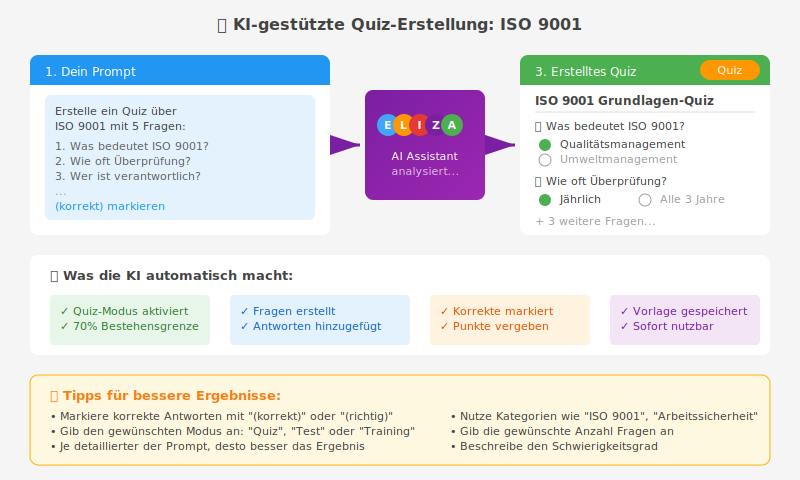

Der ELIZA AI-Assistent kann dir dabei helfen, Formularvorlagen automatisch zu erstellen. Du beschreibst einfach in natürlicher Sprache, welches Formular du benötigst, und die KI erstellt es für dich – inklusive aller Fragen, Antwortmöglichkeiten und Einstellungen.

## Überblick: Was kann die KI für dich tun?

Die KI-assistierte Formularerstellung ermöglicht es dir:

1. **Komplette Formularvorlagen erstellen** - Erstelle ein fertiges Formular mit allen Fragen in einem Schritt

Diese Funktion spart dir viel Zeit und hilft dir, professionelle Formulare schnell zu erstellen.

## Voraussetzungen

Um die KI-Formularerstellung zu nutzen, benötigst du:

- ✅ Zugriff auf den **Bot (AI-Assistent)** in ELIZA
- ✅ Berechtigung zum **Erstellen von Formularvorlagen** (`forms.add_formtemplate`)
- ✅ **Bot-Tools müssen aktiviert** sein (wird vom Administrator eingestellt)

## Komplette Formularvorlagen erstellen

### Grundlegendes Vorgehen

1. Öffne den **AI-Assistenten** in ELIZA
2. Starte einen neuen Chat
3. Aktiviere die Option **"Tools verwenden"**
4. Beschreibe in natürlicher Sprache, welches Formular du benötigst

### Beispiel-Prompts

#### 📋 Mitarbeiter-Feedback-Formular

```
Erstelle ein Mitarbeiter-Feedback-Formular mit folgenden Fragen:

1. Wie zufrieden bist du mit deiner aktuellen Position? (Bewertungsskala 1-5)
2. Was läuft in deinem Team besonders gut? (Freitext)
3. Welche Verbesserungsvorschläge hast du? (Freitext)
4. Würdest du ELIZA weiterempfehlen? (Ja/Nein)
```

**Was passiert?**
- Die KI erstellt eine Formularvorlage mit dem Titel "Mitarbeiter-Feedback-Formular"
- Alle 4 Fragen werden automatisch hinzugefügt
- Passende Antworttypen werden gewählt (Scale, Textarea, YesNo)
- Du erhältst einen direkten Link zur erstellten Vorlage

#### 🎓 Quiz über ISO 9001



**Beispiel-Prompt:**

```
Erstelle ein Quiz über ISO 9001 mit 5 Multiple-Choice-Fragen:

1. Was bedeutet ISO 9001?
   - Qualitätsmanagementsystem (korrekt)
   - Umweltmanagement
   - Arbeitssicherheit
   - Datenschutz

2. Wie oft muss ein QMS überprüft werden?
   - Einmal jährlich (korrekt)
   - Alle 3 Jahre
   - Nie
   - Nur bei Bedarf

3. Wer ist für das QMS verantwortlich?
   - Die Geschäftsleitung (korrekt)
   - Die IT-Abteilung
   - Externe Berater
   - Niemand

[...]
```

**Was passiert?**
- Formular wird im **Quiz-Modus** erstellt
- Alle Antwortmöglichkeiten werden hinzugefügt
- Korrekte Antworten werden markiert
- Bestehensgrenze wird auf Standard (70%) gesetzt

#### 📝 Kunden-Zufriedenheitsumfrage

```
Erstelle eine Kunden-Zufriedenheitsumfrage für unser Produkt:

- Wie zufrieden bist du mit unserem Service? (Skala 1-10)
- Welche Features nutzt du am häufigsten? (Mehrfachauswahl: Dashboard, Reports, Export, Benachrichtigungen)
- Was könnten wir verbessern? (Freitext)
- Würdest du uns weiterempfehlen? (Ja/Nein)
```

**Was passiert?**
- Formular wird als **Standard-Formular** erstellt
- Kategorie wird automatisch auf "customer" gesetzt
- Alle Fragen werden mit passenden Antworttypen erstellt

### Unterstützte Formular-Modi

Die KI kann Formulare in verschiedenen Modi erstellen:

| Modus | Beschreibung | Wann verwenden? |
|-------|-------------|-----------------|
| **Formular** | Standard-Formular ohne Bewertung | Umfragen, Feedback, Datenerfassung |
| **Test** | Prüfung mit einem Versuch | Prüfungen, Tests, Zertifizierungen |
| **Quiz** | Quiz mit mehreren Versuchen | Schulungen, Selbsttests, Übungen |
| **Checkliste** | Checklisten-Modus | Aufgabenlisten, Prozess-Checklisten |

**So gibst du den Modus an:**

```
Erstelle ein Quiz (Trainingsmodus) über Arbeitssicherheit...

Erstelle eine Checkliste für die Einarbeitung neuer Mitarbeiter...

Erstelle ein Standard-Formular für Urlaubsanträge...
```

### Unterstützte Antworttypen

Die KI kann automatisch den passenden Antworttyp wählen oder du gibst ihn explizit an:

| Antworttyp | Beschreibung | Beispiel |
|------------|--------------|----------|
| **Text** | Einzeilige Texteingabe | Name, E-Mail, Kurze Antwort |
| **Textarea** | Mehrzeilige Texteingabe | Kommentare, Beschreibungen |
| **Datum** | Datumsauswahl | Geburtsdatum, Termin |
| **Ganzzahl** | Zahleneingabe (ganze Zahlen) | Anzahl, Alter |
| **Dezimalzahl** | Zahleneingabe (mit Komma) | Betrag, Prozentsatz |
| **Einfachauswahl** | Auswahl einer Option | Radio-Buttons |
| **Mehrfachauswahl** | Auswahl mehrerer Optionen | Checkboxes |
| **Bewertungsskala** | Skalierung (z.B. 1-5) | Zufriedenheit, Bewertung |
| **Ja/Nein** | Ja/Nein-Frage | Zustimmung, Bestätigung |
| **Matrix** | Tabelle mit Zeilen/Spalten | Vergleiche, Bewertungsraster |
| **Ranking** | Reihenfolge festlegen | Prioritäten, Rangliste |
| **Unterschrift** | Unterschrift erfassen | Zustimmung, Freigabe |
| **Organisationseinheit** | Auswahl einer Orgunit | Abteilung, Team |
| **Datei-Upload** | Datei hochladen | Anhänge, Dokumente |

**Detaillierte Beschreibung aller Fragetypen**: Siehe [Kapitel 8: Alle Fragetypen im Überblick]()

### Kategorien für Formulare

Formulare können in folgende Kategorien eingeteilt werden:

- **Allgemein** (`general`) - Standard-Formulare
- **Personal** (`hr`) - HR-bezogene Formulare
- **Qualität** (`quality`) - QM-bezogene Formulare
- **Kunden** (`customer`) - Kunden-Feedback, Umfragen
- **Intern** (`internal`) - Interne Prozesse, Checklisten

**Beispiel:**

```
Erstelle ein Qualitäts-Formular für interne Audits...
```

Die KI wählt automatisch die Kategorie "quality".

## Fragen zur Bibliothek hinzufügen

Du kannst auch einzelne Fragen erstellen, die später in verschiedenen Formularvorlagen wiederverwendet werden können.

### Beispiel-Prompts

#### Einfache Frage hinzufügen

```
Füge eine Frage zur Bibliothek hinzu:
"Wie viele Jahre Erfahrung hast du in diesem Bereich?" (Ganzzahl)
Kategorie: Personal
```

#### Multiple-Choice-Frage mit korrekten Antworten

```
Füge eine Quiz-Frage zum Thema Datenschutz hinzu:

Frage: "Welche Daten gelten als personenbezogen?"

Antwortmöglichkeiten:
- Name und Vorname (korrekt)
- E-Mail-Adresse (korrekt)
- Anonymisierte Daten
- Firmenname

Kategorie: Datenschutz
```

### Vorteile der Fragenbibliothek

- ✅ **Wiederverwendbarkeit** - Einmal erstellt, in vielen Formularen nutzbar
- ✅ **Konsistenz** - Gleiche Fragen werden überall gleich formuliert
- ✅ **Zeitersparnis** - Fragen müssen nicht manuell erstellt werden
- ✅ **Qualität** - KI generiert professionelle Frageformulierungen

## Tipps für optimale Ergebnisse

### 1. Sei spezifisch in deiner Beschreibung

**❌ Weniger gut:**
```
Erstelle ein Formular
```

**✅ Besser:**
```
Erstelle ein Mitarbeiter-Onboarding-Formular mit Fragen zu:
- Persönliche Daten (Name, E-Mail, Startdatum)
- Technische Ausstattung (Laptop, Telefon, Softwarezugang)
- Schulungsbedarf (welche Schulungen benötigt?)
```

### 2. Gib Antworttypen an, wenn wichtig

**❌ Ungenau:**
```
Wie zufrieden bist du?
```

**✅ Präzise:**
```
Wie zufrieden bist du mit unserem Service? (Bewertungsskala 1-10)
```

### 3. Markiere korrekte Antworten bei Quizzen

**❌ Fehlt:**
```
Was ist die Hauptstadt der Schweiz?
- Zürich
- Bern
- Genf
```

**✅ Mit Kennzeichnung:**
```
Was ist die Hauptstadt der Schweiz?
- Zürich
- Bern (korrekt)
- Genf
```

### 4. Nutze Pflichtfragen gezielt

Wenn eine Frage verpflichtend sein soll, markiere das:

```
Erstelle ein Formular mit folgenden Fragen:
1. E-Mail-Adresse (Pflichtfeld)
2. Telefonnummer (optional)
3. Bemerkungen (optional)
```

### 5. Strukturiere komplexe Formulare

Bei längeren Formularen hilft es, die Struktur zu beschreiben:

```
Erstelle ein Bewerbungsformular mit folgenden Abschnitten:

Persönliche Daten:
- Name (Pflicht)
- E-Mail (Pflicht)
- Telefon (optional)

Qualifikationen:
- Ausbildung (Freitext)
- Berufserfahrung in Jahren (Ganzzahl)
- Sprachen (Mehrfachauswahl: Deutsch, Englisch, Französisch, Italienisch)

Motivation:
- Warum bewirbst du dich? (Freitext, Pflicht)
```

## Nach der Erstellung

Nach der Erstellung durch die KI erhältst du:

1. ✅ **Direkter Link** zur erstellten Formularvorlage
2. 📊 **Zusammenfassung** aller erstellten Fragen
3. 🎯 **Modus und Kategorie** der Vorlage

### Was du noch anpassen kannst

Die KI erstellt eine Basis-Vorlage. Du kannst anschliessend noch:

- 📝 Fragen bearbeiten oder hinzufügen (siehe [Kapitel 4: Vorlagen erstellen]())
- 🎨 Design und Layout anpassen
- 🔧 Erweiterte Einstellungen konfigurieren
- 📁 Ordner und Berechtigungen festlegen (siehe [Kapitel 2: Ordner]())
- ⚙️ Aktionen bei Formular-Einreichung definieren (siehe [Kapitel 9: Formular-Actions]())

### Formular aktivieren

Vergiss nicht, dein Formular zu aktivieren:

1. Öffne die erstellte Formularvorlage
2. Prüfe alle Fragen und Einstellungen
3. Setze "Aktiv" auf "Ja"
4. Optional: Aktiviere "Öffentlich ausfüllbar" für öffentliche Formulare

## Häufige Anwendungsfälle

### 👥 HR & Personal

```
Erstelle ein Mitarbeiter-Jahresgespräch-Formular:
- Zielerreichung (Skala 1-5)
- Stärken (Freitext)
- Entwicklungsbereiche (Freitext)
- Weiterbildungswünsche (Mehrfachauswahl)
- Gesamtbewertung (Skala 1-10)
```

### 🎓 Schulung & Training

```
Erstelle ein Quiz (Trainingsmodus) für Arbeitssicherheit:
- 10 Multiple-Choice-Fragen über Brandschutz
- 5 Multiple-Choice-Fragen über Erste Hilfe
- Bestehensgrenze: 80%
```

**Mehr zum Quiz-Modus**: Siehe [Kapitel 6: Quiz-Modus verwenden]()

### 📊 Qualitätsmanagement

```
Erstelle eine Audit-Checkliste:
- Dokumentation vollständig? (Ja/Nein)
- Prozesse dokumentiert? (Ja/Nein)
- Schulungen durchgeführt? (Ja/Nein)
- Verbesserungspotenzial (Freitext)
```

**Mehr zu Checklisten**: Siehe [Kapitel 7: Checklisten-Modus verwenden]()

### 👨‍💼 Kunden-Feedback

```
Erstelle eine Kunden-Zufriedenheitsumfrage:
- Gesamtzufriedenheit (Skala 1-10)
- Produktqualität (Skala 1-10)
- Kundenservice (Skala 1-10)
- Was schätzt du besonders? (Freitext)
- Verbesserungsvorschläge (Freitext)
```

## Fehlerbehebung

### Die KI erstellt kein Formular

**Mögliche Ursachen:**

1. ✋ **Bot-Tools nicht aktiviert** - Kontaktiere deinen Administrator
2. 🔒 **Fehlende Berechtigung** - Du benötigst `forms.add_formtemplate`
3. 📝 **Tools nicht ausgewählt** - Aktiviere "Tools verwenden" im Chat

### Formular existiert bereits

Die KI prüft, ob ein Formular mit demselben Titel bereits existiert:

```
❌ Fehler: Vorlage "Mitarbeiter-Feedback" existiert bereits
```

**Lösung:**
- Wähle einen anderen Titel
- Oder lösche die bestehende Vorlage zuerst

### Fragen werden nicht korrekt erstellt

**Prüfe:**
- ✅ Sind Antwortmöglichkeiten klar formuliert?
- ✅ Sind korrekte Antworten eindeutig markiert?
- ✅ Ist der Antworttyp passend gewählt?

Du kannst Fragen nach der Erstellung noch manuell korrigieren (siehe [Kapitel 4: Vorlagen erstellen]()).

## Best Practices

### ✅ Do's

- **Sei präzise** in deinen Beschreibungen
- **Strukturiere** komplexe Formulare in Abschnitte
- **Kennzeichne Pflichtfelder** explizit
- **Markiere korrekte Antworten** bei Quizzen
- **Nutze die Bibliothek** für wiederkehrende Fragen
- **Prüfe das Ergebnis** und passe es an

### ❌ Don'ts

- **Zu vage Beschreibungen** vermeiden
- **Zu viele Fragen auf einmal** (besser in mehreren Schritten)
- **Keine Antworttypen** bei komplexen Fragen
- **Fehlende Kategorisierung** bei thematischen Formularen

## Zusammenfassung

Die KI-assistierte Formularerstellung in ELIZA ermöglicht dir:

- ⚡ **Schnelle Erstellung** kompletter Formularvorlagen
- 🎯 **Präzise Umsetzung** deiner Anforderungen
- 🔄 **Wiederverwendbare Fragen** in der Bibliothek
- 🎓 **Quiz-Erstellung** mit korrekten Antworten
- 📝 **Flexible Anpassung** nach der Erstellung

Nutze die KI als Startpunkt für deine Formulare und spare wertvolle Zeit bei der Formularerstellung!

## Häufige Fragen

### Kann die KI auch bestehende Formulare bearbeiten?

Aktuell kann die KI nur neue Formulare erstellen. Bestehende Formulare musst du manuell bearbeiten (siehe [Kapitel 4: Vorlagen erstellen]()).

### Werden die von der KI erstellten Formulare automatisch aktiviert?

Nein, du musst das Formular nach der Erstellung manuell aktivieren. So kannst du es vorher noch prüfen und anpassen.

### Kann ich Fragen aus der KI-erstellten Bibliothek in manuell erstellten Formularen verwenden?

Ja! Alle von der KI zur Bibliothek hinzugefügten Fragen stehen dir auch beim manuellen Erstellen von Formularen zur Verfügung.

### Unterstützt die KI alle 14 Fragetypen?

Ja, die KI kann alle in ELIZA verfügbaren Fragetypen erstellen. Eine vollständige Übersicht findest du in [Kapitel 8: Alle Fragetypen im Überblick]().

### Kann die KI auch Formular-Actions erstellen?

Aktuell erstellt die KI nur die Formularvorlage mit Fragen. Formular-Actions musst du manuell konfigurieren (siehe [Kapitel 9: Formular-Actions]()).

---

**Weitere Hilfe:**

- Kontaktiere deinen ELIZA-Administrator bei Fragen zur Aktivierung
- Schau dir die [Übersicht]() für weitere Informationen an
- Schau dir die [Fragetypen]() für Details zu allen Fragetypen an
