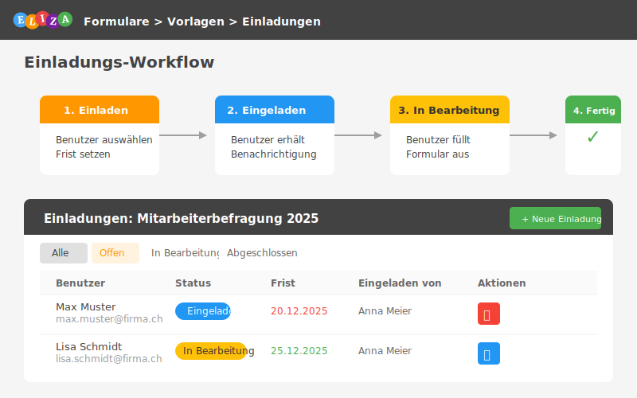

# Benutzer einladen

Mit der Einladungs-Funktion kannst du gezielt Benutzer zum Ausfüllen eines Formulars auffordern. Dabei können Fristen gesetzt und der Bearbeitungsstand überwacht werden.

## Was du in diesem Kapitel lernst

- Benutzer zu einem Formular einladen
- Fristen (Deadlines) setzen
- Einladungsstatus überwachen
- Überfällige Einladungen erkennen
- Einladungen verwalten und löschen

---

## Einladungen erstellen

### Einladungs-Formular öffnen

1. Öffne die **Formular-Vorlage**, zu der du Benutzer einladen möchtest
2. Klicke auf den Button **"Einladen"** (person_add Icon) in der Aktionsleiste



### Einladungsformular ausfüllen

> **Benutzer zu Formular einladen**
>
> - **Benutzer auswählen**: Wähle einen oder mehrere Benutzer aus
> - **Frist**: Optionales Datum bis wann das Formular ausgefüllt werden muss
> - **Nachricht**: Optionale persönliche Nachricht an die eingeladenen Personen
>
> Klicke auf **[Einladungen senden]**

**Felder:**

| Feld | Beschreibung |
|------|--------------|
| **Benutzer** | Wähle einen oder mehrere Benutzer aus der Benutzerliste |
| **Frist** | Optionales Datum (Deadline) bis wann das Formular ausgefüllt sein soll |
| **Nachricht** | Optionale persönliche Nachricht an die eingeladenen Personen |

> **Tipp:** Bereits eingeladene Benutzer werden unter dem Formular angezeigt und können nicht erneut eingeladen werden.

---

## Einladungen verwalten

### Einladungs-Übersicht öffnen

In der Vorlagen-Detailansicht siehst du den Button **"Einladungen"** (mail Icon). Klicke darauf, um zur Einladungs-Übersicht zu gelangen.

### Status-Filter

Die Einladungs-Übersicht bietet verschiedene Filter-Tabs:

| Tab | Beschreibung |
|-----|--------------|
| **Alle** | Alle Einladungen anzeigen |
| **Offen** | Einladungen, die noch nicht begonnen wurden |
| **In Bearbeitung** | Formulare, die gerade ausgefüllt werden |
| **Abgeschlossen** | Vollständig ausgefüllte Formulare |

### Einladungs-Tabelle

Die Übersicht zeigt alle Einladungen mit folgenden Informationen:

| Spalte | Beschreibung |
|--------|--------------|
| **Benutzer** | Name und E-Mail der eingeladenen Person |
| **Status** | Aktueller Status (Eingeladen / In Bearbeitung / Abgeschlossen) |
| **Frist** | Deadline mit visueller Hervorhebung |
| **Eingeladen von** | Wer die Einladung versendet hat |
| **Eingeladen am** | Datum der Einladung |
| **Aktionen** | Einladung löschen oder Formular ansehen |

---

## Fristen und Deadlines

### Frist-Anzeige

Fristen werden visuell hervorgehoben:

| Anzeige | Bedeutung |
|---------|-----------|
| **Grün** | Frist ist noch nicht erreicht |
| **Orange** | Frist läuft bald ab (innerhalb 3 Tagen) |
| **Rot** | Frist ist überschritten |

### Überfällige Einladungen erkennen

Überfällige Einladungen werden in der Tabelle rot hervorgehoben:
- Die gesamte Zeile erhält einen roten Hintergrund
- Das Frist-Datum wird rot dargestellt
- Ein Warnsymbol erscheint neben dem Datum

> **Tipp:** Kontaktiere Benutzer mit überfälligen Einladungen direkt, um sie an das Ausfüllen zu erinnern.

---

## Einladungs-Status

Eine Einladung durchläuft folgende Status:

```
1. EINGELADEN (invited)
   ↓
   Benutzer öffnet das Formular
   ↓
2. IN BEARBEITUNG (in_progress)
   ↓
   Benutzer schliesst das Formular ab
   ↓
3. ABGESCHLOSSEN (completed)
```

### Status-Bedeutung

| Status | Symbol | Beschreibung |
|--------|--------|--------------|
| **Eingeladen** | ✉️ | Einladung wurde gesendet, Formular noch nicht geöffnet |
| **In Bearbeitung** | ✏️ | Benutzer hat mit dem Ausfüllen begonnen |
| **Abgeschlossen** | ✅ | Formular wurde vollständig ausgefüllt |

---

## Aktionen

### Einladung löschen

Offene Einladungen (Status "Eingeladen") können gelöscht werden:

1. Klicke auf das **Löschen-Icon** (roter Button) in der Aktionsspalte
2. Bestätige das Löschen im Dialog

> **Wichtig:** Bereits begonnene oder abgeschlossene Formulare können nicht gelöscht werden.

### Formular ansehen

Für Einladungen mit Status "In Bearbeitung" oder "Abgeschlossen":

1. Klicke auf das **Ansehen-Icon** (blauer Button) in der Aktionsspalte
2. Du gelangst zur Detailansicht des ausgefüllten Formulars

---

## Typischer Workflow

### 1. Vorbereitung

1. Erstelle eine Formular-Vorlage mit allen benötigten Fragen
2. Veröffentliche die Vorlage (Status: Aktiv)

### 2. Einladungen versenden

1. Öffne die Vorlage
2. Klicke auf **"Einladen"**
3. Wähle die Benutzer aus
4. Setze optional eine Frist
5. Füge optional eine persönliche Nachricht hinzu
6. Klicke auf **"Einladungen senden"**

### 3. Monitoring

1. Öffne regelmässig die Einladungs-Übersicht
2. Filtere nach Status, um den Fortschritt zu sehen
3. Identifiziere überfällige Einladungen
4. Kontaktiere Benutzer bei Bedarf

### 4. Auswertung

1. Warte bis alle Einladungen abgeschlossen sind
2. Öffne die Auswertung der Vorlage
3. Exportiere die Ergebnisse als Excel

---

## Best Practices

### Empfehlung 1: Realistische Fristen setzen

- Gib Benutzern genügend Zeit (mindestens 3-5 Arbeitstage)
- Berücksichtige Ferien und Feiertage
- Kommuniziere die Frist zusätzlich per E-Mail oder im Team-Meeting

### Empfehlung 2: Persönliche Nachricht hinzufügen

- Erkläre kurz, warum das Formular wichtig ist
- Schätze die Ausfüllzeit ("Dauert ca. 5 Minuten")
- Bedanke dich für die Teilnahme

### Empfehlung 3: Regelmässiges Monitoring

- Prüfe den Status mindestens einmal pro Woche
- Reagiere früh auf nicht gestartete Einladungen
- Sende freundliche Erinnerungen bei Bedarf

### Empfehlung 4: Gruppierte Einladungen

- Lade ähnliche Benutzergruppen zusammen ein
- Setze einheitliche Fristen für Gruppen
- Erleichtert das Monitoring und die Auswertung

---

## Häufige Fragen (FAQ)

### Kann ich eine Einladung erneut senden?

**Nein**, eine bereits bestehende Einladung kann nicht erneut gesendet werden. Der Benutzer erhält bei der ersten Einladung eine Benachrichtigung.

**Lösung:** Kontaktiere den Benutzer direkt per E-Mail oder Teams.

---

### Was passiert bei einer abgelaufenen Frist?

Die Frist ist nur eine visuelle Erinnerung. Benutzer können das Formular auch nach Ablauf der Frist noch ausfüllen.

**Tipp:** Für strikte Deadlines kannst du das Formular nach Ablauf deaktivieren.

---

### Wie lösche ich eine begonnene Einladung?

Einladungen mit Status "In Bearbeitung" oder "Abgeschlossen" können nicht gelöscht werden, da bereits Daten erfasst wurden.

**Lösung:** Du kannst das zugehörige Formular in der Formular-Liste löschen (mit entsprechenden Berechtigungen).

---

### Kann ich die Frist nachträglich ändern?

**Derzeit nicht möglich.** Fristen werden bei der Einladung festgelegt.

**Workaround:** Lösche die Einladung (nur wenn noch offen) und erstelle eine neue mit korrigierter Frist.

---

## Zusammenfassung

In diesem Kapitel hast du gelernt:

- ✅ Benutzer gezielt zu Formularen einladen
- ✅ Fristen (Deadlines) setzen und überwachen
- ✅ Einladungsstatus verstehen und filtern
- ✅ Überfällige Einladungen erkennen
- ✅ Einladungen verwalten und löschen
- ✅ Best Practices für erfolgreiches Einladungs-Management

---

## Nächste Schritte

- **[Formulare ausfüllen]()**: So füllen eingeladene Benutzer das Formular aus
- **[Vorlagen erstellen]()**: Erstelle Vorlagen für deine Einladungen
- **[Auswertung](04_vorlagen.md#auswertungs-view)**: Werte die ausgefüllten Formulare aus

---

**Viel Erfolg beim Einladen deines Teams!**
