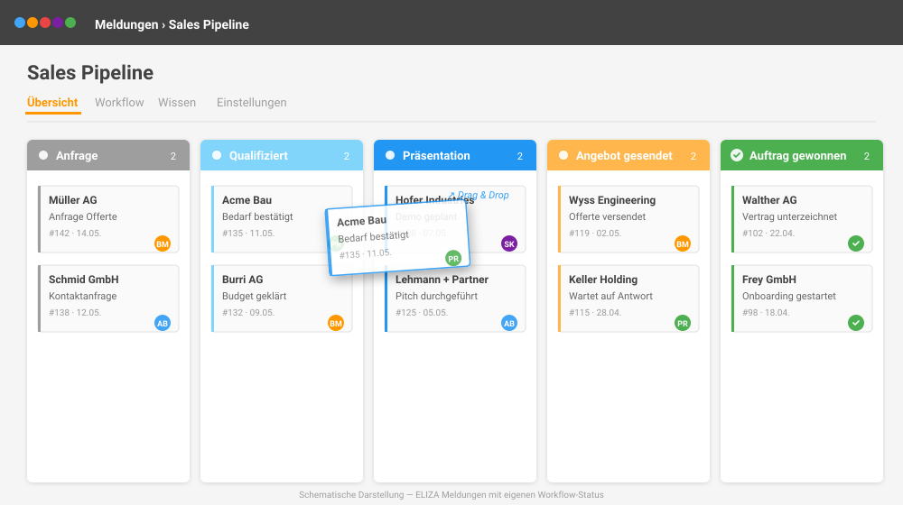
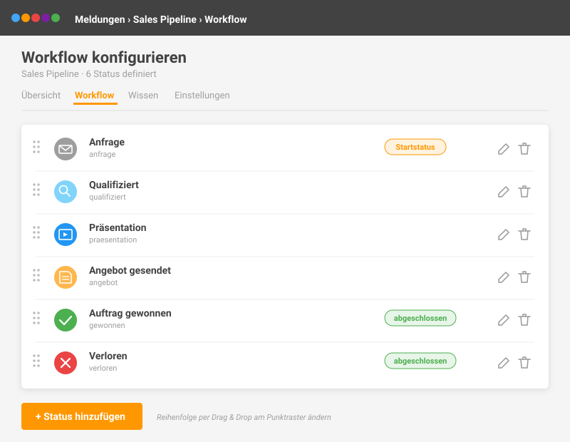

# Meldekreise verwalten

In diesem Kapitel lernst du, wie du als Administrator Meldekreise erstellst, konfigurierst und optimal für dein Team einrichtest. Meldekreise sind die Grundlage für strukturierte Meldungserfassung.

## Meldekreis erstellen

### Voraussetzungen

Um Meldekreise erstellen zu können, benötigst du:
- Die Berechtigung **issues.add_tracker** (Gruppe **issue_admin**)

### Schritt-für-Schritt Anleitung

**Schritt 1: Zur Meldekreis-Verwaltung navigieren**

1. Öffne das Meldungen-Dashboard
2. Klicke auf **"Meldekreise"** im Menü
3. Klicke auf **"Neuer Meldekreis"** (grüner Button)

**Schritt 2: Grunddaten erfassen**

| Feld | Pflicht | Beschreibung |
|------|---------|-------------|
| **Titel** | Ja | Name des Meldekreises (z.B. "Kundenreklamationen") |
| **Beschreibung** | Nein | Erklärung für Benutzer |

**Schritt 3: Konfiguration anpassen**

Konfiguriere den Meldekreis nach deinen Anforderungen (siehe folgende Abschnitte).

**Schritt 4: Speichern**

Klicke auf **"Speichern"** um den Meldekreis zu erstellen.

## Grundeinstellungen

### Titel und Beschreibung

- **Titel**: Wähle einen eindeutigen, beschreibenden Namen
- **Beschreibung**: Erkläre den Zweck des Meldekreises für Benutzer

> **💡 Tipp:** Ein guter Titel hilft Benutzern, den richtigen Meldekreis zu finden. Beispiele: "IT-Support", "Verbesserungsvorschläge", "Kundenreklamationen"

### Titelbild

Du kannst ein optionales Titelbild hochladen:

1. Klicke im Abschnitt **"Titelbild"** auf **"Datei auswählen"**
2. Wähle ein Bild (empfohlen: 400x200px)
3. Das Bild erscheint auf der Dashboard-Kachel

### Formular-Beschreibung

Die Formular-Beschreibung wird im Meldungsformular angezeigt:

- Nutze sie für Hinweise zum Ausfüllen
- Erkläre, welche Informationen benötigt werden
- Formatierung mit einfachem Text

## Nummernkreise und Präfixe

### Nummern-Präfix

Definiere ein optionales Kürzel für Meldungsnummern:

| Einstellung | Beispiel-Meldungsnummer |
|-------------|------------------------|
| Kein Präfix | #1, #2, #3, ... |
| Präfix "BUG" | BUG-1, BUG-2, BUG-3, ... |
| Präfix "REK" | REK-1, REK-2, REK-3, ... |

**Vorteile von Präfixen:**
- Sofort erkennbar, zu welchem Meldekreis eine Meldung gehört
- Einfacher in E-Mails und Kommunikation zu referenzieren
- Professionelle Erscheinung

### Beginn des Nummernkreises

Du kannst festlegen, mit welcher Nummer die Meldungen beginnen sollen:

- **Standard**: 1 (erste Meldung = #1)
- **Benutzerdefiniert**: z.B. 1000 (erste Meldung = #1001)

> **💡 Tipp:** Ein hoher Startwert kann nützlich sein, wenn du von einem anderen System migrierst und die Nummerierung fortführen möchtest.

## Zugriffsrechte konfigurieren

### Sichtbarkeit

Die Sichtbarkeit bestimmt, wer den Meldekreis sehen kann:

| Sichtbarkeit | Beschreibung |
|--------------|-------------|
| **Normal** | Alle Benutzer mit Meldungsmodul-Zugriff |
| **Geschützt** | Nur Admins, Team und beteiligte Organisationseinheiten |
| **Vertraulich** | Nur Admins und Team-Mitglieder |

> **⚠️ Wichtig:** Bei **"Vertraulich"** MUSS mindestens ein Admin zugewiesen werden, sonst ist der Meldekreis für niemanden mehr zugänglich!

### Admins

Admins haben volle Kontrolle über den Meldekreis:

- Können den Meldekreis bearbeiten und löschen
- Sehen alle Meldungen unabhängig von Klassifikation
- Können alle Meldungen bearbeiten
- Erhalten Benachrichtigungen bei neuen Meldungen

**Admins zuweisen:**
1. Im Feld **"Admins"** Benutzer auswählen
2. Mehrfachauswahl möglich
3. Nur Benutzer mit Meldungsmodul-Zugriff werden angezeigt

### Team

Team-Mitglieder können Meldungen bearbeiten:

- Können Meldungen einsehen und bearbeiten
- Können Kommentare hinzufügen
- Können als zuständige Person zugewiesen werden
- Sehen vertrauliche Meldungen (nicht geheime)

**Team zuweisen:**
1. Im Feld **"Team"** Benutzer auswählen
2. Mehrfachauswahl möglich

### Beteiligte Organisationseinheiten

Bei geschützten Meldekreisen kannst du Organisationseinheiten zuweisen:

1. Im Feld **"Beteiligte Organisationseinheiten"** auswählen
2. Alle Benutzer dieser Einheiten erhalten Zugriff
3. Option: **"Beteiligte Organisationseinheiten können Meldekreis-Übersicht sehen"**
   - Aktiviert: Können alle sichtbaren Meldungen einsehen
   - Deaktiviert: Können nur neue Meldungen erstellen

## Konfigurationsoptionen

### Dashboard-Anzeige

**Meldekreis auf der Startseite anzeigen**:
- Aktiviert: Für alle berechtigten Benutzer im Dashboard sichtbar
- Deaktiviert: Nur für Admins, Team und beteiligte Orgunits sichtbar

### Reihenfolge

Im Feld **"Reihenfolge"** kannst du eine Zahl eingeben:
- Niedrigere Zahlen erscheinen zuerst
- Gleiche Zahlen werden alphabetisch sortiert
- Leeres Feld = am Ende

### Öffentliches Formular

Aktiviere diese Option, um ein Formular ohne Anmeldung anzubieten:

1. Checkbox **"Öffentliches Formular"** aktivieren
2. Der Meldekreis erhält eine öffentliche URL
3. Externe Personen können Meldungen erstellen

**Zusätzliche Optionen bei öffentlichem Formular:**

- **Externe Beitragende erlauben**: Externe erhalten Link zum Nachverfolgen
- **Anonyme Meldungen erlauben**: Keine Kontaktdaten erforderlich

> **💡 Tipp:** Die öffentliche URL findest du in den Meldekreis-Details. Du kannst sie per E-Mail versenden oder als QR-Code auf Flyern drucken.

### Alle Benutzer können Meldungen erstellen

Diese Option überschreibt die Sichtbarkeits-Einschränkungen:

- Aktiviert: Alle Benutzer mit **add_issue**-Berechtigung können Meldungen erstellen
- Deaktiviert: Nur gemäss Sichtbarkeitseinstellung

> **💡 Tipp:** Nützlich für geschützte Meldekreise, bei denen jeder melden können soll, aber nur bestimmte Personen die Meldungen sehen dürfen.

### Initiale Klassifizierung

Bestimme die Standard-Vertraulichkeitsstufe für neue Meldungen:

| Klassifizierung | Beschreibung |
|-----------------|-------------|
| **Öffentlich** | Nach Prüfung für alle sichtbar (nur bei normaler Sichtbarkeit) |
| **Vertraulich** | Nur für Admins, Team und Beitragende sichtbar |
| **Geheim** | Nur für Admins sichtbar, auch Ersteller sieht sie nicht mehr |

### Anonyme Meldungen erlauben

Wenn aktiviert:
- Benutzer können die Checkbox "Anonyme Meldung" setzen
- Ihre Identität wird nicht mit der Meldung verknüpft
- Kontaktdaten können trotzdem optional angegeben werden

## E-Mail-Benachrichtigungen

### Benachrichtigungs-E-Mail

Gib eine E-Mail-Adresse an, die bei allen Änderungen benachrichtigt wird:

- Feld: **"Benachrichtigungs E-Mail"**
- Diese Adresse erhält E-Mails bei:
  - Neuen Meldungen
  - Neuen Kommentaren
  - Statusänderungen

### Automatische Benachrichtigungen

Checkbox **"Automatische Benachrichtigungs E-Mails versenden"**:

- Aktiviert: E-Mails werden automatisch versendet
- Deaktiviert: Keine automatischen E-Mails

> **💡 Tipp:** Bei hohem Meldungsaufkommen kann es sinnvoll sein, automatische E-Mails zu deaktivieren und stattdessen die ELIZA-Benachrichtigungen zu nutzen.

## Labels (Kategorien) verwalten

Labels helfen bei der Kategorisierung und Filterung von Meldungen.

### Labels erstellen

1. Öffne den Meldekreis
2. Klicke auf **"Labels verwalten"** (oder im Tab **"Labels"**)
3. Klicke auf **"Neues Label"**
4. Gib einen Titel ein (z.B. "Dringend", "Hardware", "Software")
5. Wähle optional eine Farbe
6. Speichere

### Scoped Labels

Scoped Labels ermöglichen eine hierarchische Kategorisierung:

**Format:** `Kategorie:Wert`

**Beispiele:**
- `Priorität:Hoch`
- `Priorität:Mittel`
- `Priorität:Niedrig`
- `Typ:Bug`
- `Typ:Feature`
- `Abteilung:Vertrieb`

**Vorteile:**
- Übersichtlichere Gruppierung im Auswahlmenü
- Konsistente Kategorisierung
- Bessere Auswertungsmöglichkeiten

### Labels bearbeiten

1. Klicke auf das Label in der Übersicht
2. Ändere Titel oder Farbe
3. Speichere

### Labels löschen

1. Klicke auf das Label in der Übersicht
2. Klicke auf **"Löschen"**
3. Bestätige die Löschung

> **⚠️ Wichtig:** Wenn du ein Label löschst, wird es von allen Meldungen entfernt, die dieses Label hatten.

## Wissensdatenbank

Die Wissensdatenbank ermöglicht es, Wissen aus gelösten Meldungen zu dokumentieren.

### Wissensdatenbank aktivieren

1. Checkbox **"Wissensdatenbank aktivieren"** setzen
2. Speichere den Meldekreis

### Wissensartikel erstellen

Nach Aktivierung können Admins und Team:

1. Wissensartikel manuell erstellen
2. Frage und Antwort formulieren
3. Mit gelösten Meldungen verknüpfen

**Automatische Erstellung:**
Wenn aktiviert, kann das System beim Abschliessen einer Meldung automatisch einen Wissensartikel-Entwurf erstellen.

### Wissensartikel-Workflow

| Status | Bedeutung |
|--------|-----------|
| **Entwurf** | Noch in Bearbeitung |
| **Zur Prüfung** | Wartet auf Review |
| **Geprüft** | Review abgeschlossen |
| **Freigegeben** | Öffentlich sichtbar |

## Zeiterfassung

Wenn das Zeiterfassungsmodul aktiviert ist, kannst du Zeiterfassung für Meldungen einrichten:

### Zeiterfassung aktivieren

1. Checkbox **"Zeiterfassung aktivieren"** setzen
2. Optional: Standard-Projektaufgabe auswählen
3. Optional: Standard-Arbeitszeit-Typ auswählen
4. Speichere

Benutzer können dann beim Bearbeiten von Meldungen Arbeitszeit erfassen.

## Eigene Workflow-Status (BETA)

> **🧪 BETA-Funktion**: Diese Funktion befindet sich in der Beta-Phase und ist standardmässig deaktiviert. Wenn du sie ausprobieren möchtest, melde dich bei [support@eliza.swiss](mailto:support@eliza.swiss) — wir schalten sie gerne für deine Installation frei.

Statt der klassischen sieben Status (Neu, In Prüfung, Akzeptiert, …) kannst du **pro Meldekreis** eigene Workflow-Status definieren — mit eigener Bezeichnung, Farbe, Icon und gestufter Sichtbarkeit. Sobald mindestens ein Custom-Status angelegt ist, zeigt die **Meldekreis-Übersicht** die Meldungen automatisch als Kanban mit Drag & Drop zwischen den Status-Spalten — eine separate Board-Ansicht ist nicht nötig.

### Status anlegen

1. Öffne den Meldekreis und klicke in der Tab-Navigation auf **Workflow** (Zeitleiste-Icon)
2. Klicke auf **Status hinzufügen**
3. Felder ausfüllen:
   - **Bezeichnung**: Anzeigename, z. B. "Anfrage erhalten"
   - **Slug**: interner Bezeichner, z. B. "anfrage" (eindeutig pro Meldekreis)
   - **Farbe**: MaterializeCSS-Farbklasse (z. B. blue lighten-2, green)
   - **Icon** (optional): Material-Icon zur visuellen Unterscheidung
   - **Startstatus**: wird neuen Meldungen automatisch zugewiesen (genau ein Status pro Meldekreis)
   - **Abgeschlossen**: Meldungen in diesem Status zählen nicht mehr als offen
   - **Sichtbarkeit**: siehe Tabelle unten
4. **Speichern**

Die Reihenfolge passt du anschliessend per Drag & Drop am Punktraster-Symbol an — sie bestimmt die Spalten auf dem Kanban-Board.

### Sichtbarkeitsstufen

Jeder Status hat eine eigene Sichtbarkeitsstufe — ideal für Triage-Phasen:

| Stufe | Wer sieht Meldungen in diesem Status? |
|-------|---------------------------------------|
| **Alle Teammitglieder** | Jede berechtigte Person sieht die Meldung (Standard) |
| **Nur Tracker-Admins** | Nur Admins — perfekt für Triage, bevor das Team eingebunden wird |
| **Admins + zuständige Person** | Nur die zugewiesene Person und Admins sehen die Meldung |

### Kanban-Ansicht nutzen

Sobald mindestens ein Custom-Status existiert, zeigt die **Meldekreis-Übersicht** die Meldungen automatisch als Kanban mit den Status als Spalten — kein separates Board und keine zusätzliche Tab-Navigation:

1. Jede Meldung erscheint als Karte in der Spalte ihres aktuellen Status
2. Ziehe eine Karte in eine andere Spalte, um den Status zu wechseln
3. Ein Modal bestätigt den Statuswechsel und erlaubt einen optionalen Kommentar — auch als interner Kommentar
4. Die Änderung wird gespeichert und als System-Kommentar (`Status geändert: X → Y`) im Verlauf der Meldung dokumentiert

### Meldekreis-Wizard

Beim Anlegen eines neuen Meldekreises führt dich ein **3-Schritte-Wizard** durch die Konfiguration:

1. **Basis**: Titel, Beschreibung, Symbol
2. **Workflow**: Auswahl einer Workflow-Vorlage (z. B. Sales-Pipeline, Support mit Triage) oder klassischer Workflow ohne Custom States
3. **Zugriff**: Admins, Team, Sichtbarkeit

Die Vorlagen kannst du anschliessend jederzeit über den Workflow-Editor anpassen.

### Beispiel: Sales-Pipeline

| Position | Status | Farbe | Markierung |
|----------|--------|-------|------------|
| 1 | Anfrage | Grau | Startstatus |
| 2 | Qualifiziert | Hellblau | |
| 3 | Präsentation | Blau | |
| 4 | Angebot gesendet | Hellorange | |
| 5 | Verhandlung | Orange | |
| 6 | Mündliche Zusage | Hellgrün | |
| 7 | Auftrag gewonnen | Grün | abgeschlossen |
| 8 | Verloren | Rot | abgeschlossen |

### Beispiel: Support mit Triage

| Position | Status | Sichtbarkeit | Beschreibung |
|----------|--------|--------------|--------------|
| 1 | Eingegangen | Nur Admins | Triage-Phase |
| 2 | Triagiert | Admins + zuständige Person | |
| 3 | In Bearbeitung | Alle | Team sieht es ab hier |
| 4 | Warte auf Kunde | Alle | |
| 5 | Gelöst | Alle | abgeschlossen |

### Status löschen

Wenn du einen Status löschst, wirst du gefragt, in welchen anderen Status die zugehörigen Meldungen umgeordnet werden sollen — keine Meldung geht verloren.

> **💡 Tipp:** Solange du keine eigenen Status anlegst, läuft alles wie bisher mit den klassischen Status weiter. Bestehende Meldekreise sind also nicht betroffen, wenn die Funktion freigeschaltet wird.

## Chatbot-Integration

Du kannst einen Chatbot-Template für den Meldekreis hinterlegen:

1. Im Abschnitt **"Chatbot"** ein Bot-Template auswählen
2. Der Bot kann bei der Meldungserfassung unterstützen
3. Speichere

## Meldekreis bearbeiten

### Grunddaten ändern

1. Öffne den Meldekreis
2. Klicke auf **"Bearbeiten"** (Stift-Icon)
3. Ändere die gewünschten Einstellungen
4. Speichere

### Sichtbarkeit ändern

**Achtung bei Sichtbarkeitsänderungen:**

- Von **normal** zu **geschützt**: Meldungen werden für allgemeine Benutzer unsichtbar
- Von **normal/geschützt** zu **vertraulich**: Nur noch Admins und Team sehen den Meldekreis
- **Vertraulich** kann nicht mehr geändert werden (Sicherheitsmassnahme)

> **⚠️ Wichtig:** Prüfe vor einer Sichtbarkeitsänderung, ob alle relevanten Personen als Admin oder Team eingetragen sind.

## Meldekreis löschen

### Voraussetzungen

- Du benötigst **issues.delete_tracker**-Berechtigung
- Vertrauliche Meldekreise können nicht gelöscht werden

### Vorgehensweise

1. Öffne den Meldekreis
2. Klicke auf **"Löschen"**
3. Bestätige die Löschung

> **⚠️ Wichtig:** Beim Löschen eines Meldekreises werden **alle Meldungen** in diesem Meldekreis ebenfalls gelöscht! Diese Aktion kann nicht rückgängig gemacht werden.

## QR-Codes für Meldekreise

Für Meldekreise mit öffentlichem Formular können QR-Codes erstellt werden:

1. Öffne den Meldekreis
2. Klicke auf **"QR-Codes"**
3. Der QR-Code verlinkt auf das öffentliche Formular
4. Drucke den QR-Code für Flyer, Aushänge oder Visitenkarten

## Best Practices

### ✅ Empfehlungen

- **Klare Benennung**: Eindeutige, beschreibende Namen wählen
- **Beschreibungen nutzen**: Erkläre den Zweck des Meldekreises
- **Sichtbarkeit passend wählen**: Nicht alles muss "normal" sein
- **Labels vorbereiten**: Definiere Labels vor dem Start
- **Admins definieren**: Mindestens 2 Admins für Vertretung
- **Benachrichtigungen konfigurieren**: E-Mail-Adresse für zentrale Überwachung

### ❌ Fehler vermeiden

- Vertrauliche Meldekreise ohne Admin erstellen
- Zu viele Meldekreise für ähnliche Zwecke
- Labels nachträglich ohne System einführen
- Öffentliche Formulare ohne Spam-Schutz (Captcha ist eingebaut)

## Zusammenfassung

Du hast gelernt, wie du:

- ✅ Meldekreise erstellst und konfigurierst
- ✅ Sichtbarkeit und Zugriffsrechte einstellst
- ✅ Labels für Kategorisierung verwaltest
- ✅ Öffentliche Formulare einrichtest
- ✅ E-Mail-Benachrichtigungen konfigurierst
- ✅ Wissensdatenbank und Zeiterfassung aktivierst

## Nächste Schritte

- Verstehe das detaillierte [Berechtigungskonzept]()
- Lerne [Tipps und Tricks]() für effizientes Arbeiten
