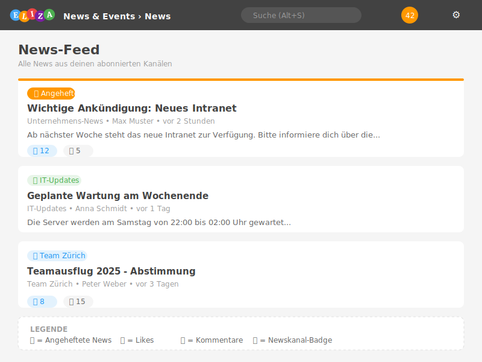

# Erste Schritte mit News & Events

Willkommen bei News & Events – deinem zentralen Kommunikationshub in ELIZA. In diesem Kapitel lernst du die Grundlagen kennen.

## Was ist News & Events?

Das News & Events-Modul ermöglicht die interne Kommunikation in deinem Unternehmen:

- **Newskanäle**: Thematisch organisierte Bereiche für Neuigkeiten
- **News**: Nachrichten mit Text, Bildern und Anhängen
- **Events**: Termine mit Teilnehmerverwaltung
- **Interaktion**: Kommentare und Likes für den Austausch

## Zugriff auf das Modul

**Navigationspfad:** Klicke in der linken Seitennavigation auf **News & Events**

Du gelangst automatisch zur News-Übersicht, wo du die neuesten Nachrichten aus deinen abonnierten Kanälen siehst.

## Die Startseite im Überblick

Die News-Startseite zeigt dir:

### Linke Spalte: News-Feed

- **Angeheftete News**: Wichtige Nachrichten, die oben fixiert sind
- **Aktuelle News**: Chronologisch sortiert nach Veröffentlichungsdatum
- **Interaktionen**: Likes, Kommentare und Lesebestätigungen

### Navigation (Untermenü)

Im Untermenü findest du folgende Bereiche:

| Menüpunkt | Beschreibung |
|-----------|--------------|
| **Newskanäle** | Alle verfügbaren Newskanäle durchsuchen |
| **News** | Alle News-Beiträge anzeigen |
| **Events** | Alle Events im Überblick |
| **Meine Events** | Events, zu denen du eingeladen bist |
| **Einstellungen** | Modul-Einstellungen (nur für Admins) |
| **Hilfe** | Dieses Benutzerhandbuch |

## Newskanäle entdecken

Newskanäle sind thematische Container für verwandte Nachrichten. Beispiele:

- **Unternehmens-News**: Allgemeine Firmennachrichten
- **IT-Updates**: Technische Ankündigungen
- **HR-Mitteilungen**: Personalinformationen
- **Team-Kanäle**: Abteilungsspezifische News

### Einen Newskanal öffnen

1. Navigiere zu **News & Events** → **Newskanäle**
2. Klicke auf einen Newskanal, um dessen Inhalte zu sehen
3. Du siehst alle News und Events dieses Kanals

> 💡 **Tipp:** Abonnierte Newskanäle erscheinen automatisch in deinem persönlichen News-Feed auf der Startseite.

## Deine erste News lesen

So öffnest du einen News-Beitrag:

1. Klicke auf den **Titel** einer News im Feed
2. Die Detailansicht zeigt den vollständigen Text
3. Scrolle nach unten für Kommentare
4. Nutze die Buttons für **Like** oder **Kommentar**

### Interaktionen

| Aktion | Icon | Beschreibung |
|--------|------|--------------|
| Like | 👍 | Zeige, dass dir der Beitrag gefällt |
| Kommentar | 💬 | Schreibe eine Antwort |
| Teilen | 🔗 | Benachrichtige Kollegen über die News |
| Als gelesen markieren | ✓ | Markiere News als gelesen |

## Events im Überblick

Events sind Termine mit zusätzlichen Funktionen:

- **Datum und Uhrzeit**: Start- und Endzeit
- **Ort**: Physischer oder virtueller Veranstaltungsort
- **Teilnehmerverwaltung**: Einladungen und Zu-/Absagen
- **Kalender-Integration**: Export als iCal

### Einen Event öffnen

1. Navigiere zu **News & Events** → **Events**
2. Klicke auf einen Event-Titel
3. Sieh dir Details wie Ort, Zeit und Teilnehmer an
4. Reagiere auf die Einladung (Zusagen/Absagen)

## Meine Events

Unter **Meine Events** findest du alle Events, die dich betreffen:

- Events, zu denen du eingeladen bist
- Events, die du selbst erstellt hast
- Events, bei denen du als Admin oder Anwesenheitsprüfer eingetragen bist

## Abonnements verwalten

Je nach Konfiguration der Newskanäle kannst du:

- **Automatisch abonniert** sein (bei obligatorischen Kanälen)
- **Manuell abonnieren** (bei optionalen Kanälen)
- **Abbestellen** (wenn der Kanal dies erlaubt)

Das Abonnement-Symbol zeigt dir den aktuellen Status:

| Symbol | Bedeutung |
|--------|-----------|
| 🔔 ausgefüllt | Abonniert |
| 🔔 leer | Nicht abonniert |
| 🔒 | Pflicht-Abonnement (kann nicht abbestellt werden) |

## Best Practices für den Einstieg

- ✅ **Erkunde die Newskanäle**: Verschaffe dir einen Überblick über verfügbare Kanäle
- ✅ **Abonniere relevante Kanäle**: Wähle Kanäle, die für deine Arbeit wichtig sind
- ✅ **Prüfe regelmässig**: Schaue täglich in den News-Feed
- ✅ **Interagiere**: Nutze Likes und Kommentare für Feedback
- ✅ **Kalender synchronisieren**: Exportiere Events in deinen Kalender

## Häufige Fragen

### Warum sehe ich bestimmte Newskanäle nicht?

Manche Newskanäle sind **geschützt** und nur für bestimmte Organisationseinheiten oder Gruppen sichtbar. Wende dich an deinen Administrator, wenn du Zugriff benötigst.

### Wie werde ich über neue News benachrichtigt?

ELIZA zeigt ungelesene News als Badge in der Navigation an. Zusätzlich können Newskanal-Admins dich per E-Mail benachrichtigen.

### Kann ich alte News wiederfinden?

Ja! Nutze die Suchfunktion (Alt+S) oder navigiere direkt zum entsprechenden Newskanal.

## Nächste Schritte

- Lerne mehr über [Newskanäle]()
- Erfahre, wie du [News erstellst]()
- Entdecke die [Event-Verwaltung]()
