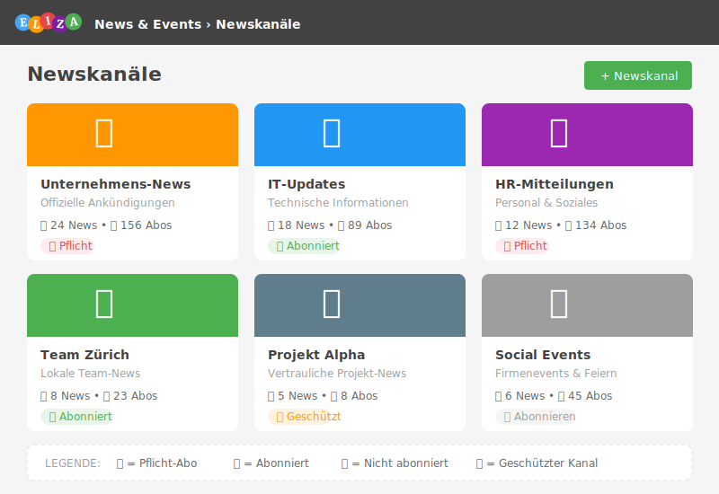

# Newskanäle verstehen und verwalten

Newskanäle sind das Herzstück des News & Events-Moduls. Sie ermöglichen eine strukturierte Kommunikation nach Themen, Abteilungen oder Projekten.

## Was sind Newskanäle?

Ein Newskanal ist ein thematischer Container, der zusammengehörige News und Events bündelt:

- **Unternehmens-News**: Allgemeine Ankündigungen
- **Abteilungs-Kanäle**: IT, HR, Marketing, etc.
- **Projekt-Kanäle**: Projektspezifische Updates
- **Team-Kanäle**: Interne Team-Kommunikation

## Newskanäle anzeigen

**Navigationspfad:** News & Events → Newskanäle

Du siehst eine Übersicht aller Newskanäle, auf die du Zugriff hast. Die Ansicht zeigt:

- **Titel** und **Beschreibung** des Kanals
- **Vorschaubild** (falls vorhanden)
- **Anzahl der News** und **Events**
- **Abonnement-Status**

## Einen Newskanal erstellen

> ⚠️ **Berechtigung erforderlich:** Du benötigst die Berechtigung zum Erstellen von Newskanälen.

**Schritt-für-Schritt:**

1. Navigiere zu **News & Events** → **Newskanäle**
2. Klicke auf den Button **Newskanal hinzufügen** (grüner Button mit Plus-Icon)
3. Fülle das Formular aus:

### Grundeinstellungen

| Feld | Pflicht | Beschreibung |
|------|---------|--------------|
| **Titel** | Ja | Name des Newskanals |
| **Beschreibung** | Nein | Erklärung des Kanal-Zwecks |
| **Bild** | Nein | Vorschaubild (empfohlen: 400x300px, Seitenverhältnis 4:3) |
| **Detailbild** | Nein | Header-Bild für die Detailansicht (empfohlen: 1600x200px) |

### Interaktions-Einstellungen

| Feld | Standard | Beschreibung |
|------|----------|--------------|
| **Kommentare erlauben** | Ja | Können Benutzer News kommentieren? |
| **Likes erlauben** | Ja | Können Benutzer News liken? |

### Sichtbarkeit

| Option | Beschreibung |
|--------|--------------|
| **Normal** | Alle Benutzer mit Leseberechtigung können den Kanal sehen |
| **Geschützt** | Nur zugewiesene Organisationseinheiten und Gruppen |

### Team-Zuweisungen

| Feld | Beschreibung |
|------|--------------|
| **Admin-Team** | Benutzer mit Vollzugriff auf den Kanal |
| **Team** | Benutzer, die News erstellen können |
| **Beteiligte Organisationseinheiten** | Bei geschützten Kanälen: Wer hat Zugriff |
| **Beteiligte benutzerdefinierte Gruppen** | Bei geschützten Kanälen: Welche Gruppen haben Zugriff |

4. Klicke auf **Speichern**

## Abo-Modi verstehen

Der **Abo-Modus** bestimmt, wie Benutzer einen Newskanal abonnieren können:

### Automatisch abonniert (nicht abstellbar)

- Alle berechtigten Benutzer sind automatisch abonniert
- Abonnement kann **nicht** beendet werden
- Ideal für: Unternehmens-News, Pflichtmitteilungen

### Manuell abonnierbar

- Benutzer müssen den Kanal **selbst abonnieren**
- Abonnement kann jederzeit beendet werden
- Ideal für: Optionale Themen-Kanäle, Interessengruppen

### Obligatorisch für Berechtigte, abonnierbar für andere

- Benutzer aus zugewiesenen Gruppen/Orgunits sind **pflicht-abonniert**
- Andere können **freiwillig** abonnieren
- Ideal für: Abteilungs-Kanäle mit optionaler Reichweite

> 💡 **Tipp:** Wähle den Abo-Modus sorgfältig – er bestimmt, wie verbindlich die Informationen für Benutzer sind.

## Wer darf News erstellen?

Im Bereich **News-Berechtigungen** legst du fest, wer in diesem Kanal News veröffentlichen kann:

| Option | Beschreibung |
|--------|--------------|
| **Alle mit Leseberechtigung** | Jeder, der den Kanal sehen kann |
| **Beteiligte Organisationseinheiten** | Nur Mitglieder zugewiesener Orgunits |
| **Beteiligte benutzerdefinierte Gruppen** | Nur Mitglieder zugewiesener Gruppen |

Diese Optionen sind **kombinierbar** – aktiviere mehrere Checkboxen für flexible Berechtigungen.

> ⚠️ **Wichtig:** Admins und Team-Mitglieder können **immer** News erstellen, unabhängig von diesen Einstellungen.

## Kategorien nutzen

Kategorien helfen dabei, News innerhalb eines Kanals zu organisieren:

### Kategorie erstellen

1. Öffne einen Newskanal
2. Navigiere zu **Kategorien** (falls verfügbar)
3. Klicke auf **Kategorie hinzufügen**
4. Gib **Titel** und optional eine **Farbe** ein
5. Speichere die Kategorie

### Kategorien anwenden

Beim Erstellen einer News kannst du eine oder mehrere Kategorien auswählen. Benutzer können dann nach Kategorien filtern.

## Newskanal bearbeiten

1. Öffne den Newskanal
2. Klicke auf das **Bearbeiten-Icon** (Stift-Symbol)
3. Passe die Einstellungen an
4. Klicke auf **Speichern**

## Newskanal archivieren

Archivierte Newskanäle werden nicht mehr aktiv angezeigt, aber die Inhalte bleiben erhalten:

1. Öffne den Newskanal
2. Klicke auf **Bearbeiten**
3. Aktiviere **Archiviert**
4. Speichere

> 💡 **Tipp:** Archiviere alte Projekt-Kanäle statt sie zu löschen – so bleiben die Informationen erhalten.

## Newskanal löschen

> ⚠️ **Warnung:** Beim Löschen werden **alle News und Events** des Kanals gelöscht!

1. Öffne den Newskanal
2. Klicke auf **Löschen** (Papierkorb-Icon)
3. Bestätige die Löschung

Gelöschte Kanäle landen im Papierkorb und können dort wiederhergestellt werden.

## Farbgestaltung

Du kannst Newskanäle visuell anpassen:

| Feld | Beschreibung |
|------|--------------|
| **Hintergrundfarbe** | Farbe für die Kanal-Kachel |
| **Textfarbe** | Farbe des Kanal-Titels |

Dies hilft bei der visuellen Unterscheidung verschiedener Kanäle auf der Übersichtsseite.

## Reihenfolge anpassen

Die **Reihenfolge** bestimmt, wo der Newskanal in der Liste erscheint. Niedrigere Werte erscheinen weiter oben.

## Best Practices

- ✅ **Klare Namen**: Verwende aussagekräftige Kanal-Titel
- ✅ **Beschreibung hinzufügen**: Erkläre den Zweck des Kanals
- ✅ **Bilder nutzen**: Vorschaubilder verbessern die Übersicht
- ✅ **Abo-Modi gezielt einsetzen**: Pflicht nur für wichtige Kommunikation
- ✅ **Kategorien nutzen**: Strukturiere Inhalte bei vielen News
- ✅ **Regelmässige Pflege**: Archiviere inaktive Kanäle

## Häufige Fragen

### Kann ich die Sichtbarkeit nachträglich ändern?

Ja, du kannst zwischen "normal" und "geschützt" wechseln. Beachte aber, dass dies sofort die Zugriffe ändert.

### Was passiert mit News, wenn ich einen Kanal archiviere?

Die News bleiben erhalten und sind weiterhin zugänglich. Der Kanal wird aber nicht mehr prominent angezeigt.

### Wie viele Newskanäle sollte ich erstellen?

Weniger ist mehr. Zu viele Kanäle führen zu Fragmentierung. Gruppiere lieber thematisch verwandte Inhalte.

## Nächste Schritte

- Lerne, wie du [News erstellst]()
- Entdecke die [Event-Verwaltung]()
- Verstehe das [Berechtigungskonzept]()
