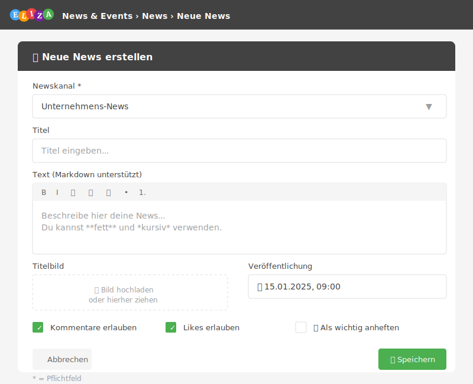

# News erstellen und verwalten

In diesem Kapitel lernst du, wie du News-Beiträge erstellst, formatierst und mit anderen teilst.

## Eine neue News erstellen

### Direkt aus dem Newskanal

1. Öffne den gewünschten **Newskanal**
2. Klicke auf **News hinzufügen** (grüner Button)
3. Fülle das Formular aus
4. Klicke auf **Speichern**

### Über die News-Übersicht

1. Navigiere zu **News & Events** → **News**
2. Klicke auf **News hinzufügen**
3. Wähle den **Newskanal** aus
4. Fülle das Formular aus
5. Speichere

## Das News-Formular



### Grundlegende Felder

| Feld | Pflicht | Beschreibung |
|------|---------|--------------|
| **Newskanal** | Ja | In welchem Kanal erscheint die News |
| **Titel** | Nein | Überschrift der News (empfohlen) |
| **Text** | Nein | Der eigentliche Inhalt (Markdown-Format) |
| **Bild** | Nein | Titelbild für die News |

### Interaktions-Einstellungen

| Feld | Standard | Beschreibung |
|------|----------|--------------|
| **Kommentare erlauben** | Ja | Können Leser kommentieren? |
| **Likes erlauben** | Ja | Können Leser liken? |

### Veröffentlichung

| Feld | Beschreibung |
|------|--------------|
| **Veröffentlichungszeitpunkt** | Wann die News sichtbar wird |
| **Kategorien** | Thematische Einordnung |

> 💡 **Tipp:** Setze den Veröffentlichungszeitpunkt in die Zukunft, um News vorzubereiten.

## Text formatieren mit Markdown

Der News-Text unterstützt **Markdown** für reichhaltige Formatierung:

### Überschriften

```markdown
# Überschrift 1
## Überschrift 2
### Überschrift 3
```

### Textformatierung

```markdown
**Fetter Text**
*Kursiver Text*
~~Durchgestrichen~~
```

### Listen

```markdown
- Punkt 1
- Punkt 2
  - Unterpunkt

1. Erster Schritt
2. Zweiter Schritt
```

### Links und Bilder

```markdown
[Link-Text](https://example.com)

```

### Zitate

```markdown
> Dies ist ein Zitat
```

### Code

```markdown
`Inline-Code`

​```python
# Code-Block
print("Hallo Welt")
​```
```

### Tabellen

```markdown
| Spalte 1 | Spalte 2 |
|----------|----------|
| Wert 1   | Wert 2   |
```

### Aufgabenlisten

```markdown
- [x] Erledigt
- [ ] Noch offen
```

## Eingebettete Medien

Der Markdown-Filter erkennt automatisch Links zu bekannten Plattformen und bettet sie ein:

| Plattform | Beispiel-Link |
|-----------|---------------|
| **YouTube** | youtube.com/watch?v=... oder youtu.be/... |
| **Vimeo** | vimeo.com/... |
| **Loom** | loom.com/share/... |
| **Spotify** | open.spotify.com/episode/... |
| **Arcade** | arcade.software/share/... |
| **Excalidraw** | excalidraw.com/... |

Füge einfach den Link in den Text ein – ELIZA erkennt ihn automatisch und zeigt das eingebettete Medium an.

## Bilder und Dateien anhängen

### Titelbild hinzufügen

Das **Bild**-Feld fügt ein Titelbild hinzu, das in der Vorschau und oben im Beitrag angezeigt wird.

### Dateien anhängen

Unter dem Text-Editor findest du die Möglichkeit, **Dateien** anzuhängen:

1. Klicke auf **Datei hinzufügen**
2. Wähle die Datei aus
3. Wiederhole für weitere Dateien

Angehängte Dateien werden unterhalb des Beitrags als Download-Links angezeigt.

## News anheften (Sticky)

Wichtige News können **angeheftet** werden, damit sie oben im Feed erscheinen:

1. Aktiviere **Angeheftet**
2. Setze das **Startdatum** (ab wann die News angeheftet ist)
3. Optional: Setze ein **Enddatum** (automatisches Lösen)

> 💡 **Tipp:** Nutze das Enddatum für zeitlich begrenzte Ankündigungen wie Wartungsfenster.

## Geplante Veröffentlichung

Du kannst News im Voraus planen:

1. Setze den **Veröffentlichungszeitpunkt** in die Zukunft
2. Speichere die News
3. Die News wird automatisch zum geplanten Zeitpunkt sichtbar

Geplante News sind mit einem speziellen Icon gekennzeichnet und nur für dich und Kanal-Admins sichtbar.

## News bearbeiten

1. Öffne die News (klicke auf den Titel)
2. Klicke auf das **Bearbeiten-Icon** (Stift)
3. Nimm deine Änderungen vor
4. Speichere

> ⚠️ **Wichtig:** Bearbeitungen sind für alle sichtbar – es gibt keine versteckte Versionshistorie.

## News löschen

1. Öffne die News
2. Klicke auf **Löschen** (Papierkorb-Icon)
3. Bestätige die Löschung

Gelöschte News landen im Papierkorb und können wiederhergestellt werden.

## Kommentare

### Kommentar schreiben

1. Scrolle unter die News zum Kommentar-Bereich
2. Klicke auf **Kommentieren**
3. Schreibe deinen Kommentar
4. Klicke auf **Absenden**

### Auf Kommentare antworten

Du kannst auf bestehende Kommentare antworten – so entstehen Diskussionsstränge.

### Kommentar löschen

- Du kannst deine eigenen Kommentare jederzeit löschen
- Kanal-Admins können alle Kommentare löschen

## Likes

Klicke auf das **Daumen-hoch-Icon** (👍), um eine News zu liken. Die Anzahl der Likes wird angezeigt.

Klicke erneut, um den Like zu entfernen.

## Als gelesen markieren

Am Ende jeder News findest du den Button **Als gelesen markieren**. Dies:

- Entfernt die News aus dem "Ungelesen"-Zähler
- Zeigt anderen, dass du die News gesehen hast

Admins können sehen, wer eine News gelesen hat (**Lesebestätigungen**).

## News teilen

Mit dem **Teilen-Button** kannst du Kollegen auf eine News aufmerksam machen:

1. Klicke auf das **Teilen-Icon**
2. Wähle die Empfänger aus
3. Optional: Füge eine persönliche Nachricht hinzu
4. Sende die Benachrichtigung

Die Empfänger erhalten eine ELIZA-Benachrichtigung mit Link zur News.

## Best Practices

- ✅ **Titel verwenden**: Auch wenn optional – ein Titel verbessert die Übersicht
- ✅ **Kurz und prägnant**: Wichtiges zuerst, Details danach
- ✅ **Bilder nutzen**: Visuelle Inhalte erhöhen die Aufmerksamkeit
- ✅ **Kategorien vergeben**: Hilft beim späteren Filtern
- ✅ **Sticky sparsam einsetzen**: Zu viele angeheftete News verlieren ihre Wirkung
- ✅ **Vorausplanen**: Nutze die geplante Veröffentlichung für wichtige Ankündigungen

## Häufige Fragen

### Kann ich eine veröffentlichte News zurückziehen?

Du kannst den Veröffentlichungszeitpunkt in die Zukunft verschieben oder die News löschen.

### Werden Benutzer über neue News benachrichtigt?

Das hängt von den Einstellungen ab. Kanal-Admins können Benachrichtigungen manuell auslösen.

### Wie formatiere ich Text fett oder kursiv?

Verwende Markdown: `**fett**` für **fett** und `*kursiv*` für *kursiv*.

### Kann ich Emojis in News verwenden?

Ja! Kopiere Emojis direkt in den Text oder nutze die Emoji-Tastatur deines Betriebssystems.

## Nächste Schritte

- Entdecke die [Event-Verwaltung]()
- Verstehe das [Berechtigungskonzept]()
