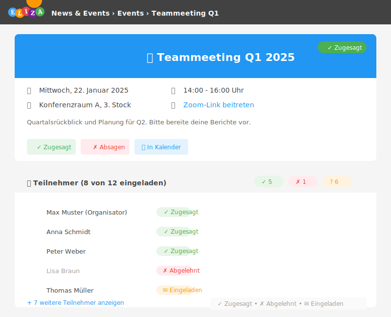

# Events planen und verwalten

Events ermöglichen dir, Termine zu organisieren, Teilnehmer einzuladen und Anwesenheit zu erfassen. In diesem Kapitel lernst du alle Funktionen kennen.

## Was sind Events?

Events sind Termine mit erweiterten Funktionen:

- **Datum und Uhrzeit**: Start- und Endzeit
- **Ort**: Physischer oder virtueller Veranstaltungsort
- **Teilnehmerverwaltung**: Einladungen, Zu- und Absagen
- **Anwesenheitsprüfung**: Wer hat tatsächlich teilgenommen?
- **Unterschriften**: Optionale digitale Signaturen
- **Kalender-Integration**: Export als iCal-Feed

## Events anzeigen

### Alle Events

**Navigationspfad:** News & Events → Events

Du siehst alle Events chronologisch sortiert nach Startdatum.

### Meine Events

**Navigationspfad:** News & Events → Meine Events

Zeigt nur Events, die dich betreffen:

- Events, zu denen du **eingeladen** bist
- Events, die du **erstellt** hast
- Events, bei denen du **Admin** oder **Anwesenheitsprüfer** bist

## Ein Event erstellen

### Direkt aus dem Newskanal

1. Öffne den gewünschten **Newskanal**
2. Klicke auf **Event hinzufügen**
3. Fülle das Formular aus
4. Speichere

### Über die Event-Übersicht

1. Navigiere zu **News & Events** → **Events**
2. Klicke auf **Event hinzufügen**
3. Wähle den **Newskanal** aus
4. Fülle das Formular aus
5. Speichere

## Das Event-Formular

### Grundlegende Felder

| Feld | Pflicht | Beschreibung |
|------|---------|--------------|
| **Newskanal** | Ja | In welchem Kanal erscheint das Event |
| **Titel** | Ja | Name des Events |
| **Text** | Nein | Beschreibung (Markdown-Format) |
| **Bild** | Nein | Titelbild für das Event |

### Zeitangaben

| Feld | Pflicht | Beschreibung |
|------|---------|--------------|
| **Startdatum** | Ja | Beginn des Events |
| **Enddatum** | Ja | Ende des Events |
| **Ganztägig** | Nein | Event ohne spezifische Uhrzeiten |
| **Veröffentlichungszeitpunkt** | Ja | Ab wann das Event sichtbar ist |

### Ort

| Feld | Beschreibung |
|------|--------------|
| **Ort** | Textbeschreibung (z.B. "Konferenzraum A") |
| **Ort (URL)** | Link zu Online-Meeting oder Kartenansicht |

> 💡 **Tipp:** Kombiniere beide Felder, z.B. "Zoom-Meeting" mit dem Einladungslink.

### Teilnehmer-Einstellungen

| Feld | Beschreibung |
|------|--------------|
| **Minimale Teilnehmerzahl** | Mindestanzahl für Durchführung |
| **Maximale Teilnehmerzahl** | Kapazitätsgrenze |
| **Anmeldefrist** | Bis wann Anmeldungen möglich sind |
| **Unterschrift erforderlich** | Teilnehmer müssen digital unterschreiben |

### Verwaltung

| Feld | Beschreibung |
|------|--------------|
| **Admins** | Benutzer mit Vollzugriff auf das Event |
| **Anwesenheitsprüfer** | Wer die Teilnahme erfassen darf |
| **Kategorien** | Thematische Einordnung |

## Event-Detailansicht

## Teilnehmer einladen

Nach dem Erstellen eines Events kannst du Teilnehmer einladen:

1. Öffne das Event
2. Klicke auf **Teilnehmer einladen** oder das Personen-Icon
3. Wähle die einzuladenden Benutzer aus:
   - **Einzelne Benutzer** auswählen
   - **Gruppen** oder **Organisationseinheiten** einladen
4. Klicke auf **Einladen**

Die eingeladenen Personen erhalten eine Benachrichtigung.

## Einladungen beantworten

Als eingeladene Person siehst du das Event unter **Meine Events**:

### Zusagen

1. Öffne das Event
2. Klicke auf **Zusagen** (grüner Button)
3. Falls erforderlich: Unterschreibe digital

### Absagen

1. Öffne das Event
2. Klicke auf **Absagen** (roter Button)

### Status-Übersicht

| Status | Bedeutung | Icon |
|--------|-----------|------|
| **Eingeladen** | Keine Antwort bisher | ✉️ |
| **Zugesagt** | Teilnahme bestätigt | ✓ |
| **Abgelehnt** | Kann nicht teilnehmen | ✗ |

## Anmeldefrist

Wenn eine **Anmeldefrist** gesetzt ist:

- Vor der Frist: Zusagen und Absagen möglich
- Nach der Frist: Keine Änderungen mehr möglich

> 💡 **Tipp:** Setze die Anmeldefrist einige Tage vor dem Event, damit du planen kannst.

## Teilnehmerlimits

Mit **minimaler** und **maximaler Teilnehmerzahl** kannst du:

- **Minimum**: Sicherstellen, dass genug Personen dabei sind
- **Maximum**: Kapazitätsgrenzen einhalten

Wenn das Maximum erreicht ist, können keine weiteren Personen zusagen.

## Unterschrift erforderlich

Bei aktivierter Option **Unterschrift erforderlich**:

1. Teilnehmer müssen beim Zusagen digital unterschreiben
2. Die Unterschrift wird gespeichert
3. Admins können die Unterschriften einsehen

Dies ist nützlich für:
- Schulungen mit Nachweispflicht
- Sicherheitsunterweisungen
- Verbindliche Anmeldungen

## Anwesenheit erfassen

Als **Anwesenheitsprüfer** oder **Admin** kannst du die tatsächliche Teilnahme erfassen:

1. Öffne das Event
2. Gehe zu **Teilnehmer**
3. Markiere anwesende Personen
4. Bei Bedarf: Lasse Teilnehmer vor Ort unterschreiben

## Event anheften (Sticky)

Wichtige Events können angeheftet werden:

1. Bearbeite das Event
2. Aktiviere **Angeheftet**
3. Setze **Start-** und optional **Enddatum**
4. Speichere

Angeheftete Events erscheinen prominent auf der Startseite.

## Event kopieren

Für wiederkehrende Events:

1. Öffne das Event
2. Klicke auf **Kopieren** (falls verfügbar)
3. Passe Datum und Details an
4. Speichere als neues Event

## Kalender-Integration

### iCal-Feed abonnieren

ELIZA bietet einen persönlichen iCal-Feed für deine Events:

1. Navigiere zu **News & Events** → **Events**
2. Suche nach dem **Kalender-Link** oder **iCal-Button**
3. Kopiere die URL
4. Füge sie in deiner Kalender-App hinzu (Outlook, Google Calendar, Apple Kalender)

Der Feed aktualisiert sich automatisch mit neuen Events.

### Einzelnes Event exportieren

Du kannst auch einzelne Events als .ics-Datei herunterladen und in deinen Kalender importieren.

## Benachrichtigungen

Als Event-Admin kannst du Teilnehmer benachrichtigen:

1. Öffne das Event
2. Klicke auf **Benachrichtigen** oder das Glocken-Icon
3. Wähle die Zielgruppe:
   - Alle Eingeladenen
   - Nur Zugesagte
   - Nur Eingeladene (ohne Antwort)
4. Füge optional eine Nachricht hinzu
5. Sende die Benachrichtigung

## Event bearbeiten

1. Öffne das Event
2. Klicke auf **Bearbeiten** (Stift-Icon)
3. Nimm Änderungen vor
4. Speichere

> ⚠️ **Wichtig:** Informiere Teilnehmer über wesentliche Änderungen (Datum, Ort).

## Event löschen

1. Öffne das Event
2. Klicke auf **Löschen** (Papierkorb-Icon)
3. Bestätige die Löschung

Eingeladene Teilnehmer werden **nicht automatisch** benachrichtigt. Nutze vorher die Benachrichtigungsfunktion.

## Best Practices

- ✅ **Frühzeitig erstellen**: Gib Teilnehmern genug Vorlauf
- ✅ **Anmeldefrist setzen**: Ermöglicht bessere Planung
- ✅ **Ort und URL kombinieren**: Für hybride Events
- ✅ **Teilnehmerlimits nutzen**: Bei begrenzten Räumen
- ✅ **Kalender-Feed bewerben**: Erleichtert die Integration
- ✅ **Erinnerungen senden**: Kurz vor dem Event benachrichtigen
- ✅ **Anwesenheit erfassen**: Für Dokumentation und Nachverfolgung

## Häufige Fragen

### Kann ich die Teilnehmerliste exportieren?

Ja, als Admin siehst du die vollständige Teilnehmerliste mit Status und kannst diese exportieren.

### Was passiert, wenn ich ein Event absage?

Dein Status ändert sich zu "Abgelehnt". Du kannst dies rückgängig machen, solange die Anmeldefrist nicht abgelaufen ist.

### Werden Teilnehmer bei Änderungen benachrichtigt?

Nicht automatisch. Nutze die Benachrichtigungsfunktion, um über wichtige Änderungen zu informieren.

### Kann ich ein Event wiederholen?

Nutze die Kopier-Funktion und passe das Datum an. Automatische Wiederholungen werden aktuell nicht unterstützt.

### Wie synchronisiere ich Events mit meinem Kalender?

Abonniere den iCal-Feed in deiner Kalender-App. Der Feed aktualisiert sich automatisch.

## Nächste Schritte

- Verstehe das [Berechtigungskonzept]()
- Kehre zur [Übersicht]() zurück
