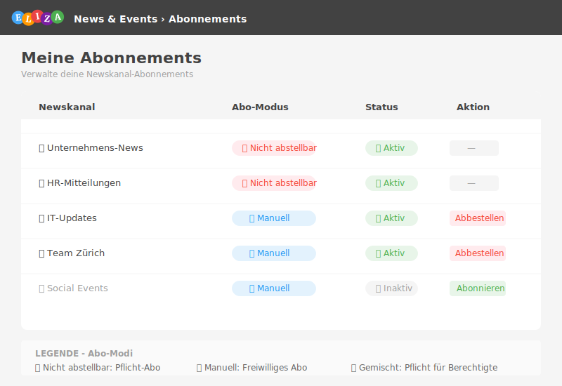

# Berechtigungen und Abonnements

In diesem Kapitel erfährst du, wie das Berechtigungssystem in News & Events funktioniert und wie Abonnements verwaltet werden.

## Berechtigungskonzept im Überblick

Das News & Events-Modul verwendet ein mehrstufiges Berechtigungssystem:

<pre>
┌─────────────────────────────────────────────────────────┐
│  1. Systemgruppen (Basis-Berechtigungen)                │
│     ↓                                                   │
│  2. Newskanal-Sichtbarkeit (Normal / Geschützt)         │
│     ↓                                                   │
│  3. Newskanal-Rollen (Admin / Team / Leser)             │
│     ↓                                                   │
│  4. News-Berechtigungen (Wer darf erstellen?)           │
└─────────────────────────────────────────────────────────┘
</pre>

## Systemgruppen

ELIZA definiert drei Systemgruppen für News & Events:

### streams_readers

**Nur-Lese-Zugriff:**

- ✓ News und Events anzeigen
- ✓ Kommentieren
- ✓ Liken
- ✗ Keine eigenen News erstellen
- ✗ Keine Newskanäle verwalten

**Typische Benutzer:** Mitarbeiter ohne Redaktionsaufgaben

### streams_users

**Standard-Benutzer-Rechte:**

- ✓ Alles aus streams_readers
- ✓ News erstellen (wenn im Kanal erlaubt)
- ✓ Events erstellen (wenn im Kanal erlaubt)
- ✗ Keine Newskanäle verwalten

**Typische Benutzer:** Mitarbeiter mit Kommunikationsaufgaben

### streams_admin

**Vollzugriff:**

- ✓ Alles aus streams_users
- ✓ Newskanäle erstellen, bearbeiten, löschen
- ✓ Alle News und Events bearbeiten/löschen
- ✓ Kommentare moderieren
- ✓ Modul-Einstellungen verwalten

**Typische Benutzer:** Kommunikationsverantwortliche, Administratoren

## Berechtigungen im Detail

| Berechtigung | readers | users | admin |
|--------------|:-------:|:-----:|:-----:|
| News anzeigen | ✓ | ✓ | ✓ |
| Events anzeigen | ✓ | ✓ | ✓ |
| Kommentieren | ✓ | ✓ | ✓ |
| Liken | ✓ | ✓ | ✓ |
| News erstellen | ✗ | ✓* | ✓ |
| Events erstellen | ✗ | ✓* | ✓ |
| News bearbeiten (eigene) | ✗ | ✓ | ✓ |
| News bearbeiten (alle) | ✗ | ✗ | ✓ |
| News löschen (eigene) | ✗ | ✓ | ✓ |
| News löschen (alle) | ✗ | ✗ | ✓ |
| Newskanäle verwalten | ✗ | ✗ | ✓ |
| Einstellungen | ✗ | ✗ | ✓ |

*abhängig von Newskanal-Einstellungen

## Newskanal-Sichtbarkeit

Jeder Newskanal hat eine **Sichtbarkeitseinstellung**:

### Normal

- Alle Benutzer mit Leseberechtigung sehen den Kanal
- Standard für öffentliche Unternehmens-News

### Geschützt

- Nur zugewiesene Benutzer sehen den Kanal
- Zugriff über:
  - **Organisationseinheiten**: Alle Mitglieder der zugewiesenen Orgunits
  - **Benutzerdefinierte Gruppen**: Alle Mitglieder der zugewiesenen Gruppen
  - **Admin-Team**: Immer Zugriff
  - **Team**: Immer Zugriff

> 💡 **Tipp:** Nutze geschützte Kanäle für vertrauliche Informationen oder abteilungsinterne Kommunikation.

## Newskanal-Rollen

Innerhalb eines Newskanals gibt es drei Rollen:

### Admin-Team

Benutzer im **Admin-Team** haben:

- Vollzugriff auf den Newskanal
- Können alle News und Events bearbeiten/löschen
- Können andere Admins hinzufügen
- Können den Newskanal konfigurieren

### Team

Benutzer im **Team** haben:

- Können News und Events erstellen
- Können eigene Beiträge bearbeiten/löschen
- Keine Verwaltungsrechte für den Kanal

### Leser

Alle anderen berechtigten Benutzer sind **Leser**:

- Können News und Events lesen
- Können kommentieren und liken
- News-Erstellung abhängig von Kanal-Einstellungen

## Wer darf News erstellen?

Die Einstellung **News-Berechtigungen** im Newskanal legt fest, wer News veröffentlichen kann:

### Option 1: Alle mit Leseberechtigung

Jeder, der den Kanal sehen kann, darf auch News erstellen.

**Anwendungsfall:** Offene Team-Kanäle, wo alle beitragen sollen

### Option 2: Beteiligte Organisationseinheiten

Nur Mitglieder der zugewiesenen Organisationseinheiten dürfen News erstellen.

**Anwendungsfall:** Abteilungs-Kanäle mit klarer Redaktions-Verantwortung

### Option 3: Beteiligte benutzerdefinierte Gruppen

Nur Mitglieder der zugewiesenen Gruppen dürfen News erstellen.

**Anwendungsfall:** Projektkanäle mit definiertem Kommunikationsteam

> ⚠️ **Wichtig:** Diese Optionen sind **kombinierbar**! Du kannst mehrere aktivieren.

> 💡 **Tipp:** Admins und Team-Mitglieder können **immer** News erstellen, unabhängig von diesen Einstellungen.

## Abonnement-System

Das Abonnement-System steuert, welche Newskanäle auf deiner persönlichen Startseite erscheinen.

### Abo-Modi

Newskanäle können einen von drei Abo-Modi haben:

#### Automatisch abonniert (nicht abstellbar)

- Du bist automatisch abonniert, wenn du Zugriff hast
- Abonnement **kann nicht** beendet werden
- Der Kanal erscheint immer in deinem Feed

**Symbol:** 🔒 (Schloss)

**Typische Verwendung:** Unternehmens-News, Pflichtmitteilungen, Compliance-Informationen

#### Manuell abonnierbar

- Du musst den Kanal **selbst abonnieren**
- Du kannst jederzeit **abbestellen**
- Nur abonnierte Kanäle erscheinen in deinem Feed

**Symbol:** 🔔 (Glocke, leer = nicht abonniert, ausgefüllt = abonniert)

**Typische Verwendung:** Interessengruppen, optionale Themen-Kanäle

#### Obligatorisch für Berechtigte, abonnierbar für andere (Gemischt)

- **Berechtigte Benutzer** (aus zugewiesenen Orgunits/Gruppen): Pflicht-Abonnement
- **Andere Benutzer**: Können freiwillig abonnieren/abbestellen

**Symbol:** Je nach Status 🔒 oder 🔔

**Typische Verwendung:** Abteilungs-Kanäle mit Pflicht für die Abteilung, optional für andere

## Abonnements verwalten

### Einen Kanal abonnieren

1. Navigiere zum Newskanal
2. Klicke auf das **Abonnieren-Symbol** (Glocke)
3. Der Kanal erscheint nun in deinem News-Feed

### Ein Abonnement beenden

1. Navigiere zum Newskanal
2. Klicke auf das **Abbestellen-Symbol**
3. Der Kanal erscheint nicht mehr in deinem Feed

> ⚠️ **Hinweis:** Bei Pflicht-Abonnements ist der Abbestellen-Button **deaktiviert**.

### Abo-Übersicht

**Navigationspfad:** News & Events → (Einstellungen) → Abonnements

Hier siehst du:

- Alle deine aktiven Abonnements
- Den Abo-Modus jedes Kanals
- Optionen zum Abonnieren/Abbestellen

## Praktische Beispiele

### Beispiel 1: Unternehmens-News

**Konfiguration:**
- Sichtbarkeit: Normal
- Abo-Modus: Automatisch abonniert (nicht abstellbar)
- News-Berechtigung: Nur Admin-Team

**Ergebnis:** Alle Mitarbeiter sehen die News, nur die Kommunikationsabteilung kann veröffentlichen.

### Beispiel 2: IT-Support-Kanal

**Konfiguration:**
- Sichtbarkeit: Normal
- Abo-Modus: Manuell abonnierbar
- News-Berechtigung: Beteiligte Organisationseinheiten (IT-Abteilung)

**Ergebnis:** Alle können den Kanal sehen und optional abonnieren. Nur IT-Mitarbeiter können News veröffentlichen.

### Beispiel 3: Geschützter Projekt-Kanal

**Konfiguration:**
- Sichtbarkeit: Geschützt
- Beteiligte Gruppen: Projekt-Team-Gruppe
- Abo-Modus: Obligatorisch für Berechtigte, abonnierbar für andere

**Ergebnis:** Projekt-Mitglieder sind pflicht-abonniert. Andere sehen den Kanal nicht (geschützt).

## Best Practices

- ✅ **Systemgruppen gezielt zuweisen**: Gib nur nötige Berechtigungen
- ✅ **Geschützte Kanäle für Vertrauliches**: Nutze sie für sensitive Informationen
- ✅ **Abo-Modi bewusst wählen**: Pflicht nur für wirklich wichtige Kanäle
- ✅ **News-Berechtigungen einschränken**: Verhindert Informationsüberflutung
- ✅ **Rollen nutzen**: Admin-Team für Verwaltung, Team für Redaktion
- ✅ **Regelmässig prüfen**: Kontrolliere, wer Zugriff hat

## Häufige Fragen

### Warum kann ich einen Kanal nicht abbestellen?

Der Kanal verwendet den Abo-Modus "Automatisch abonniert (nicht abstellbar)" oder du bist bei "Gemischt" als berechtigt eingestuft.

### Warum sehe ich einen Kanal nicht?

Der Kanal ist **geschützt** und du bist nicht in einer der zugewiesenen Organisationseinheiten oder Gruppen.

### Warum kann ich keine News erstellen?

Prüfe:
1. Hast du die Berechtigung `streams_users` oder höher?
2. Sind die News-Berechtigungen im Kanal für dich aktiviert?
3. Bist du Mitglied der berechtigten Orgunits/Gruppen?

### Kann ich die Berechtigungen eines Benutzers sehen?

Als Administrator siehst du in der Benutzerverwaltung, welche Gruppen ein Benutzer hat.

## Zusammenfassung

<pre>
Berechtigungen prüfen:

1. Systemgruppe des Benutzers?
   → streams_readers / streams_users / streams_admin

2. Sichtbarkeit des Newskanals?
   → Normal (alle) / Geschützt (nur zugewiesene)

3. Rolle im Newskanal?
   → Admin / Team / Leser

4. News-Berechtigung im Kanal?
   → Alle Leser / Nur bestimmte Gruppen
</pre>

## Nächste Schritte

- Kehre zur [Übersicht]() zurück
- Lies [Erste Schritte]() für den Einstieg
- Erfahre mehr über [Newskanäle]()
