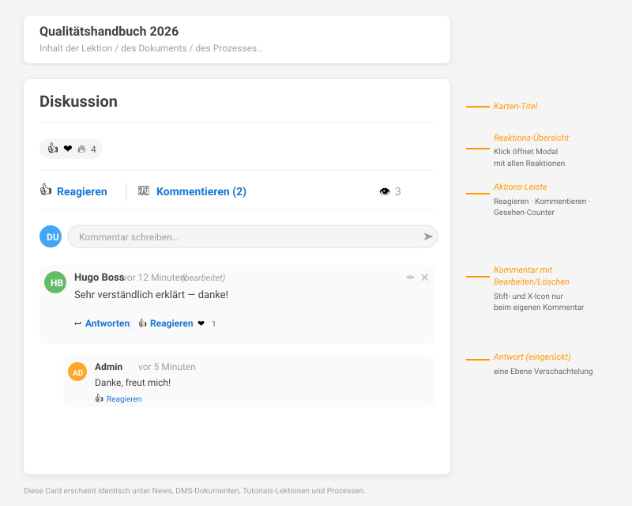
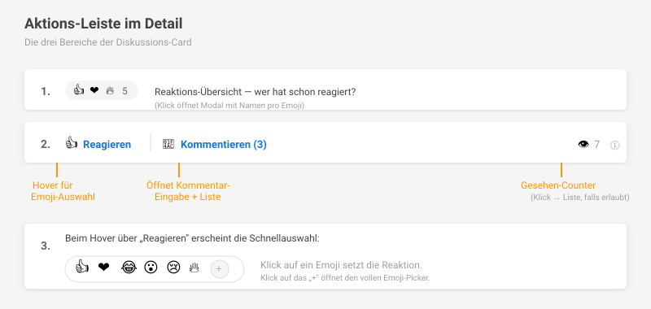

# Diskussion: Reagieren, Kommentieren, Gesehen

Die **Diskussion** ist eine modulübergreifende Funktion in ELIZA, die unter Inhalten erscheint und dir ermöglicht zu **reagieren**, zu **kommentieren** und zu sehen, **wer den Inhalt gesehen hat**. Sie funktioniert nach demselben Prinzip wie auf LinkedIn oder Facebook.

## Wo findest du die Diskussion?

Sobald die Administration sie aktiviert hat, erscheint die Diskussions-Card am Ende folgender Seiten:

- **News-Beiträge** (News & Events)
- **DMS-Dokumente**
- **Tutorials-Lektionen**
- **Prozesse**

Jede dieser Seiten zeigt die gleiche Diskussions-Card mit derselben Bedienung — was du hier lernst, gilt überall.

## Reagieren

Mit einer **Reaktion** signalisierst du anderen, dass du den Inhalt gesehen hast und ihn schätzt (oder lustig findest, oder traurig, …). Reaktionen sind die einfachste Art zu interagieren — ein Klick genügt.

### Verfügbare Emojis

| Emoji | Bedeutung |
|-------|-----------|
| 👍 | Gefällt mir |
| ❤️ | Liebe es |
| 😂 | Lustig |
| 😮 | Überrascht |
| 😢 | Traurig |
| 🔥 | Begeistert / „on fire" |
| ➕ | Eigenes Emoji wählen (Emoji-Picker) |

### So reagierst du

1. Klick auf **Reagieren** → vergibt automatisch 👍
2. Hover über **Reagieren** → öffnet die Schnellauswahl mit allen sechs Emojis
3. Klick auf das **+**-Symbol in der Schnellauswahl → öffnet den vollen Emoji-Picker

### Reaktion wechseln oder entfernen

- **Wechseln**: Wähle einfach ein anderes Emoji aus — deine Reaktion wird ersetzt
- **Entfernen**: Klick auf das gleiche Emoji nochmal → deine Reaktion wird entfernt

### Wer hat reagiert?

Die Zusammenfassung oberhalb der Action-Bar zeigt die häufigsten Emojis und die Gesamtzahl (z.B. `👍 ❤️ 🔥 5`). Klick darauf → ein Modal zeigt **alle Reaktionen mit Namen** der reagierenden Personen, gruppiert nach Emoji.

## Kommentieren

Kommentare sind ausführlicher als Reaktionen — geeignet für Rückmeldungen, Fragen oder Diskussionen.

### Kommentar verfassen

1. Klick auf **Kommentieren** → öffnet das Eingabefeld
2. Tippe deinen Text
3. Drücke **Enter** oder klick aufs **Senden**-Symbol (Papierflieger)

Wenn schon Kommentare existieren, ist das Eingabefeld direkt sichtbar.

### Auf einen Kommentar antworten

Unter jedem Kommentar findest du **Antworten**. Ein Klick darauf öffnet eine eingebettete Eingabezeile. Replies erscheinen direkt unter dem Eltern-Kommentar (eine Ebene Verschachtelung).

### Auf einen Kommentar reagieren

Neben **Antworten** steht auch **Reagieren** — du kannst Reaktionen genauso auf einzelne Kommentare vergeben.

### Eigenen Kommentar bearbeiten

Hast du dich vertippt? Du kannst deinen eigenen Kommentar nachträglich bearbeiten:

1. Stift-Icon ✏️ neben deinem Kommentar klicken
2. Text anpassen
3. **Speichern** (oder Abbrechen)

Bearbeitete Kommentare zeigen *(bearbeitet)* neben dem Zeitstempel — als Hinweis für andere Leser.

⚠️ **Wichtig:** Bearbeitung ist nur innerhalb eines **Zeitfensters** möglich (Standard: 15 Minuten nach Erstellung). Sobald jemand auf deinen Kommentar geantwortet hat, kannst du ihn **nicht mehr bearbeiten oder löschen** — das schützt die Thread-Integrität. Administratoren mit der entsprechenden Berechtigung können auch ausserhalb des Zeitfensters bearbeiten.

### Eigenen Kommentar löschen

X-Icon ❌ neben deinem Kommentar — Bestätigung im Browser-Dialog, dann ist er weg. Gleiche Regeln wie beim Bearbeiten: nur innerhalb Zeitfenster und nur ohne Antworten.

### Andere Personen erwähnen mit @

Du kannst andere Benutzer direkt in einem Kommentar **erwähnen** — sie bekommen dann eine Benachrichtigung und können schnell zur Diskussion springen.

**So funktioniert es:**

1. Im Kommentar- oder Antwort-Feld das Zeichen **`@`** tippen
2. Sobald du mind. ein Zeichen weiter tippst (z.B. `@hu`), erscheint ein Dropdown mit Vorschlägen
3. Mit **↑/↓** auswählen, **Enter** oder **Tab** zum Einfügen — oder direkt mit der Maus klicken
4. Der erwähnte Username wird im Text blau hervorgehoben (z.B. `@hugo.boss`)

**Wer erscheint im Dropdown?**

Du siehst nur Personen, die den Inhalt selbst **sehen dürfen** (gleiche Berechtigung wie beim Lesen des Beitrags). Damit kannst du niemanden erwähnen, der den Kontext eh nicht öffnen könnte.

**Was passiert, wenn ich jemanden erwähne?**

Die erwähnte Person erhält eine **Benachrichtigung** im Posteingang („Hugo Boss hat dich in einem Kommentar erwähnt") und kann mit einem Klick direkt zum Beitrag springen.

💡 **Tipp:** Mehrfach-Erwähnungen sind möglich (z.B. `@hugo.boss @sandra.berger Kannst du das prüfen?`) — jede Person bekommt eine eigene Benachrichtigung.

## Gesehen-Tracking

Bei Inhalten mit aktivem **Gesehen-Tracking** erfasst ELIZA automatisch, wer den Inhalt aufgerufen hat — ähnlich wie LinkedIn anzeigt, „wer hat meinen Beitrag gesehen".

### Wie funktioniert es?

- Sobald ein Inhalt **50% sichtbar** auf deinem Bildschirm ist und du ihn **mindestens 5 Sekunden** anschaust (bei weiteren Inhalten 2.5 Sekunden), wird er als gesehen markiert
- Pausiert automatisch, wenn der Browser-Tab nicht aktiv ist
- Funktioniert auch für sehr lange Beiträge: dort genügt, dass der halbe Bildschirm vom Inhalt gefüllt ist

### Was siehst du als Leser?

Das Auge-Icon 👁 in der Action-Bar zeigt die Anzahl gesehen-Markierungen. Wenn du berechtigt bist (Autor/Admin), kannst du draufklicken — ein Modal zeigt die **Liste der Personen, die den Inhalt gesehen haben**.

### Versionen

Bei Inhalten mit Versionierung (z.B. **DMS-Dokumente**) gilt: der Counter zeigt nur User, die die **aktuelle Version** gesehen haben. Wird eine neue Version freigegeben, beginnt das Tracking für die neue Version frisch — so erkennst du, wer die neuste Fassung schon kennt.

## Benachrichtigungen

Damit du nichts Wichtiges verpasst, verschickt ELIZA automatisch Benachrichtigungen:

| Was passiert | Wer wird benachrichtigt |
|---|---|
| Jemand kommentiert deinen Beitrag/dein Dokument/deine Lektion/deinen Prozess | Du als Autor/Verantwortlicher |
| Jemand antwortet auf deinen Kommentar | Du als Verfasser des Kommentars |
| Jemand erwähnt dich mit `@username` in einem Kommentar | Du als erwähnte Person |
| Jemand reagiert mit einem Emoji | _Keine Benachrichtigung_ (verhindert Spam bei vielen Likes) |
| Du kommentierst oder erwähnst dich selbst | _Keine Selbst-Benachrichtigung_ |

Die Benachrichtigungen erscheinen im **Glockensymbol** oben rechts in ELIZA. Falls **Push-Benachrichtigungen** in deinem Browser aktiviert sind, erhältst du sie zusätzlich als Browser-Hinweis.

## Wer darf was?

Die Diskussion respektiert die normalen Berechtigungen der jeweiligen Inhalte:

- **Reagieren / Kommentieren**: Erfordert mindestens **Sicht-Berechtigung** auf den Inhalt
- **Gesehen-Liste anzeigen**: Nur **Autor/Admin** sieht, wer den Inhalt gesehen hat (nicht alle Benutzer)
- **Fremden Kommentar bearbeiten/löschen**: Nur **Admins** mit den entsprechenden Berechtigungen

Du wirst nie auf Inhalte stossen, die du eigentlich nicht sehen darfst — wenn du keine Berechtigung hast, ist auch die Diskussion nicht sichtbar.

## Aktivierung (für Administratoren)

Die Diskussion ist **standardmässig deaktiviert** und muss pro Modul eingeschaltet werden:

1. Als Admin: **Einstellungen** → **Social-Bar**
2. Module einzeln aktivieren:
   - **DMS**: Reaktionen/Kommentare und Gesehen-Tracking
   - **Tutorials**: ditto für Lektionen
   - **Prozesse**: ditto für Prozesse
3. **Zeitfenster für Kommentar-Bearbeitung** anpassen (Standard 15 Min, 0 = unbegrenzt)
4. **Speichern**

News-Beiträge (Streams) haben Reaktionen und Kommentare seit jeher aktiv — dort wird die Diskussion automatisch angezeigt.

💡 **Tipp:** Aktiviere zuerst nur ein Modul (z.B. DMS) für ein paar Wochen, sammle Feedback, und schalte dann weitere Module nach.

## Häufige Fragen

**Warum sehe ich die Diskussion bei DMS nicht?**
Das Modul muss vom Admin aktiviert werden (siehe oben). Falls aktiviert: prüfe, ob du Sicht-Berechtigung auf das Dokument hast.

**Was passiert, wenn ich einen Kommentar lösche?**
Der Kommentar wird mit Verzögerung ausgeblendet. Vorhandene Antworten verhindern das Löschen — du müsstest erst die Antworten löschen (lassen).

**Kann ich Reaktionen rückgängig machen?**
Ja — klick einfach nochmal auf dasselbe Emoji.

**Bekomme ich eine Benachrichtigung bei jedem Like?**
Nein, Reaktionen verschicken keine Benachrichtigungen — sonst würde es bei beliebten Beiträgen schnell zu viel werden.

**Wer sieht, dass ich einen Inhalt gesehen habe?**
Nur der **Autor / die Admins** des Inhalts. Andere normale Leser sehen nur die Gesamtzahl, nicht deinen Namen.

**Warum erscheint eine Person nicht im @-Mention-Dropdown?**
Vorgeschlagen werden nur Personen, die den aktuellen Inhalt sehen dürfen. Hat jemand keine Sicht-Berechtigung auf den Beitrag, kann sie/er auch nicht erwähnt werden — wende dich an deinen Admin, falls die Berechtigung erweitert werden soll.
